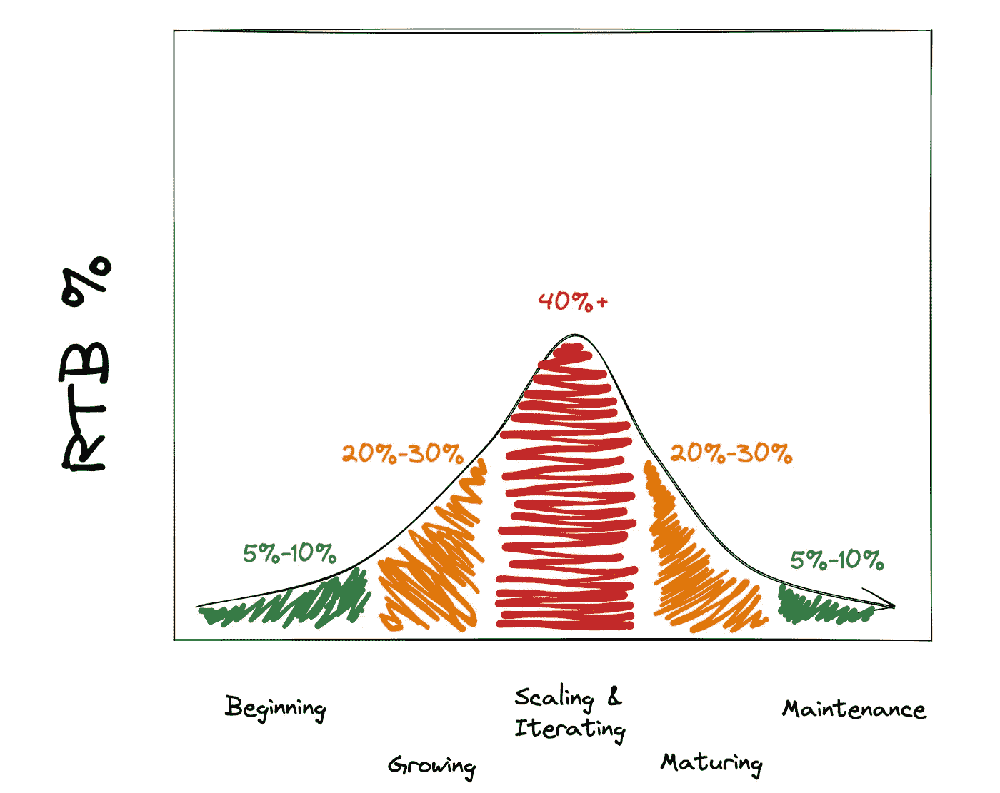
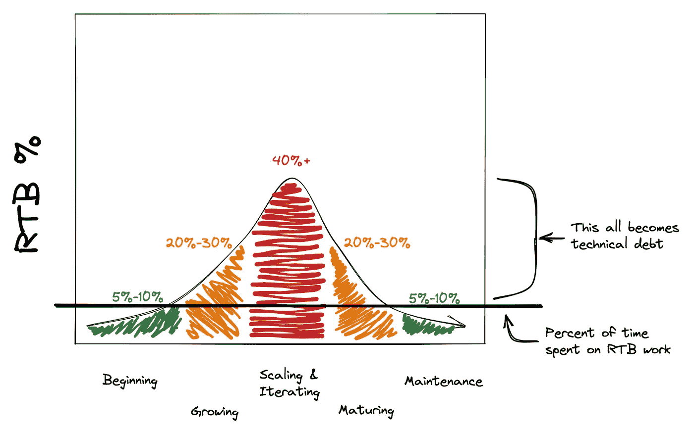

# 为什么发布新功能需要这么长时间

> 原文：<https://medium.com/codex/why-it-takes-so-long-to-ship-a-new-feature-efd8daf12dfc?source=collection_archive---------6----------------------->

你的新软件需要几个月才能发布，这可能有上百种不同的原因。今天我想谈谈一个非常具体的原因，许多人凭直觉“感觉”到，但很少有人有具体的词语来描述它，更不用说框架了——“经营业务”工作。

# 经营企业

什么是跑业务(RTB)工作？这是一个模糊的类别(我很乐意在以后的文章中探讨)，但是对于大多数公司来说，RTB 工作通常包括支持现有功能所需的任何东西。这包括但不限于:

*   更新库或包
*   修复产品错误和安全问题
*   可靠性和扩展工作
*   现代化努力
*   技术供应商更新

那么为什么 RTB 的工作会让你慢下来呢？首先，如果你考虑到它，它不需要。如果你不考虑它，RTB 的工作将会成为你技术债务和计划外工作的主要来源之一。

# 工作量分配

当遵循敏捷实践的团队经历构建他们的 backlog，并准备他们的 sprints 的过程时，他们通常不区分，也不考虑他们承担了多少 RTB 工作。更多的时候，RTB 的工作只是作为计划外的救火工作进入冲刺阶段。

这是不幸的，因为如果一个团队负责他们的 RTB 工作，他们会对为什么新项目需要这么长时间有更强的理解。在与科技行业的同行交谈时，一些人告诉我，他们计划将新功能工作与 RTB 工作分成 70%/30%。

虽然这种观点是可行的，但是我发现在计算团队正在开发的产品的成熟度方面更成功。这是因为从事处于不同成熟阶段的产品的团队应该期望在 RTB 工作上花费非常不同的时间。看看下面的图表。

这个图表将与大多数开发人员的经验相匹配——他们在早期进展非常快，然后，通常，新特性开始花费越来越长的时间。这是因为即使一个特性已经从`Beginning`阶段转移到`Scaling & Iterating`阶段，团队并没有增加他们花在 RTB 工作上的时间——他们可能仍然只花 5%-10%的时间在 RTB 工作上。那么，为什么这很重要呢？这是一场长期的比赛。

# 累积债务

当你没有在 RTB 的工作上花费适当的时间，它开始累积。

首先，每周只需要解决几个 bug，然后是昂贵且耗时的 Nodejs 版本升级，最终你会听到这样的说法:“这怎么可能需要一周多的时间？”作为一名开发人员，环境开始变得令人沮丧和疲惫，这一切都发生在同一时间。

那么一切都完了吗？是不是所有的特性都需要花更多的时间来开发？或者我们应该把 40%的时间花在 RTB 的工作上？

# 找到问题

首先，多问问题。不要屈服于指责游戏，不，这不是现在的开发者更差。这并不是说你雇佣的人不能胜任这项任务。

很多时候，终身开发人员的观点已经慢慢冻结了——他们看不到系统中出现的问题，或者他们不知道如何指出他们看到的问题。平衡功能性投资以降低 RTB 成本可以带来回报，让你不至于达到上面看到的 40%。这是一个相当大的话题，所以如果你对解决这个问题的方法感兴趣，或者“功能投资”在这里意味着什么——请在下面留言！