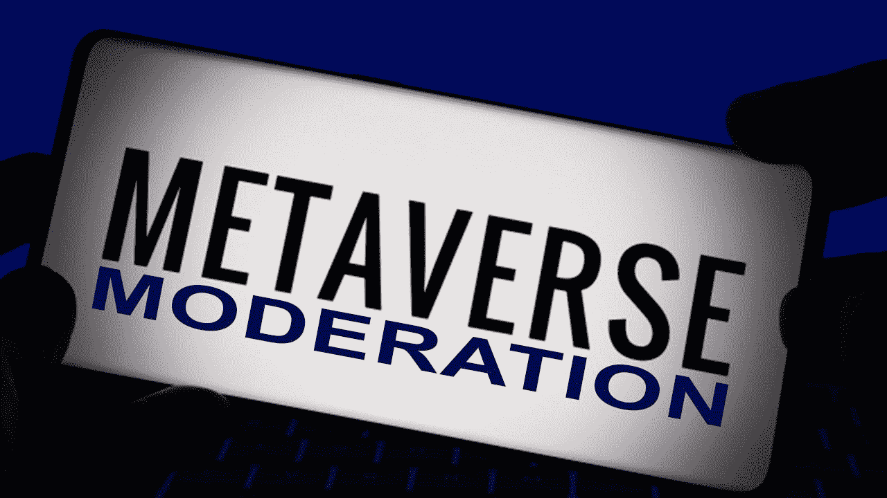

# 为什么元宇宙温和派比你想象的更容易成功

> 原文：<https://medium.com/codex/why-its-easier-to-succeed-with-metaverse-moderation-than-you-might-think-eba4eac8a74d?source=collection_archive---------17----------------------->

元宇宙是一个不断发展的生态系统，拥有从游戏到虚拟和增强现实体验的各种应用。任何人——无论其行业或业务模式如何——都可以利用该平台，包括社交网络、在线教育、在线零售、在线商务、约会服务等。

元宇宙是一个虚拟环境，用户可以在其中实时开发他们的数字化身(一个 MB)。在网站内，用户可以从各种可定制的头像中进行选择。他们利用这些头像与网站上的其他用户互动，例如在社交网络上与他们交谈，或者通过匹配算法与朋友或陌生人玩游戏。

游戏平台审核是元宇宙审核最受欢迎的用例。另一方面，适度有着广泛的应用。

审核服务是至关重要的，因为它们提供了最佳实践在任何给定空间内应该如何工作的指南。

无论是在线约会网站，用户在与陌生人面对面交谈时需要指导如何表现；或者企业需要照顾那些长时间不在家工作的员工，由于无法上网，他们每隔几个小时就不能报到一次。

**元宇宙审核服务类别**

图像、视频和语音是元宇宙审核服务的三种类型。语音可以实时转录和翻译。**视频内容审核**可以被转录和翻译。物体、人、不合适的材料(如色情)，甚至文字(如果是手写的符号)都可能被图像调节检测到。

情感分析——根据一个人的情绪状态评估对一个物体或概念的态度——以及电影中可能被视为危险或非法的事情——也可以通过语音和视频分析来进行。

# 当您有一个预先存在的要审核的图像数据库时，图像审核会很有帮助。

当你想要调节一个现存的照片数据库时，图像调节就变得很方便了。例如，如果您的公司已经从客户那里收集图片有一段时间了，现在想要在公开之前开始过滤它们，或者您最近开始接受用户生成内容(UGC ),并且需要将现有的审核标准应用于所有新的贡献。

另一方面，[图像和视频内容审核](https://www.cogitotech.com/services/image-video-content-moderation)对于图片审核无效，因为它不允许您从帧中排除某些项目。这意味着，虽然视频可以用作更全面的解决方案的一部分，包括语音识别和对象识别服务，如 Cogito 提供的服务，但它不能用作完整的图像调节解决方案的一部分。

# 投机

赌博是一种胜负只取决于机会和运气的游戏。它可以在实体环境中进行，如赌场，也可以通过在线博彩网站进行。

虽然赌博可能看起来是一种无害的消磨时间的方式，但重要的是要记住，如果你不小心，它可能会上瘾！如果 18 岁以下的孩子玩这个游戏，他们可能会面临父母或监护人的法律诉讼。

如果孩子们经常看到他们的父母这样做，他们可能会觉得自己不得不这样做，而不知道会有什么后果。

# 暴力

暴力是一个严重的问题，影响到全世界的个人，包括元宇宙的个人。身体虐待、性侵犯和强奸都是性虐待的例子。即使暴力很难量化，当我们遇到它时，我们也能认出它:

1.  当有人故意伤害你或其他人时。
2.  当药物或酒精阻止你同意性行为时
3.  当你被迫做你不想做的事情时(比如分享你的个人信息)

# 色情内容

默认情况下，禁止色情内容，但您可以在您的社区中启用它。作为一个家庭友好的在线区域，元宇宙不会接受色情或任何其他露骨的色情内容的传播。

如果您决定在您的社区中允许此类内容，我们强烈建议您指定**元宇宙审核**服务来检查可能包含敏感信息(如裸体)的帖子。

这将保证网络上只允许合适的照片，用户将无法未经授权共享不合适的内容。

**你可以使用这些服务来开始你的创作，而不是重新发明轮子。**

Cogito 是一家提供用户生成内容和元宇宙审核服务的公司。当您利用元宇宙的图像、语音和视频 [**内容审核**](https://www.cogitotech.com/services/content-moderation) 服务时，您将获得:

*一个易于使用的仪表板，用于管理照片、视频和语音

*强大的筛选功能，让您可以实时忽略垃圾邮件或其他不需要的内容

*广泛控制您的审核策略

# 结论

当您使用 [**【元宇宙审核】**](https://www.cogitotech.com/services/metaverse-content-moderation) 服务时，所有用户生成的素材都会受到监控。这意味着材料将以三种方式控制:图片、视频和声音。

重要的是要记住，任何人，不仅仅是平台用户，都可以创建用户生成的内容。如果用户在你的平台上制作了一些东西，然后决定在社交媒体的其他地方发布(比如脸书)，这项服务仍然适用。

*原载于*[*https://www.linkedin.com*](https://www.linkedin.com/pulse/why-its-easier-succeed-metaverse-moderation-than-you-might-/)*。*