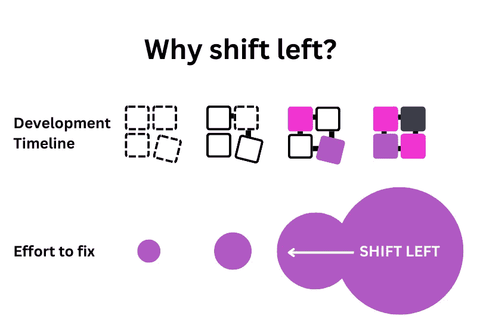

# 为什么是时候转移左边的技术债务了

> 原文：<https://medium.com/codex/why-its-time-to-shift-left-technical-debt-7996cf2c225a?source=collection_archive---------6----------------------->

我们需要讨论将科技债务向左转移。以下是我们如何通过关注技术债务来改善代码库健康和未来提高质量的方法。

左移给测试、安全和开发带来了巨大的好处，但没有给技术债务和问题跟踪带来好处。然而，技术债务是开发团队努力或无法交付的主要原因之一。

让我们面对现实吧——开发人员不想处理无休止的技术债务积压。太糟糕了。科技债务阻碍了生产力，从而影响了士气。没有什么比作为一个团队慢慢陷入停滞更糟糕的了。

在本文中，我们将回答以下问题:

*   什么是左移？
*   技术债左移是什么意思？
*   技术债不左移有什么影响？
*   你如何着手将技术债务向左转移？

# 什么是左移？

一般来说，当我们说“左移”时，我们指的是在流程的时间线中更早地移动任务。通过这样做，我们为将来更好的代码质量打下了基础，并且避免了以后更大的努力去修复。

这个概念起源于软件开发被绘制在黑板上的时候，左边是需求，然后是设计、编码、测试，最后是交付。

但是在开发过程的后期进行测试意味着发现问题的时间也很晚。这意味着延迟、成本、妥协的产品和不开心的人。随着产品或功能变得更加具体，修复它们变得更加困难和耗时。所以他们在开发周期的早期进行软件测试。他们*将其向左移动。*

这种做法有助于团队更加主动，而不是被动。

“左移”已经改变了一系列学科，如…

*   DevOps(例如，开发人员通过制作 docker 映像并将其放入托管平台进行部署。通过设置一键部署将其向左移动。)
*   IT 服务管理(例如，客户通过提交帮助台请求来重置其密码。通过构建自助密码重置工具将其左移)
*   安全性(例如，团队手动审查软件组件的安全风险。通过引入自动软件组合分析工具的使用，将它左移。)
*   A11y(例如，像 ARIA 角色和属性这样的 a11y 功能需要人工审核。通过引入一个 11y 的棉绒将它向左移动。)

# 那么，在技术债的背景下，左移意味着什么？

技术团队已经转移了大量剩余的东西。我们也可以从将[技术债务](https://www.stepsize.com/handbook/what-is-technical-debt)左移中受益。

现在，技术债务是软件开发过程中不可避免的一部分。就像金融债务一样，它既可能有害，也可能有益。当工程师为了更快地出货而走捷径时，技术债务就会累积，而这通常是必要的。工程师和团队领导必须有效地管理技术债务，以确保偿还债务时影响最小。

**当我们将技术债务向左转移时，我们正在构建工具和更好的流程来帮助我们跟踪技术债务。这使我们能够有效地衡量它，确定它的优先级，并最终进一步解决它。**

# 如果我们不把科技债务向左转移，会发生什么？

在每一次冲刺中，我们都面临着在发布新功能和偿还一些技术债务之间的权衡。但是选择总是发布新功能是不可持续的。游戏的结局是，我们最终会在技术上破产。这意味着重写大量代码，这可能需要几个月的时间。

但是技术债务导致的元问题远远超出了工程团队。通过降低质量和增加上市时间，我们正在影响营销人员和销售人员实现目标所需的功能和期限。性能问题和停机时间增加了客户支持、成功和客户管理的工作量。

当然，没有工程师愿意花大量时间处理技术债务。他们在工作上没有进步。他们感到无聊。他们离开了。这对他们、对团队、对 HR 来说都是垃圾— [雇佣新工程师的成本很高，而且可能要花很长时间。](https://www.qualified.io/blog/posts/the-hidden-cost-of-hiring-software-engineers)

**反正感觉是这样* [在这里了解更多关于科技债务如何影响每个人的信息。](https://www.stepsize.com/blog/how-tech-debt-impacts-everyone-in-the-company)

# 我们如何将科技债务左移？

概括地说，当我们向左转移技术债务时，我们正在转移与软件开发生命周期早期积累和管理技术债务相关的任务。在持续的基础上，尽可能早地处理技术债务有助于将质量推向上游，避免难以控制的技术债务。

**将科技债务左移的关键做法是创建一个强大的系统来跟踪科技债务。这为今后更直接的科技债务优先排序和修复奠定了基础。**

# 向左转移技术债务始于正确跟踪技术债务

技术团队通常很难有效地跟踪技术债务。这表现在几个方面。

**1。问题不会被跟踪。几乎每个开发人员都讨厌跟踪问题的常用项目管理工具，比如吉拉。这些工具迫使他们不断地进行上下文切换，打断了他们的流程，更多的是分散他们的注意力，让他们远离代码。**

**2。跟踪的问题缺乏细节。**在问题跟踪器和 IDE 之间来回切换很烦人，这使得我们不太可能正确标记所有相关的代码行和文件。

**3。问题被遗忘了。**没错——积压的门票积灰的墓地。大多数团队都有一个..！

这些问题相互交织在一起。含糊不清的票据使得审查积压毫无意义。问题不会被跟踪，因为开发人员认为没有人会费心去关注它们。

那么我们能做些什么呢？为了让跟踪技术债务成为一种持续的习惯，我们需要让技术团队容易(1)报告和记录问题，(2)轻松添加细节，(3)查看代码库问题。

我们的目标是确保创建高质量的门票。我们可以通过…做到这一点

*   最小化上下文切换——这可以通过代码编辑器本身的扩展来实现
*   使得将特定的代码行和文件链接到问题变得容易
*   使用工具使问题在代码编辑器中可见

尝试检查一个像 Stepsize 的 [VSCode](https://stepsize.com/r/vscode) 和 [JetBrains](https://stepsize.com/r/jetbrains?utm_source=medium&utm_medium=referral&utm_campaign=why-its-time-to-shift-left-technical-debt) 扩展这样的工具。这有助于工程师直接从编辑器中跟踪技术债务，并将代码库问题添加到您的 sprint 中。

这种方法允许您将问题链接到代码，获得技术债务的可见性，并在维护问题上与您的队友合作，而无需离开您的编辑器和切换上下文。

# 下一步:优先解决科技债务

既然问题被定期跟踪，我们就可以有一个有意义的策略，一旦问题被记录下来，就可以对其进行优先排序和修复。

现在我们已经把我们的技术债务转移到左边，我们的下一步是(1)为你的团队创造一个讨论你的代码库问题的空间，以及(2)把你的技术债务工作整合到你现有的工作流程中。

定期分配合理的技术债务预算至关重要——例如，每个 sprint 或定期重构 sprint 的 20%——这样工程师就可以偿还技术债务。

做好这一点是双赢的局面。你将避免技术破产和船舶功能更快。

我们已经在这里写了对抗和防止技术债务的三个最佳策略。

# 底线

**解决技术债务问题的唯一方法是开始左移。跟踪它需要是一个持续的过程，在软件开发生命周期中尽可能早地发生。**

这已经在从安全到 a11y 的地方发生了，现在是我们把注意力转移到科技债务的时候了。

如果管理不善，技术债务会对代码库健康、团队士气以及最终的商业繁荣产生广泛而严重的影响。我们可以通过采取三种核心做法将科技债务向左转移来避免这种情况。它们是有效地跟踪科技债务问题，定期优先处理和修复科技债务，以及使用指标来检测和缩减科技债务。

向左转移技术债务需要成为使软件开发高效、可靠和愉快的下一个前沿。

【https://stepsize.com】最初发表于**。**