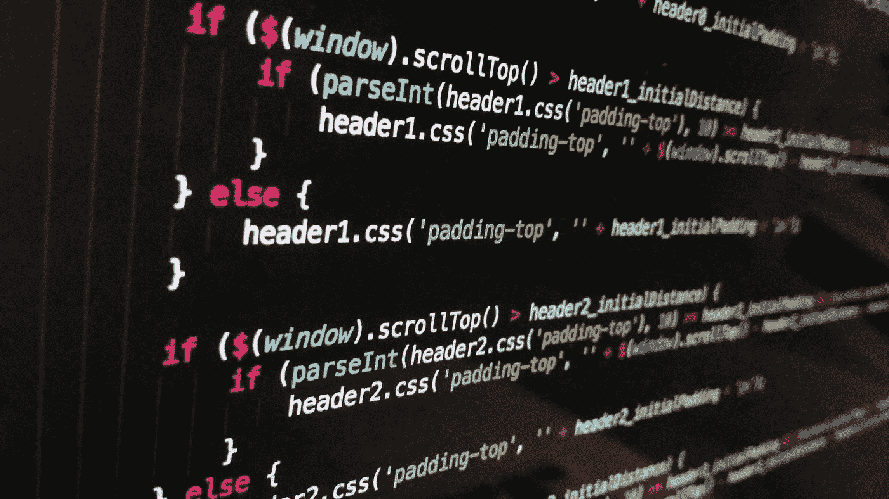

# 为什么 JavaScript 是可笑的隐式

> 原文：<https://medium.com/codex/why-javascript-is-ridiculously-implicit-785323689985?source=collection_archive---------3----------------------->

## JavaScript 隐含性的概述，以及为什么它对语言应用如此重要的例子。

图片由[像素](https://pixabay.com)上的[像素](https://pixabay.com/users/pexels-2286921/)生成

当开始一个新项目时，在最初的规划阶段需要意识到的最重要的事情之一就是技术堆栈。给定应用程序的技术堆栈可以包括来自…