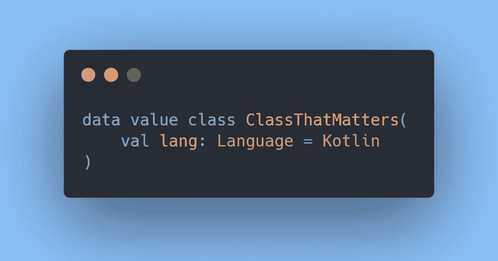

# 为什么科特林的优秀类型很重要

> 原文：<https://medium.com/codex/why-kotlins-better-types-matter-a-lot-4d9fb2e690ac?source=collection_archive---------6----------------------->

*作者使用* [*碳*](https://carbon.now.sh/) *创建的图像。*

与 Java 相比，Kotlin 有很多优点，但我发现容易被忽略的一点是它们的两个特殊类:数据类和内联类。数据类初看起来只是在开发过程中节省了一些时间，但我相信它们也能产生更好的代码。内联类经常被完全忽略。

所以让我们看看为什么我认为这两个类实际上对好代码有影响。

# 数据类使代码更加简洁

Kotlin 的数据类本质上只是创建 POJOs 的一种更快捷的方式。它们会自动为您生成 getters、setters、`hashcode`、`equals`和`toString`。Java 17 在记录的形式上引入了类似的东西，[尽管有一些细微的差别](https://blog.oscarablinger.dev/the-difference-between-kotlins-data-classes-and-java-16-records)。我要说的关于它们的几乎所有东西，也适用于记录。

对于那些不知道的人，下面是一个数据类:

如果没有它，在 17 版之前的 Java 中，我们必须编写以下代码:

显而易见的是，我们节省了大量必须编写的代码，更糟糕的是，*读*。但是不太明显但更重要的区别是，改变某些东西需要很多改变——其中一些很容易被忽略，并且可能不会导致任何测试失败。很容易添加一个字段，却忘记将它添加到`hashCode`或`equals`方法中。

使改变或创建一个类变得困难也阻碍了程序员这样做。例如，在 99%的情况下，一个类的构造函数中有一个布尔值意味着这个类应该被分成两个不同的类。然而，你会发现在任何更大的代码库中，仅仅是因为添加一个布尔字段需要大约 5 分钟，而创建另一个类可能需要 20 分钟，如果它很大的话。虽然 15 分钟对于更清洁的架构来说似乎是很小的代价，但很少有人会真的选择这个选项。

# 内联类可以使代码更干净，更有性能(甚至是可行的)

内联类本质上是 JVM 上目前所能得到的最接近自定义值类型的类。假设您有下面的内联类:(示例取自 [kotlin 文档](https://kotlinlang.org/docs/inline-classes.html#members))。

Kotlin 将尽可能地阻止对象的创建，而使用 raw 类型(在本例中为`String`)。实例方法调用以及属性 getters 将被编译为静态方法调用。

我喜欢它的主要原因是它最终允许一种高性能的方式来实现[微小类型](https://darrenhobbs.com/2007/04/11/tiny-types/)。虽然我是这个想法的忠实粉丝，但我永远不会在任何严肃的项目中使用它，因为我的工作要求高性能标准，在这种情况下，Java 中该技术的对象变动将是一个非常现实的问题。尽管如此，我相信好处是巨大的。有了创建新类的快捷方式和不创建大量实例的可能性，这就变成了一种非常真实且易于实现的风格。

# 内联类的缺点

可悲的是，我也看到了内联类的一些缺点:

1.  **它们只与一个参数一起工作。**这是一个主要的限制，这意味着当你需要将多个值组合在一起时，你仍然需要每次都创建一个对象。
2.  有时它会提供虚假的安全感。当“实例化”一个内联类时，很容易认为它永远不会真正被创建。然而，在某些情况下，这是不正确的。主要是当它被用作其接口之一或在泛型方法中使用时。
3.  它们必须是最终的。虽然我不认为这是个大问题，因为我看不出有什么理由扩展一个只有一个输入字段的类。

# 摘要

当比较 Java 和 Kotlin 时，数据类型和内联类通常很快被认为是最好的。但我认为这是在低估他们。它们不仅提供了减少样板代码的方法，而且使用起来更安全，可以允许微小类型和类似的干净代码风格的高性能使用，并减少制作更干净代码的摩擦——而摩擦是好软件的敌人。

*原发布于*[*https://blog . oscarablinger . dev*](https://blog.oscarablinger.dev/why-kotlins-better-types-matter-a-lot)*。*