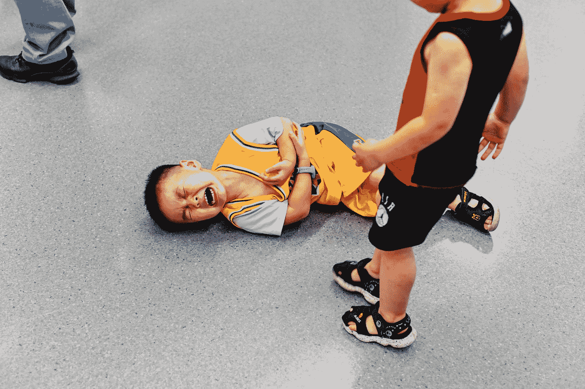

# 为什么学习 Python 是编程初学者所能做的最糟糕的事情

> 原文：<https://medium.com/codex/why-learning-python-is-the-worst-thing-you-can-do-as-a-programming-beginner-30691353475d?source=collection_archive---------2----------------------->

## 有了 C/C++和 C#，你走了额外的路，但以后会得到回报。

[杨淼](https://unsplash.com/@yangmiao?utm_source=medium&utm_medium=referral)在 [Unsplash](https://unsplash.com?utm_source=medium&utm_medium=referral) 上拍照

你还记得你上学的第一天吗？你的初吻？你的第一次性感？我打赌你知道。

> 第一刀是最深的——洛德·斯蒂沃特