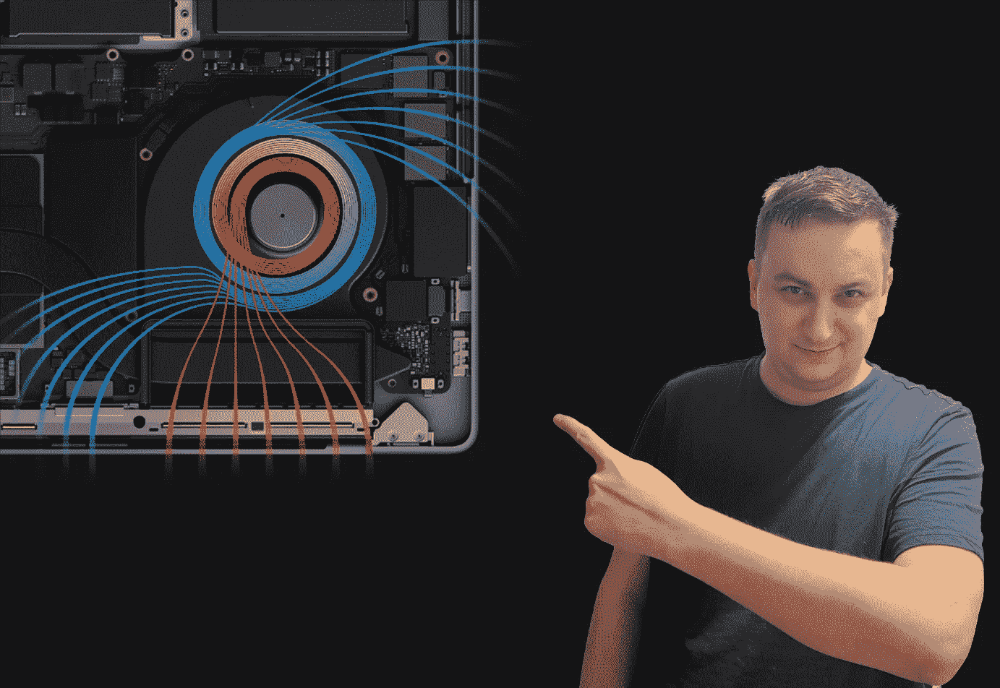

# 为什么苹果硅的 MAC 电脑不会过热

> 原文：<https://medium.com/codex/why-macs-with-apple-silicon-dont-overheat-2bb68e2ee95e?source=collection_archive---------0----------------------->

## 是的，也有例外

苹果 MacBook Pro 冷却系统解释——图片由作者提供

向苹果芯片的转移将苹果电脑带到了一个全新的水平。随着定制芯片的出现，苹果电脑的性能大幅提升，能效更高，实际上解决了早期型号的问题。后者由于身体太薄而过热，这导致了所谓的热节流…