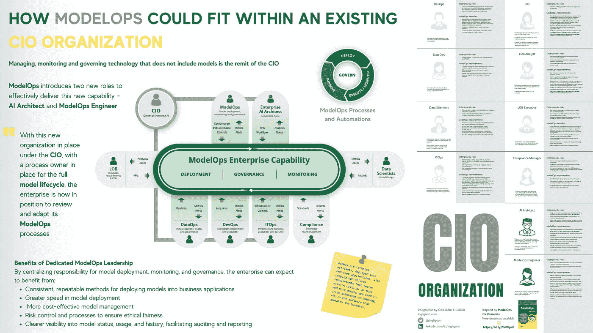
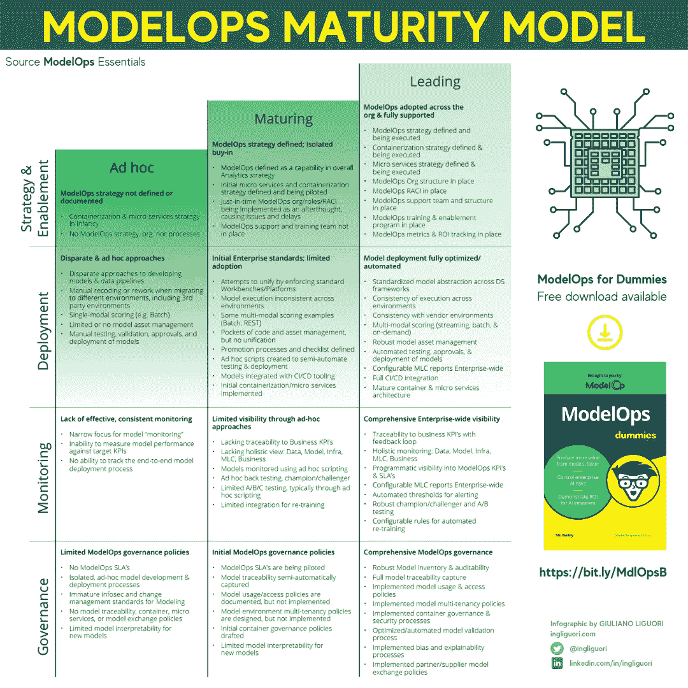

# 为什么模型操作是首席信息官负责的企业级功能

> 原文：<https://medium.com/codex/why-modelops-is-an-enterprise-level-capability-under-the-cios-accountability-e9c5aa981934?source=collection_archive---------11----------------------->

与 [ModelOp](http://www.modelop.com/) 合作的文章

照片由来自[佩克斯](https://www.pexels.com/photo/black-and-white-laptop-2740956/?utm_content=attributionCopyText&utm_medium=referral&utm_source=pexels)的[普拉蒂克·卡蒂亚尔](https://www.pexels.com/@prateekkatyal?utm_content=attributionCopyText&utm_medium=referral&utm_source=pexels)拍摄

## 我们都听说过 DevOps 以及它给企业应用交付带来的变革。然而，还有另一个同样强大的新兴能力 ModelOps，它也可以给所谓的企业人工智能的组织带来竞争优势。

# 介绍

今天，人工智能的应用非常广泛，甚至在日常生活中也能感觉到。例如，考虑汽车在转弯时自动刹车或不驶出车道的能力，或者卫生部门，人工智能能够监控和报告异常趋势，并帮助简化流程，以腾出医生的时间表，从而降低成本。让我们以一台计算机为例，它能够识别我们脑海中的名人，问自己不超过 10 个问题，或者人工智能如何不断被金融和商业部门的许多组织采用，以重组公司，提高收益和体验，降低风险，并增加我们现代经济的金融引擎的机会。

这些已经是或多或少先进的人工智能的现有技术，正在改变我们的生活、工作和学习方式。当机器独立学习时，由于这些并通过经验，通过提供更多答案或更多功能来随着时间的推移改善其性能，您将拥有机器学习。

然而，人工智能和机器学习模型给模型操作化(后期开发)带来了新的风险。许多模型操作流程是手动的，或者使用本地开发的解决方案进行管理，这些解决方案需要随着新技术、工具和治理要求的引入而不断更新。

出于这个原因，人工智能必须超越由数据科学家进行的临时小规模实验，转向可以将推理结果直接传递到企业环境中的自动化管道。

> 你可能也想阅读安全可靠的人工智能的模型操作

# 什么是 ModelOps？

与此同时，为了保持竞争力，各组织正试图以越来越快的速度开发人工智能和机器学习模型，以获得新的见解，继续他们的数字化转型，并重新构想他们的业务，正如我们所说的那样，失败和浪费资源的风险仍然非常高。

众所周知，几十年来，组织一直在使用各种模型来支持业务。然而，人工智能和机器学习模型引入了与模型本身的可操作化相关的新风险。这种模型在默认情况下是概率性和非确定性的，需要监控和治理(有时需要重新调整、重新训练，甚至替换)，以有效地支持大规模人工智能计划的发展。

ModelOps 作为在整个企业人工智能中部署、监控和管理生产中的模型生命周期的关键战略能力，是人工智能应用产品的端到端生命周期管理的新颖框架和平台。为了确保可扩展性和治理，最具创新性的企业正在使用 ModelOps 作为一种使能技术，这是各种人工智能产品、平台和解决方案融合的关键一步。

# ModelOps 如何适应现有的 CIO 组织？

理解 ModelOps 在企业人工智能中所扮演角色的最佳方式是从定义 ModelOps 功能的组件开始，并确定如何组织和管理这项工作。为了使企业 AI 对整个组织产生影响，企业必须有一个统一的战略，允许企业的每个部分灵活地利用最适合他们需求的 AI 工具，同时确保这些工具的结果快速、可靠、完全合规并完全负责地流向企业。

> 你可能也喜欢阅读[不要让工具和管理方法扼杀你的人工智能创新](https://towardsdatascience.com/dont-let-tooling-and-management-approaches-stifle-your-ai-innovation-5fcee5ec8b2f?source=user_profile---------4-------------------------------)

大多数企业的组织设置会对业务线、IT、开发运维、数据运营和风险/合规团队之间的冲突产生负面影响。

通过使用 ModelOps，部门之间的冲突和运营摩擦被最小化，同时确保所有实施的 AI 工具的结果输出快速、可靠地流入业务，并具有完全的合规性和责任性。

ModelOps 不是一个角色，而是一组可以驻留在组织的许多不同部分的能力。企业中有许多可以容纳模型操作的总线:

*   在一个行动小组。
*   在建模团队中，如预测分析团队。
*   在产品管理功能中，如营销团队。
*   拥有基础设施专业知识的 IT 团队。

然而，对于许多企业来说，一个关键问题仍然是组织的哪一部分对模型操作负有责任，以及需要多少资金。

当一个组织开始转型时，他们会将 ModelOps 放在首席分析官领导下的企业数据科学团队中。当目标是了解数据科学是否能为组织创造任何价值时，这是有意义的。然而，随着组织在转型中走向成熟，他们通常会开始从围绕数据科学模型开发能力的努力中看到价值。因此，由于数据科学模型有助于他们未来的竞争力，如果不是他们的存在，现在是时候审查组织对模型操作的责任了。

由于 ModelOps 是一种为模型开发过程及其操作提供组织框架的整体方法，它应该由 CIO 组织来处理。事实上，如果数据科学团队向运营团队(DataOps、DevOps、ITOps、法规遵从性等)发布模型，他们将缺乏适当的技能来满足模型运营的要求，因此他们会尝试将模型投入生产，因为他们习惯于使用传统软件。这种方法显然是行不通的，因为团队不能在跨职能的工作组中组织起来，用定义的流程和相关的[工具](https://bit.ly/ModelOp)来管理操作化流程。

> 你可能也想阅读[用 ModelOps](https://towardsdatascience.com/unlocking-the-value-of-artificial-intelligence-in-business-applications-with-modelops-92379965f87c?source=user_profile---------3-------------------------------) 释放人工智能在商业应用中的价值

这种角色和责任的混乱对人工智能计划产生了负面影响，不可避免地导致长时间的延迟和低成功率。此外，这也是人工智能驱动的影子 It(shadow It)兴起的原因，在影子 It 中，单个总线接管了模型的运行。

因此，模型操作必须由首席信息官负责。事实上，生产中的[模型必须受到 24/7](https://bit.ly/ModelOp) 的监控和管理，无论应用的部门或领域是什么。下面的信息图展示了 ModelOps 如何融入现有的 CIO 组织。此外，它还引入了两个对这项新功能的成功至关重要的新角色:人工智能架构师和模型操作工程师。

由[作者](http://ingliguori.com)制作的信息图——来源[假人模型图](https://bit.ly/MdlOpsB)

根据[假人模型](https://bit.ly/MdlOpsB)作者[斯图·贝利](https://www.linkedin.com/in/stubaileyblox/)的说法，新组织中的企业 AI 团队将包括以下人员:

> 来自[车型操作基本指南](https://www.modelop.com/resources/whitepapers/modelops-essentials-guide/#:~:text=ModelOps%20Essential%20Guide,models%20across%20the%20entire%20organization.)的描述

## **数据科学家**

设计、构建和测试能够为特定用例带来实质性业务价值的模型。设计、构建和测试旨在改进模型和支持业务模型的实验。

*企业 AI 角色*:

*   交付在业务应用中部署
    时能够创造价值的分析模型。
*   开发测试以确定已部署
    模型的功效并推动改进。

*模型操作要求*:

*   为每个应用程序和用例自由使用最有效的模型开发工具。
*   模型开发的最小开销和约束是由模型部署的考虑强加的。
*   模型从开发工作台到生产环境的自动化打包和交付。
*   实时了解已部署模型的性能。

## **ITOps**

维护支持业务应用程序中运行的模型所需的核心基础设施和相关服务。

*企业 AI 角色*:

*   提供高度可用、安全的基础设施，以便在企业应用程序中全天候大规模运行高性能模型。
*   交付已部署模型和应用程序的性能指标。
*   计划和执行基础设施发展以支持人工智能技术。

*模型操作要求*:

*   所有模型、模型运行时要求、沿袭和操作历史的集中目录。
*   可以在任何基础架构(本地、云、混合)中以一致的方式部署、监控和控制的标准化模型，而不管用于创建它们的工具是什么。
*   关于模型性能和行为的自动警报。
*   部署、测试、更新和监控的自动化流程和批准。
*   实时了解已部署模型的性能。

## DevOps

开发业务应用程序，并确保它们保持运行和可用。

*企业 AI 角色*:

*   创建和实现敏捷流程和资源，以便将模型合并到业务应用程序中，并将应用程序部署到基础架构中。
*   应用程序的业务指标报告。

*模型操作的好处*:

*   使不同类型和来自不同工具的模型能够整合到应用程序中，并与任何类型的数据管道(触发、批处理、实时)连接，具有标准化的监控和控制功能。
*   无论来源如何，每个模型都具有一致的可见性。
*   自动化模型管理和刷新，无需专门的定制脚本。

## **数据操作**

开发和测试模型输入的数据管道，并接收模型推理的输出。

*企业 AI 角色*:

*   向所有模型提供来自多个来源的相关、精选数据。

*ModelOps 需求*:

*   完整、集中的模型清单，包含关于所访问数据源的所有相关元数据。
*   快速检测和纠正模型行为变化的能力。
*   可见性和控制，以确保和验证针对安全性和隐私的数据保护准则得到执行。

## **首席信息官**

提供适当的技术来支持业务战略。对基础设施容量进行监控、规划和预算。确保负责数据安全、网络利用和应用程序开发的团队的效率。

*企业 AI 角色*:

*   企业人工智能战略、运营基础设施、流程和监督。

*模型操作要求*:

*   集中、一致的工具，支持实施 MLC 的流程自动化，能够灵活适应各种模型和应用使用情形。
*   对照各自的关键绩效指标，实时了解所有参与者(数据科学、开发运维、数据运维、信息运维、合规)的绩效趋势。
*   消除危及业务价值并使组织面临风险的临时、分散的建模方法。
*   随着“公民数据科学家”可以获得人工智能能力，防止“影子人工智能”传播的可见性和控制力。
*   数据来推动对基础架构和员工需求的现实规划，并保护现有的基础架构。

## **业务线分析师**

定义利用 AI/ML 模型的需求，这些模型可以为他们的业务流程提供提升。监控 KPI 并向 LOB 主管汇报。

*企业 AI 角色*:

*   与数据科学团队合作，将业务需求转化为模型 KPI。
*   根据业务 KPI 持续监控和报告模型性能。
*   确保快速发现并解决与 KPI 的差异。

*模型操作要求*:

*   实施 MLC 的流程的清晰表达和自动化。
*   模型性能的实时和趋势可见性，尤其是在业务 KPI 级别。
*   当警报显示绩效偏离 KPI 时，能够推动和跟踪自动响应流程。
*   消除危及业务价值并使组织面临风险的临时、分散的建模方法。
*   随着“公民数据科学家”可以获得人工智能能力，防止“影子人工智能”传播的可见性和控制力。
*   数据来推动对基础架构和员工需求的现实规划，并保护现有的基础架构。

## **LOB 主管**

定义并执行利用高级分析提高业务线盈利能力的战略。

*企业 AI 角色*:

*   最大限度地利用人工智能技术的商业价值。
*   确保业务 KPI 驱动模型的开发、部署和操作。
*   缓解限制从人工智能投资中获取价值的能力的技术和组织瓶颈。

*ModelOps 好处*:

*   符合企业人工智能标准，对数据科学家和开发人员创造价值的限制最少。
*   MLC 自动化最大限度地减少员工时间和延迟，并确保符合内部和外部批准和法规。
*   自动化模型更新(再培训)以限制衰退并保持最大的商业价值输出。
*   从业务级别 KPI 的角度持续了解模型性能。
*   部署、测试、更新和监控的自动化流程和批准。
*   实时了解已部署模型的性能。

## **合规经理**

确保模型、它们的数据和消费应用程序在功效、隐私、公平性和其他参数方面符合内部和监管标准。

*企业 AI 角色*:

*   最小化和减轻因使用人工智能而产生的风险和暴露。
*   监控和审核模型和数据是否符合法规和公司标准。
*   向业务线、数据科学、数据运营和其他团队传达法规遵从性，以确保模型和数据管道的开发符合要求。

*模型操作要求*:

*   具有全面元数据的集中式模型目录。
*   自动报告任何模型的完整历史和谱系，以满足审计要求。
*   当模型偏离合规规范或流程批准时触发的警报。

## **AI 架构师(新角色)**

设计跨职能流程，为所有模型、业务单位和职能组织实施快速有效的 MLC。设计用于自动化 MLC 并将其与企业 it 堆栈集成的工具。作为实施企业人工智能并从中受益的所有团队之间的主要实践界面。

*企业 AI 角色*:

*   为所有应用中使用的所有模型设计端到端 MLC 的技术标准、流程模板和 KPI。
*   设计并监督企业模型操作平台的实施和运行。
*   向所有社群和执行管理层报告组织的企业 AI 之旅的状态和进展。

*模型操作要求*:

*   支持设计和实施流程的工具，这些流程为每个应用中的每种型号定义 MLC。
*   模型部署、监控和控制功能的标准化。
*   自由授权数据科学团队利用最适合其独特需求的模型创建工具。
*   以最小的摩擦促进所有成员协调的过程自动化。
*   随着人工智能功能嵌入常见的企业应用程序，能够减轻影子人工智能的影响。
*   展示人工智能对企业的价值的报告

## **模型操作工程师(新角色)**

作为实施企业人工智能并从中受益的所有团队之间的主要实践界面。

*企业 AI 角色*:

*   协助将 ModelOps 功能集成到企业 IT 系统和业务应用程序中。
*   监控模型性能，并确保对出现的任何问题做出快速响应。

*ModelOps 需求*:

*   能够在自动化模型操作框架中反映技术和业务 KPI。
*   能够实施技术标准，使来自任何来源的模型符合部署、监控和治理的通用标准，而不会对数据科学、数据运营、开发运维、ITOps 或合规团队施加不当的限制或要求。
*   能够通过双方同意的规则、触发器和/或警报来实施符合一致遵守业务 SLA 的独特要求的流程。
*   能够快速发现、解决和报告 MLC 流程任何部分(技术、业务、批准、报告等)的问题。).

# 模型操作的优势

随着 CIO 领导下的新组织的建立，在整个模型生命周期中有一个流程负责人，该公司现在能够审查和调整其模型操作流程。因此，新的组织利用了从筒仓和相关流程中的功能结构到更精简的跨功能结构和流程集的转变。这将更加有效和高效地实现运营模型的目标，并促进人工智能计划的大规模发展。

# 把东西包起来

商业创新要求企业在人工智能战略的核心使用 ModelOps，因为它有助于融合不同的人工智能产品、平台和解决方案，确保可扩展性和治理。

企业人工智能影响着许多业务领域，需要一个统一的战略，允许每个业务领域能够利用最适合他们需求的工具，同时确保输出高效、可靠地流入业务，并符合所有法规。

在确定数据科学模型不仅有价值，而且对其未来的竞争地位甚至生存至关重要后，要对不同部门和业务部门的任何人工智能运营流程的任何方面形成共识，包括流程和相关的[工具](https://bit.ly/ModelOp)，CIO 组织必须对模型操作负责。

*想了解更多关于 ModelOps 的知识，我建议你去读读*[*ModelOps for Dummies*](https://bit.ly/MdlOpsB)*。*

信息图由[作者](http://ingliguori.com) —来源 [ModelOp](https://www.modelop.com/)

> 这本书解释了一种称为 ModelOps 的企业级运营规程，它已经成为释放人工智能力量的关键。ModelOps 是一种新的企业功能，它集成并自动化了整个组织的所有业务、技术和合规性利益相关者和活动，以确保 AI 模型(以及所有类型的模型)得到治理、高效运营和持续监控，在保持合规性的同时产生价值。

> 你可能也想阅读[ModelOps 如何帮助你执行你的人工智能策略](/codex/how-modelops-helps-you-execute-your-ai-strategy-a8c007d49623?source=user_profile---------1-------------------------------)
> 
> **关注我的每日技术和创新更新**

[https://bit.ly/m/ingliguori](https://bit.ly/m/ingliguori)

# 参考

*   [假人模型操作](https://bit.ly/MdlOpsB)
*   [ModelOps 要领](https://www.modelop.com/resources/whitepapers/modelops-essentials-guide/)
*   Modelop 的[网站](http://www.modelop.com/)
*   [2021 年模型运行状态报告](https://www.modelop.com/resources/ai-transformation-with-modelops/state-of-modelops-2021-report/)
*   [模型操作在企业规模上实施人工智能的关键](https://www.modelop.com/wp-content/uploads/2021/02/Key-to-Operationalizing-AI-at-Scale.pdf)
*   [使用 ModelOps 扩展和管理人工智能计划](https://towardsdatascience.com/scale-and-govern-ai-initiatives-with-modelops-afdc33ce1171?source=user_profile---------7-------------------------------)
*   [在你的人工智能策略中加入模型运算](https://towardsdatascience.com/including-modelops-in-your-ai-strategy-f3a7bb4831dd?source=user_profile---------13-------------------------------)
*   [ModelOps 基本指南](https://www.modelop.com/resources/whitepapers/modelops-essentials-guide/#:~:text=ModelOps%20Essential%20Guide,models%20across%20the%20entire%20organization.)