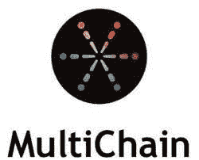

# 为什么多链在区块链生态系统中意义重大？—区块链 Shiksha

> 原文：<https://medium.com/codex/why-multichain-is-significant-in-the-blockchain-ecosystem-blockchain-shiksha-eb5c9f1a2d8a?source=collection_archive---------26----------------------->

直到最近十年，区块链一直以其紧密团结的群体和排他性为特征。政府、组织、机构投资者和个人都开始接受这个不断扩大的舞台。多链解决方案将把区块链行业从一个“有趣的新技术”转变为一个重要的高增长行业。本文将讨论什么是多链以及为什么它是必要的。

MultiChain 是一个开源的区块链平台，允许用户构建和部署在企业内部或跨企业工作的私有区块链应用程序。

该平台带有一个简单的 API 和命令行界面，可用于进行金融交易。权限管理、数据流、本机资产、数据流和简单的每链设置只是多链中包含的部分功能。

企业应用程序受益于这些在可伸缩性、保密性、集成和法规遵从性方面的高端功能。

作为一个轻量级的专用网络，使用开发人员友好的通用工具进行设置和管理非常简单。它支持多种编程语言，如 Ruby、Python、JavaScript、C#和 PHP。

用户可以在网络上生成本地令牌或资产，并在利益相关方之间传递它们。

[MultiChain](https://multichain.org/) 是一个现成的平台，因为它扩展了比特币协议和比特币核心 API，以反映比特币的一些功能。这种独特性使其能够兼容为比特币构建的各种工具和开源代码，如软件库、在线浏览器、移动钱包和硬件安全设备。网络上的节点只需要连通性，而不是同质性。

该系统意味着所有安装该程序的参与系统被连接在一起形成多链网络，该网络可以在一个公司内部或公司之间，并共享相同的交易数据库。

# 为什么用户需要多链？

一群程序员在 2014 年决定构建一个类似于比特币但更适合受控生态系统的数据库。软件企业 Coin Sciences 是第一个尝试比特币 2.0 的企业，该举措被称为 Coin Spark。

硬币火花项目失败后，硬币科学公司决定建造多链作为许可的区块链。MultiChain 是通过解决困扰比特币的可扩展性和膨胀问题来改善区块链技术的。MultiChain 通过集成的用户权限管理提供所需的隐私和控制，克服了采矿成本的相关挑战，并降低了与开放相关的风险。

硬币火花项目失败后，硬币科学公司决定建立多链作为一个许可的区块链。MultiChain 是通过解决困扰比特币的可扩展性和膨胀问题来改善区块链技术的。MultiChain 通过集成的用户权限管理提供所需的隐私和控制，克服了采矿成本的相关挑战，并降低了与开放相关的风险。

作为专用区块链，它通过限制每个块中共享的数据、删除无关数据和提高事务处理速度来确保网络的可扩展性。它还为组织提供了急需的项目隐私，因为区块链的活动只对选定的当事人开放。

挖掘区块的成本更低，因为它是通过委托而不是工作证明来完成的，尽管它是比特币网络的一个分支。因此，它比比特币的高能耗开采机制更环保。多链软件适用于金融系统和供应链解决方案，因为它的交易速度和直接的数据存储方法。

# 多链的重要性

携带特定元数据的网络事务在多链中用于授予和撤销权限。所有权力，包括管理其他用户特权的管理员权利，立即被授予初始“genesis”块的矿工。第一个管理员可以将挖掘职责分配给任何网络利益相关者，转移资产所有权，并与任何其他节点共享网络的数据库或流。

通过对事务中大量数据的散列进行编码，而不是对数据本身进行编码，可以减小块的大小。每段数据的解密密钥只与那些应该看到它的人共享。

与比特币挖掘不同，在比特币挖掘中，节点必须解决一个数学难题，任何被允许的节点都可以在随机超时后生成新的区块，这取决于多样性参数。MultiChain 使用一个挖掘多样性参数来实现该方案，限于 0 挖掘多样性 1。

默认情况下，交易费和区块奖励固定为 0 美元，因此，除了区块链无缝运营的一般利益之外，矿工不需要为提供该服务而获得报酬。网络成员可以用当地货币补偿矿工，以换取令牌化资产。

**可扩展性:**多链使用多链数据存储方法来解决可扩展性难题。根据您的偏好，发布到流的每个数据项可以是链上的或链外的。多链(TPS)每秒可处理多达 2000 笔交易。它从不重复每个节点的数据。

**最终想法:**多链企业为企业应用提供了复杂的区块链技术，包括可扩展性和高交易速度，以及与许多区块链连接和交互的能力。可以假设，获得许可的区块链在受监管的金融行业中是有价值的，银行等公司也开始雇佣它们。

尽管设置专用区块链的成本很高，尤其是在早期阶段，但多链要求您在每次交易之前建立每个节点。无论如何，MultiChain 被广泛认为是最棒的企业区块链应用之一。多链计划被一百多个组织用于金融交易。

请随意在下面的方框中添加您的观点。团队区块链 Shiksha 很乐意与您合作。

*原载于 2022 年 5 月 5 日*[*【https://blockchainshiksha.com】*](https://blockchainshiksha.com/multichain-in-the-blockchain/)*。*