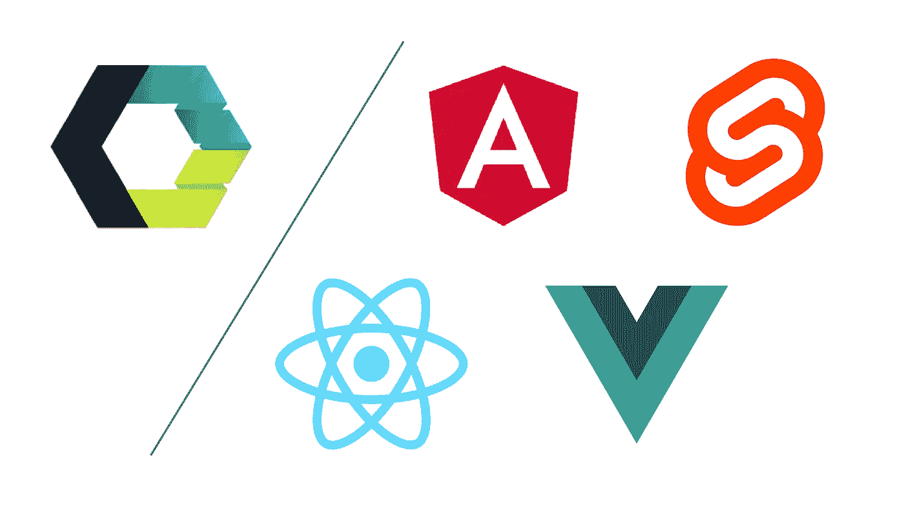

# 为什么要学习 React、Angular、VueJs 和 Svelte 的 Web 组件？

> 原文：<https://medium.com/codex/why-one-would-learn-web-components-with-react-angular-vuejs-and-svelte-around-d992cf38ea29?source=collection_archive---------9----------------------->

我最近发布了我的“[Web 组件简介](https://beforesemicolon.medium.com/intro-to-web-components-full-walkthrough-623023d365f1)”，一些人询问实际学习 Web 组件的好处，因为我们仍然有流行的 JavaScript 库和框架可以更好地解决 UI 组件，而不那么笨重。