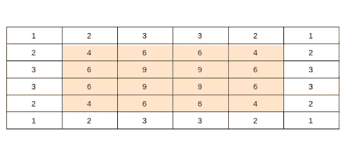
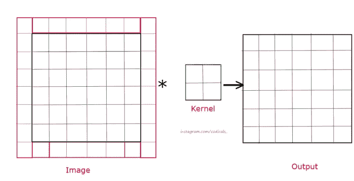

# 为什么填充在卷积神经网络(CNN)中很重要

> 原文：<https://medium.com/codex/why-padding-is-important-in-convolutional-neural-network-cnn-8cf7e9e38ca8?source=collection_archive---------6----------------------->

在解决大多数计算机视觉问题时，一个重要的任务是收集图像(数据集)。每个图像都有不同的形状，但是为了在这些图像上训练我们的模型，我们需要所有的图像都是一个形状。

## 是的，你是对的，我们可以把我们所有的图像重塑成一个形状，我们可以做到，但是有一个问题，让我们来理解这个问题。

图片来源:谷歌照片

图片来源:谷歌照片

假设您正在构建一个猫或狗的分类器，您从 google 下载了一些图像，在观察这些图像时，您注意到一些图像是矩形或正方形的，因此您决定将所有的图像都整形为正方形。

现在请记住，您正在将矩形图像重塑为方形图像，因此矩形图像将被压缩，也许狗或猫的腿的脸会变得比平时更大，也许它们的身体会变瘦，并且会发生更多的事情。

图片来源:谷歌照片

> 这个问题有解决办法…

# 填料

在外行人看来，语言 ***填充是在图像矩阵被处理的同时向其添加零。***

我们简单了解一下，

> 注意:现在我将使用内核的参考，如果你不知道它们，那么你可以阅读我的[以前的博客](/codex/kernels-filters-in-convolutional-neural-network-cnn-lets-talk-about-them-ee4e94f3319)或
> 给像我一样懒惰的人:**内核是一个移动输入数据的矩阵**

当 3×3 内核在 6×6 大小的图像上移动时，它给我们 4×4 大小的输出矩阵。

下图显示了 3 x 3 内核在单个像素(元素)上移动的次数。下图中的彩色部分告诉我们，图像中间部分的内核移动次数比边缘部分多。因此，输出矩阵将比边缘更了解图像的中间部分，我们可能会丢失边缘的一些重要特征。

内核在图像上移动的次数

# 这个问题的解决方案是增加一个维度，这意味着一个 6 x 6 大小的图像将变成 7 x 7 大小。

现在问题又来了，该给这个维度添加什么值呢？

输入矩阵是一个图像，所以它有从 0 到 255(颜色范围)的值，但是如果我们从这个范围添加随机值，那么它将是图像的一部分，内核将提取不必要的信息。所以我们会加上 0 或 255 个值(0 代表黑色，255 代表白色)。

> 注意:输入矩阵是 7 x 7 大小，内核是 3 x 3 大小，因此输出矩阵将有 6 x 6 大小，这意味着输出矩阵将具有图像的大部分特征。

## 如果你在调整图片形状时使用了填充，那么每张图片上会有一个额外的尺寸，这将有助于正确地调整图片的形状。

Ok 明白了，添加额外维度；但是如何决定增加多少维度呢？

决定有一个公式

> 填充尺寸=(内核尺寸-1) / 2

## 敬请关注，继续学习