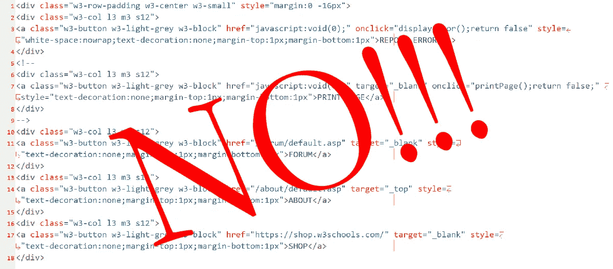

# 为什么 HTML/CSS 的表示类是无知的垃圾

> 原文：<https://medium.com/codex/why-presentational-classes-for-html-css-are-ignorant-garbage-bcfdb02ec397?source=collection_archive---------4----------------------->

## [法典](http://medium.com/codex)

大多数人是“视觉导向型”的。他们喜欢在考虑其他事情之前先考虑事情的发展。对于 web 开发来说，这是一个很难打破的“习惯”,但是考虑到 HTML 不仅仅是为视力良好的用户设计的，这是一个很重要的习惯。这就是为什么像艺术家一样的低音部胡说八道在他们的错觉下…