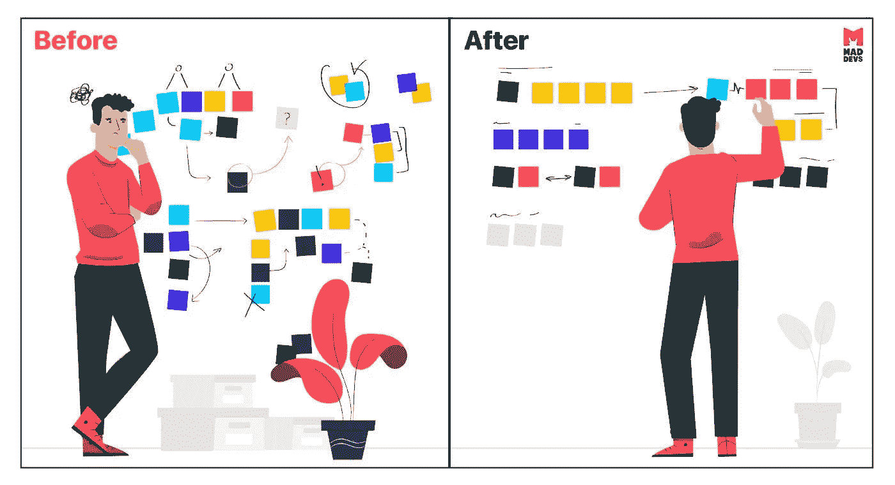

# 为什么重构不可避免

> 原文：<https://medium.com/codex/why-refactoring-is-inevitable-22df14dbd543?source=collection_archive---------10----------------------->

上周，一个开发人员说他需要更多的时间来重构他的代码，没有任何延迟，scrum 大师跳了进来，问我们为什么需要重构，因为代码是在最后一个 sprint 中写的？(虽然 SM 做得非常优雅，但房间里出现了尴尬的沉默)开发人员尽力解释这个场景，但老实说，这不是很有说服力。

我同情他，因为我以前也遇到过类似的情况，更糟糕的是，我从我的经理那里得到了粗略的反馈，要求给我更多的时间进行重构，从那以后，我通常都是私下进行重构😛。

> 《禅与艺术系统分析》这本书以“*代码、代码、代码、重构、重构、重构、代码、代码、代码”*的口头禅来谈论重构和重构的必要性

通过阅读这本书和上面的情况，我回顾了我的过去，我是如何进入那些情况的，下面是我的发现。

# 为什么我一点都不惊讶？

当我们开始着手一个新项目时，我们会经历头脑风暴、理解需求和提出尽可能完美的设计的常规程序😉！！！！！然后，我们进入执行模式，在此期间，意外情况会发生，我们会发现新的案例，会有最后一分钟的需求变更，更糟糕的是，我们会发现更好的设计原则，这些原则可能更适合我们的案例😮。
虽然我们在设计阶段和精疲力尽的头脑风暴会议中把所有的艰苦工作放在前面，但不知何故我们陷入了同样的境地，设计中的某些东西必须改变，以使其更具适应性、可读性和可测试性*。*

> **系统设计和执行阶段就像恋爱，你将处于发现、探索和完成事情的情绪中，这将是非常令人兴奋的，但维护就像婚姻，如果应用程序没有建立在适当的基础上，系统中的任何变化都可能成为噩梦。**

# *这不是实际的问题*

*我们不能责怪任何人，因为这在软件开发的生命周期中是意料之中的。毕竟，我们在执行阶段更接近系统，当我们更接近时，我们倾向于发现未知的东西。这很正常，这就是为什么我们遵循敏捷方法并雇佣有活力的人，因为事情可能在最后一刻发生变化。*

# *真正的问题是*

*但是我认为真正的问题不是发现了执行阶段的变化，而是没有认识到这是一种常态。真正要做的是接受新的变更，并想办法确定变更是否适合现有设计，或者是否需要在设计层面上进行更多的变更，以改善系统。*

*相反，通常发生的情况是，开发人员被指责没有积极主动地预见到这样的变化。正因为如此，大多数开发人员将这样的场景隐藏起来，让系统腐烂，更糟糕的是，他们不考虑系统，总是想方设法责备或指责别人。
必须遵守截止日期，所以顺便说一下，做临时修复来修补现有设计中的变化是好的，但真正真正的问题是我们没有花额外的时间来修复系统的整体设计。*

> **我不认为当 scrum 大师在的时候，我的向我询问重构时间的队友会再提起这个话题。**

# *影响*

*我们应该永远记住，我们已经和我们的应用程序结了婚，并将和它们一起生活很长一段时间；因此，修复错误、添加功能、提高性能始终是旅程的一部分，我们必须不时地花时间来构建它，否则应用程序将开始以意想不到和不可预测的方式运行，这将再次给我们的技能组合打上一个大大的问号。*

# *通往山的众多路径之一*

*有许多方法可以解决这个问题，我的方法是使重构成为规范，为了实现这一点，领导应该做好向利益相关者解释重构的重要性，并使开发人员容易获得重构的额外时间，这就像给了第二次机会，开发人员会泪眼汪汪地接受它。
当然，人们不应该认为这是理所当然的，这也是领导允许合法案件和严格要求懒惰的责任。
这项活动将帮助开发人员纠正他们为快速执行所犯的错误，并且从长远来看也有助于维护应用程序的健康。*

*一如既往，说起来容易做起来难，总会有高优先级的业务需求与技术债务，这两者都是应用程序的阴阳☯️，有必要找到中间路径，以便找到平衡并保持平静。*

# *结论*

*我写这篇文章想要达到的目的是解释重构对于不同角色的重要性*

*你将会与之相处一段时间，所以勇敢一点，争取必要的时间来重构以完善系统，否则你就是受害者。*

***领导和经理**——如果我们不给开发人员重构的时间，并开始指责他们，你正在创造一种恐惧的文化，人们将不再承担责任。*

***利益相关者**——像任何产品一样，不可能一开始就想通所有的事情，同样，软件本身也必须进化以符合我们的需求，因此 ***重构是不可避免的。****