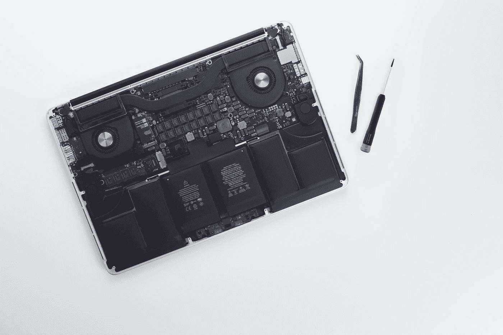

# 电脑为什么要升级？

> 原文：<https://medium.com/codex/why-should-computers-be-upgradable-cea9ee707c17?source=collection_archive---------9----------------------->

## 电脑不是神奇的互联网盒子

尼古拉·切尔尼琴科在 [Unsplash](https://unsplash.com?utm_source=medium&utm_medium=referral) 上拍摄的照片

近年来，笔记本电脑越来越不容易维修，越来越容易处理。苹果焊接他们笔记本的内存和存储。一些制造商在他们的一些机器中焊接 RAM。这不是一个好趋势。相反，我认为这是一种反用户、反消费者的模式，它只服务于…