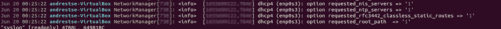
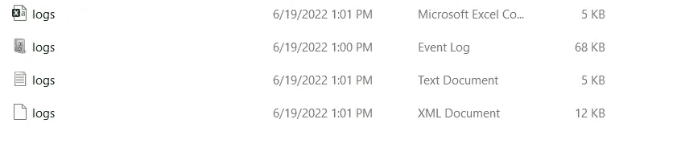
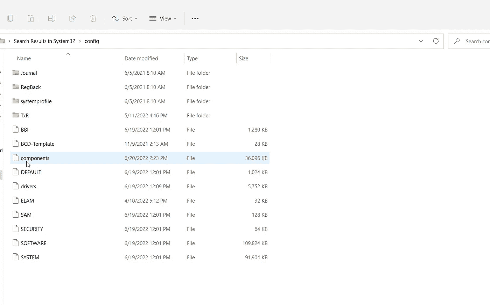
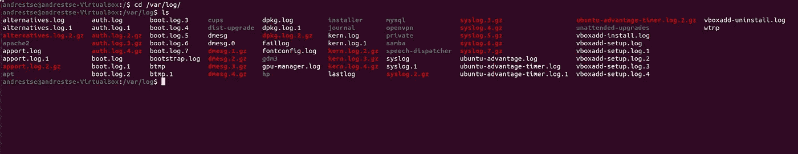
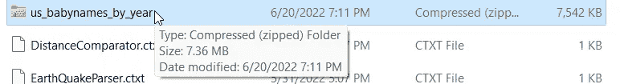
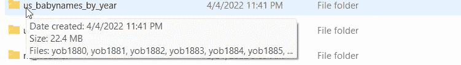

# 网络安全为什么要关心日志？

> 原文：<https://medium.com/codex/why-should-we-care-about-logs-in-cybersecurity-11f85afa88df?source=collection_archive---------12----------------------->

**什么是日志？**

实际上，日志是记录特定事件、发生时间、发生位置以及与事件相关的其他信息的文件，具体取决于配置的参数。对于安全性和故障排除来说，这些是绝对重要的——无论我们是查看过去的日志来确定违规的根本原因，还是查看最近的日志来确定操作是否正常运行，日志都会告知我们系统中发生的事件，并且是让我们了解情况的关键。

位于/var/log/syslog 中的日志

**日志格式**

日志可以有多种格式。如果您的日志来自**窗口事件查看器**，您可以利用*。csv* ，。 *XML* ，*。evtx* 和*。txt* 扩展名。

在 Windows 机器上存储日志时，可以使用不同的扩展。

另一方面，如果您使用的是 **Linux** 系统，日志通常会有*。日志*扩展。

Ubuntu 上的日志文件

在哪里可以找到我的日志？

在 Windows 环境中，事件日志通常会存储在***C:\ Windows \ system32 \ config***文件夹中。请注意，要修改、查看或编辑日志文件，您需要提升权限。

C:\Windows\system32\config 文件夹

在 Linux 环境中，日志通常会存储在 ***/var/log*** 路径中。同样的逻辑也适用于这里——根据日志文件的不同，您需要适当的权限来读取和/或修改它。

包含日志文件的/var/log/文件夹

日志记录发生在哪里？

在企业环境中，网络中的几乎所有设备都可以被记录。从工作站、端点、路由器、交换机、防火墙和代理到 IOT，日志记录是了解这些系统中到底发生了什么的非常有效的工具。但是，一定要突出 ***质量日志*** 的重要性。

记录与您的目标无关的事件会导致*噪音，*噪音通常弊大于利。你当然不希望为了找到对你有帮助的东西而去翻很多不相关信息的文件。就磁盘存储而言，这也是非常昂贵的，我们将在接下来讨论这一点。

目标应该始终是记录重要的事件——指示操作是否按预期运行的事件、异常流量等等。

**记录日志时使用了多少磁盘存储空间？**

根据组织和所用设备的不同， **EPS** (每秒事件数)的数量会有所不同。例如，平均而言，Windows 工作站的 **EPS** 为 **1.0** ，这表示每秒一个事件，而防火墙的 **EPS** 为**10.0–50.0**，这表示每秒 10–50 个事件。

然而，在做这些决定时考虑高峰时间也是很重要的，因为通常在那些时间会发生一些不寻常的事情。要想知道在某一天你将利用多少空间，你可以使用下面的公式:

*EPS(每台设备)* 86，400(一天中的秒数)* 600(平均原始单个事件的大小，以字节为单位)* =考虑到事件以其**原始**形式存储，给定日期和单个设备的未压缩日志文件的大小，以字节为单位。

*EPS(每台设备)* 86，400(一天中的秒数)* 1500(平均标准化单个事件的大小，以字节为单位)* =给定一天单个设备的未压缩日志文件的大小，以字节为单位，考虑到事件是以其**标准化**形式存储的。

所以，你可能会问自己，一个 ***原始事件*** 和一个 ***正常化事件*** 有什么区别？

规范化事件本质上是原始事件的修改版本。原始事件的内容被重新组织，并添加了额外的信息，以便安全管理员能够更好地阅读和理解该事件。这是一个非常重要的步骤，可以确保日志提供正确保护系统所需的信息。但是，与原始事件相比，规范化事件的字节数更多。

**压缩**

以未压缩的形式存储这些日志文件会占用大量存储空间。因此，我们必须利用压缩来减少存储磁盘需求。8:1 的比率可能是一个很好的起点，但考虑到对 SIEM 系统的影响、标准化数据量与原始数据量等变量也很重要。

压缩文件夹大小

未压缩的文件夹大小

**总结**

日志是网络安全操作的一个重要元素。如果执行得当，日志记录可以让我们清楚地看到系统中正在发生或已经发生的事情，让我们能够更精确地证实事件，并根据需要进行调整。如果我们要从这个过程中获取价值，了解在哪里记录什么是至关重要的。就所需的存储磁盘而言，日志记录的成本可能很高，因此考虑各种因素(EPS、NEs(正常事件)、PEs(峰值事件)、标准化和原始事件、压缩率、设备数量、潜在扩展空间、增长空间等)非常重要。)将磁盘空间资源分配给日志文件时。