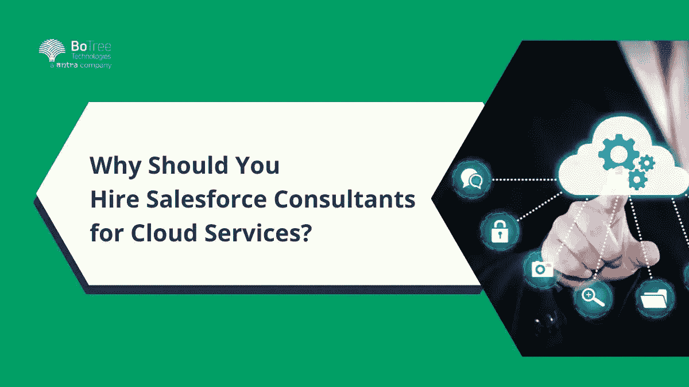

# 为什么您应该为云服务雇佣 Salesforce 顾问？

> 原文：<https://medium.com/codex/why-should-you-hire-salesforce-consultants-for-cloud-services-f61cd4d5b3d0?source=collection_archive---------11----------------------->

# 简介:sales force CRM for Business Efficiency

技术世界节奏快，千变万化。随着企业不断发展并适应新的工作方式，技术在企业运营中的作用也在不断扩大。企业需要利用更新的技术来领先于竞争对手并满足客户的需求。

这就是 Botree 等[软件开发公司](https://www.botreetechnologies.com/)提供的云服务发挥作用的地方阅读更多:Salesforce RPA 集成:综合指南技术派上用场了！云服务是企业简化流程、削减成本和释放 IT 资源用于其他项目的绝佳方式。这些服务还为公司数据提供了更长的正常运行时间和更高的安全性，鉴于如今企业保留了大量的个人信息，这一点至关重要。

Salesforce 无疑是当今使用最广泛的业务编程阶段之一。对于希望始终如一地处理其业务安排的组织，Salesforce 提供了大量的项目和管理—这正好可以做到。

一个[软件解决方案](https://www.botreetechnologies.com/blog/what-services-does-a-software-development-firm-provide/)只是你与客户良好关系的一小部分。借助 [Salesforce 开发服务](https://www.botreetechnologies.com/blog/salesforce-integration-services/)，您可以定制和集成技术以提高生产力和利润。对于组织来说，这是在云结构中处理其 CRM、展示和每个信息的一站式解决方案。

> **阅读更多:** [**Salesforce RPA 集成:全面指南**](https://www.botreetechnologies.com/blog/rpa-implementation-in-salesforce-a-comprehensive-guide/)

尽管如此，如今许多组织无法利用应用程序带来的优势。你可以想一想，什么结果很糟糕？他们的 Salesforce 执行中可能会有什么瑕疵？首先，产品的大小和亮点意味着某种东西:它很可能试图配置、引入、跟上和使用。

因此，考虑雇佣一个有准备的、有经验的销售专家来帮助你利用 CRM 绝对不是一个糟糕的想法。如果你是一家独立的[企业](https://www.tntra.io/ventures)或者是一家拥有大量员工的大型企业，招聘具有关键程度的参与度、专业技能和知识的专家会让你的企业发展起来。这是一种可靠且经济的方法，但你可能会问我们。

无论你是刚刚开始寻找，还是已经考虑了一段时间，雇佣[sales force consulting services](https://www.botreetechnologies.com/salesforce-consulting-services)都有充分的理由让你的企业受益。如果您准备好利用云服务将事情提升到一个新的水平，或者想要一些帮助，请继续阅读，了解他们可以为您做什么！

在这篇文章中，我们分析了为什么你的企业应该立即向销售专家投入资源的原因。尽管如此，在努力看到每一个优势之前，我们应该把 Salesforce 作为一个阶段来研究。

# 雇佣 Salesforce 咨询服务的好处

*   **为问题提供高效的解决方案**
*   如果您的组织使用多个系统，可能很难在需要时找到数据。您的团队正确使用和访问各种系统的能力也可能存在问题。当你[雇佣一个 salesforce 顾问](https://www.forcetalks.com/top-salesforce-consultants/)来帮助你转换到一个单一的、统一的系统，比如云服务，这些问题可以得到缓解。
*   您将能够访问您需要的数据，而无需与多个系统和方法进行斗争。您还可以利用 Salesforce 提供的许多报告和分析工具，这些工具可以帮助您识别模式并在更大范围内做出更明智的决策。
*   如果您的企业使用多个系统，您可能会遇到数据集成问题。这可能会导致您的团队在数据输入上花费太多时间，并使其难以有效地使用数据。
*   在[企业软件开发公司](https://www.botreetechnologies.com/enterprise-software-development-company)的帮助下，像 Salesforce implementation 这样的单一统一系统可以帮助您的团队减少花费在数据输入上的时间。您无需登录多个系统或使用多个用户 id 就可以访问您需要的信息。
*   **预测并减轻风险**
*   在您做出将对您的组织产生重大影响的决策之前，考虑所有可能的风险以及您将如何减轻这些风险是至关重要的。例如，云的风险之一是您的数据存放在不受您组织控制的服务器上。
*   如果您的数据存储在本地(即您自己的数据中心)，它会更安全，但切换到 Salesforce 等基于云的[解决方案](https://www.tntra.io/case-studies/freight-forwarding)将意味着它不再在您的控制之下。
*   Salesforce 顾问可以帮助您应对这一风险，方法是权衡将数据保留在本地与迁移到云的利弊，并找到解决方案来应对在云中托管数据带来的网络安全风险。
*   通过考虑风险，你可以做出明智的决定，并在风险发生时更好地准备如何管理它们。
*   **评估您现有的平台**
*   在转向云服务之前，您需要评估您现有的平台，以确定它是否仍然适合您的业务。并非所有的 CRM 平台都是平等的。您应该考虑许多不同的因素，例如系统的可伸缩性、功能、支持选项和成本。
*   虽然这听起来像是一个简单的任务，但要完全理解您当前的系统却是一个挑战。为了更好地了解您当前的系统，您应该考虑以下问题:—系统的核心功能是什么？主要特点和优势是什么？—系统的局限性是什么？
*   salesforce 顾问可以帮助您评估您当前的平台，并深入了解它与 [Salesforce](https://www.botreetechnologies.com/blog/rpa-implementation-in-salesforce-a-comprehensive-guide/) 的对比情况，以便您做出明智的决策。如果你决定坚持使用当前系统会更好，顾问可以帮助你计划如何过渡到新的解决方案。
*   **提高投资回报**
*   尽管确保 Salesforce 是您组织的正确解决方案是至关重要的，但确保您从投资中获得最大收益也是至关重要的。
*   salesforce 顾问可以帮助您彻底探索您的选择，并为您的组织确定最佳计划。它们还可以帮助您找到节省实施成本的方法，例如通过优化您的架构或利用您的现有资产。
*   正确使用云服务可以从您的技术中获得更多收益，从而提高您的投资回报率(ROI)。您可以减少团队花费在数据输入上的时间，确保数据的准确性，并访问更多数据。
*   **提高客户参与度**
*   消费者对企业的要求越来越高，这关系到他们如何与品牌打交道。如果你的企业使用过时的沟通方式，与利用新技术吸引客户的品牌相比，你将处于劣势
*   salesforce 顾问可以帮助您确定使用云服务与客户互动的最佳方式。例如，实施[实时聊天解决方案](https://www.tntra.io/case-studies/music-chat-application)可以帮助您的客户获得问题的答案，而不必等待支持票。此外，salesforce 顾问还可以帮助您跟踪客户互动，更深入地了解您的客户，以创建更个性化、更吸引人的营销活动。

> **阅读更多:** [**Salesforce 和 AWS:哪个技术更好？**](https://www.botreetechnologies.com/blog/salesforce-vs-aws/)

# 结论

如你所见，雇佣 Salesforce 顾问有很多好处。一位经验丰富的顾问可以根据您组织的需求、资源和预算，帮助您权衡从另一个系统切换或实施 Salesforce 特定功能的利弊。你也可以从这些顾问的专业知识中获益。如果您正在探索将您的业务迁移到云或使用其服务作为您的混合解决方案的一部分，雇用 salesforce 顾问可能是最好的决定。

*原载于 2022 年 12 月 12 日 https://www.botreetechnologies.com***。**