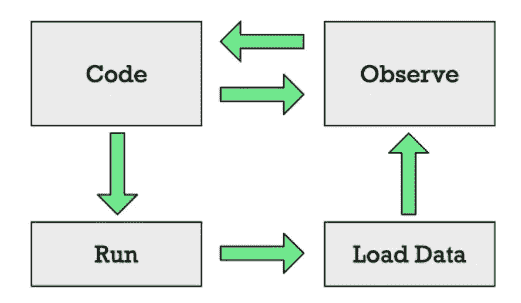
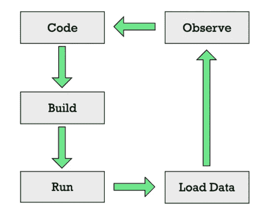

# 你为什么要和 Julia 一起编程？

> 原文：<https://medium.com/codex/why-should-you-program-with-julia-76dd8d3600c6?source=collection_archive---------2----------------------->

## 文章

## *摘自埃里克·恩海姆著* [*茱莉亚作为第二语言*](https://www.manning.com/books/julia-as-a-second-language?utm_source=medium&utm_medium=referral&utm_campaign=book_engheim_julia_3_10_22)

**

**本文涵盖:**

*   *朱莉娅解决什么类型的问题。*
*   **静态类型语言的局限性。**
*   **为什么这个世界需要快速的动态类型语言。**
*   **Julia 如何提高程序员生产力。**

*如果你对 Julia 语言及其优点和缺点感兴趣，请阅读它。*

*在[manning.com](https://www.manning.com/books/julia-as-a-second-language?utm_source=medium&utm_medium=referral&utm_campaign=book_engheim_julia_3_10_22)结账时，在折扣代码框中输入 **fccengheim** 即可享受 25%的折扣。*

*你可以从数百种编程语言中进行选择，其中许多语言远比 Julia 更有名。那为什么选朱莉娅呢？简而言之，Julia 具有广泛的应用，许多功能，并且易于学习和使用。它非常适合数据科学、复杂的线性代数、数据挖掘和机器学习，但是您还可以用它做更多的事情。*

## ***朱莉娅是什么？***

*Julia 是一种通用的多平台编程语言，它:*

*   *是数字*
*   *是动态类型的*
*   *具有自动内存管理(垃圾收集)*
*   *是高性能和实时编译的(JIT)*

*好吧，这是很多，有些事情听起来很矛盾。Julia 怎么可能是一种通用语言，而且也是为数值编程量身定做的？它是通用的，因为像 Python 一样，Julia 可以用于几乎任何事情。它是数值型的，因为像 Matlab 一样，Julia 非常适合数值编程。*

## ***静态类型语言和动态类型语言的优缺点***

*让我们关注 Julia 的一个方面:它是动态类型的。通常编程语言分为两大类:*

*   *动态类型化*
*   *静态类型的*

> *“在静态语言中，表达式有类型；在动态语言中，值是有类型的。”*

*—斯蒂芬·卡尔平斯基，朱莉娅的创造者*

*静态类型语言的例子有 C/C++、C#、Java、Swift、Go、Rust、Pascal 和 Fortran。在静态类型语言中，在允许程序运行之前，会对所有代码执行类型检查。*

*动态类型语言的例子有 Python、Perl、Ruby、JavaScript、Matlab 和 LISP。动态类型语言在程序运行时执行类型检查。不幸的是，动态类型语言往往非常慢。*

*在动态语言中，诸如数字、字符和字符串之类的值都有附加的标签，表明它们是什么类型。这些标签使得用动态类型语言编写的程序在运行时检查类型正确性成为可能。*

*Julia 与众不同，因为它既是一种动态类型语言，又是一种高性能语言。对许多人来说，这是一个矛盾。Julia 的这一独特特性之所以成为可能，是因为该语言是专门为实时(JIT)编译而设计的，并为所有函数调用使用了一个名为*多重调度*的特性。C/C++和 Fortran 等语言使用超前(AOT)编译。使用 AOT 编译，编译器在程序运行前将整个程序翻译成机器码。其他语言，如 Python、Ruby 和 Basic，使用解释器。使用解释语言，程序读取源代码的每一行，并在运行时解释它来执行指令。*

*现在你对朱丽亚是哪种语言有了一些概念，我们可以开始谈论朱丽亚的吸引力了。*

## ***茱莉亚集优雅、生产力和性能于一身***

*虽然性能是 Julia 的关键卖点之一，但当我在 2013 年第一次发现 Julia 时，引起我注意的是它是如何经过深思熟虑、功能强大且易于使用。我有一个用几种语言重新编写的程序，用来比较每种语言的表达性、易用性和高效性。和 Julia 一起，我设法做出了这段代码最优雅、最简洁、最易读的变体。从那以后，我尝试了许多编程语言，但从未接近我和 Julia 一起达到的水平。这里有几个简单的例子，让你对 Julia 的表现力有所了解。*

***清单 1。朱莉娅的俏皮话***

```
*filter(!isempty, readlines(filename)) # strip out empty lines
 filter(endswith(".png"), readdir())   # get PNG files
 findall(==(4), [4, 8, 4, 2, 5, 1])    # find every index of the number 4*
```

*自从 20 世纪 90 年代开始编程以来，我有过厌倦编程的时期。朱莉娅帮助我重新获得了编程的乐趣。一部分原因是，一旦你掌握了 Julia，你会觉得你有了一种对你有用而不是对你不利的语言。我想我们很多人都有过这样的经历:在解决一个问题的时候，我们有一个很好的解决方法，但是我们使用的语言妨碍了我们。语言的局限性迫使我们不得不拼凑出不优雅的解决方案。有了 Julia，我可以用我想要的方式构建软件，而不用语言设置障碍。*

*另一个增加您的生产力和乐趣的方面是 Julia 附带了一个丰富的标准库。你一路狂奔。你可以做很多事情，而不需要在网上搜寻一些你想做的库。Julia 为您介绍了您是否想做线性代数、统计、HTTP、字符串操作或处理不同的日期格式。如果您想要的功能不在标准库中，Julia 有一个紧密集成的包管理器，使添加第三方库变得轻而易举。*

*为 Julia 编程几乎会让你感到内疚或被宠坏，因为你可以在不影响性能的情况下构建丰富而优雅的抽象。*

*Julia 的另一个重要优点是简单易学。随着时间的推移，这种轻松的学习帮助 Julia 获得了一个更大的社区。要理解为什么 Julia 容易学，考虑一下用 Julia 写的无处不在的“hello world”程序:*

```
*print("Hello world")*
```

*运行时，该代码将文本“hello world”写入屏幕。虽然微不足道，但许多语言需要大量复杂的搭建来完成如此简单的事情。这是一个做同样事情的 Java 程序:*

```
*public class Main {
     public static void main(String[] args) {
         System.out.print("hello world");
     }
 }*
```

*这让初学者一下子接触到更多的概念，这可能会让人不知所措。Julia 更容易学，因为我们可以一次专注于学习一个概念。您可以学习编写一个函数，而不必查看类型定义。有了大量现成可用的功能，您甚至不需要知道如何导入外部库来编写有用的代码。*

## ***为什么朱莉娅被创造出来***

*为了真正理解朱丽亚带来了什么，我们需要更好地理解*为什么*朱丽亚首先被创造出来。Julia 编程语言的创造者想要解决所谓的“T4”双语问题。*

*它指的是很多软件是用两种不同的编程语言编写的，每种语言都有不同的特点。在科学领域，机器学习和数据分析动态语言通常是首选。然而，这些语言通常不会给出好的性能。因此，解决方案经常需要用更高性能、静态类型的语言重写。但是为什么会存在这种偏好呢？为什么不用传统的高性能静态类型语言来编写所有东西呢？*

## *科学家需要动态类型语言提供的交互式编程*

*科学家开始用 Fortran 语言[【1】](https://freecontent.manning.com/why-should-you-program-with-julia/#id_ftn1)编写大型天气模拟软件，用 C 或 c++[【3】](https://freecontent.manning.com/why-should-you-program-with-julia/#id_ftn3)编写神经网络[【2】](https://freecontent.manning.com/why-should-you-program-with-julia/#id_ftn2)等软件。这些语言提供了处理大型问题所需的性能。然而，性能是有代价的。这些语言往往僵化冗长，缺乏表现力，所有这些都降低了程序员的生产力。*

*然而，最根本的问题是这些语言不适合交互式编程。我这么说是什么意思？交互式编程意味着编写代码和获得即时反馈的能力。*

*交互式编程在数据科学和机器学习中非常重要。在典型的数据分析过程中，数据是由开发者将大量数据加载到交互式编程环境中来探索的。然后，开发人员对这些数据进行各种分析。可能是寻找平均值和最大值。它可能在绘制直方图。第一次分析的结果告诉程序员下一步应该做什么。*

*图 1 用动态类型语言展示了这个过程。首先运行代码，加载数据，然后可以观察数据。但是，在更改代码之后，您不必经历这整个过程。您可以更改代码并立即观察更改。不需要再次加载海量数据。*

**

*图一。在动态类型语言中，我们可以在编码和观察之间来回切换。大型数据集不需要重新加载到内存中。*

*让我们将这种体验与使用静态类型语言(如 Fortran、C/C++或 Java[【4】](https://freecontent.manning.com/why-should-you-program-with-julia/#id_ftn4))进行对比。开发人员将编写一些代码来加载数据并探索它，而不知道数据看起来像什么。然后，他们必须等待程序:*

1.  *编制*
2.  *发动*
3.  *加载大量数据*

*此时，开发人员会看到数据和统计数据的图表，这为他们提供了选择下一个分析所需的信息。但是选择下一个分析需要再次重复整个循环。每次迭代都必须重新加载大数据块。这使得每次迭代都非常慢。这减慢了整个分析过程。这是一种静态的、非交互式的编程方式。*

**

*图二。静态类型语言需要重复整个循环。*

## *其他领域的开发者也需要动态类型语言提供的交互性*

*这个问题不是科学家独有的。游戏开发者长期以来面临着同样的问题。我们所说的游戏引擎，通常是用 C 或 C++等可以编译成快速机器码的语言编写的。软件的这一部分通常会做一些很好理解和定义的事情，比如在屏幕上绘制对象，并检查它们是否相互碰撞。*

*就像数据分析师一样，游戏开发者有很多代码，这些代码需要多次迭代才能令人满意。特别是开发好的游戏需要大量的实验和迭代。人们必须调整和改变游戏中角色行为的代码。地图或关卡的布局需要反复试验才能正确。由于这个原因，几乎所有的游戏引擎都使用第二种语言，这种语言允许动态修改代码。通常这些是用诸如 Lua[【5】](https://freecontent.manning.com/why-should-you-program-with-julia/#id_ftn5)、JavaScript 或 Python[【6】](https://freecontent.manning.com/why-should-you-program-with-julia/#id_ftn6)这样的语言编写的。*

*有了这些语言，游戏角色和地图的代码可以改变，而不需要重新编译和加载地图、关卡和角色。因此，人们可以尝试玩游戏，暂停，修改代码，然后继续进行新的修改。*

*机器学习专业人士面临类似的挑战。他们建立预测模型，如神经网络，输入大量数据进行训练。这通常既是一门科学，也是一门艺术。要把它做好需要实验。如果每次修改模型时都需要重新加载训练数据，将会减慢开发过程。由于这个原因，诸如 Python、R 和 MATLAB 之类的动态类型语言在科学界变得非常流行。*

*然而，因为这些语言不是很快，所以它们与 Fortran 或 C/C++等语言成对使用，以获得良好的性能。tensor flow[【7】](https://freecontent.manning.com/why-should-you-program-with-julia/#id_ftn7)或 py torch[【8】](https://freecontent.manning.com/why-should-you-program-with-julia/#id_ftn8)等神经网络都是由 C/C++编写的组件组成的。Python 用于排列和连接这些组件。因此，在运行时，我们可以使用 Python 重新安排这些组件，而无需重新加载整个程序。*

*气候模型和宏观经济模型可能首先以动态语言开发，并在开发时在小数据集上测试。一旦模型完成，许多组织将雇用 C/C++或 Fortran 开发人员用高性能语言重写解决方案。因此，我们多了一个步骤，使开发过程变得复杂，增加了成本。*

## ***茱莉亚的高性能解决了双语问题***

*为了解决必须使用两种语言的问题，朱莉娅被创造了出来。它使得将动态类型语言的灵活性与静态类型语言的性能结合起来成为可能。这就是为什么我们喜欢说:*

> *“朱莉娅走路像蟒蛇一样。像 c 一样运行。”*

*—朱莉娅社区的流行说法*

*使用 Julia，许多领域的开发人员可以像使用 Python、Ruby、R 和 Matlab 等语言一样高效地编写代码。正因为如此，朱莉娅对这个行业产生了深远的影响。在 2019 年 7 月版的《自然》杂志中，有对各种科学家关于他们使用朱莉娅的采访。*

*例如，在墨尔本大学，通过将计算模型从 R 移植到 Julia，他们已经看到了 800 倍的改进。*

> *"你可以在一小时内完成原本需要几周或几个月才能完成的事情。"*

*— Michael Stumpf，系统生物学家 UOM*

*加州理工学院材料科学的 Jane Herriman 报告说，自从用 Julia 重写 Python 代码以来，运行速度提高了 10 倍。*

*在 2019 年的超级计算国际会议(SC19)上，Julia 的创造者之一艾伦·埃德尔曼(Alan Edelman)讲述了麻省理工学院(MIT)的一个小组如何用 Julia 重写了他们的 Fortran 气候模型的一部分。他们提前决定，他们可以容忍代码速度降低 3 倍。在他们看来，这是获得更高生产率的高级语言的一个可接受的折衷。相反，他们通过切换到 Julia 获得了 3 倍的速度提升。*

*这些只是当今大量关于 Julia 如何变革科学计算和高性能计算的故事中的几个。通过避免两种语言的问题，科学家们可以比以前工作得更快。*

## ***茱莉亚适合所有人***

*这些故事可能会给人一种错觉，认为朱莉娅只适合穿白大褂的聪明人。但是没有什么比这更偏离事实了。事实证明，使 Julia 成为科学家的优秀语言的许多特征也使它成为其他人的优秀语言。朱莉娅提议:*

*   *模块化和重用代码的强大工具。*
*   *一个严格的类型系统，有助于在代码运行时捕捉代码中的错误。*
*   *一个减少重复样板代码的复杂系统(元编程[【9】](https://freecontent.manning.com/why-should-you-program-with-julia/#id_ftn9))。*
*   *一个丰富灵活的类型系统，允许你对各种各样的问题建模。*
*   *一个装备良好的标准库和各种第三方库来处理各种任务。*
*   *伟大的字符串处理设施。这通常是任何瑞士军刀风格的编程语言的关键卖点。这就是 Perl、Python 和 Ruby 等语言最初流行的原因。*
*   *轻松与各种其他编程语言和工具接口。*

*虽然 Julia 的大卖点是它解决了两种语言的问题，但这并不意味着与现有 Fortran、C 或 C++代码接口的需求已经完全减轻。修复两种语言问题的要点是避免每次遇到性能问题时都必须编写 Fortran 或 C 代码。你可以全程跟着朱莉娅。但是，如果有人已经用另一种语言解决了您的问题，那么您可能没有必要用 Julia 从头开始重写解决方案。Python、R、C、C++和 Fortran 都有经过多年构建的大型包。朱莉娅社区不能在一夜之间取代那些。为了提高工作效率，Julia 开发人员需要能够利用现有的软件解决方案。*

*从长远来看，将遗留软件转移给 Julia 有一个明显的优势。维护旧的 Fortran 库比维护 Julia 库需要开发人员付出更多的努力。*

*最大的好处可能是朱莉娅提供的组合能力。有某些类型的问题需要构建大型的整体库。相比之下，Julia 非常适合制作小型库，这些库可以很容易地组合起来，以匹配其他语言的大型整体库所提供的功能。让我举一个例子。*

*机器学习为自动驾驶汽车、人脸识别、语音识别和许多其他创新技术提供了动力。机器学习最著名的包是 PyTorch 和 TensorFlow。这些包是由大型团队维护的巨大的整体。他们之间没有代码共享。Julia 有许多机器学习库，如 Knet、Flux[【10】](https://freecontent.manning.com/why-should-you-program-with-julia/#id_ftn10)和 Mocha[【11】](https://freecontent.manning.com/why-should-you-program-with-julia/#id_ftn11)。相比之下，这些图书馆很小。为什么？因为 PyTorch 和 TensorFlow 的能力可以通过**结合**Julia 中的多个小库来匹配。更多地解释为什么这是一个复杂的话题，需要对 Julia 和神经网络库如何工作有更深入的了解。如果你感兴趣的话，我在书里会谈到更多！*

*许多小库是一般应用程序的一个优势。任何构建任何类型软件的人都将受益于以多种新方式重用现有软件的能力，而不必重新发明轮子。对于遗留编程语言，人们经常不得不重复实现相同的功能。例如，TensorFlow 和 PyTorch 有许多重复的功能。Julia 通过在许多机器学习库之间共享的库中添加更多的功能来避免重复。随着您对 Julia 了解的越来越多，您将会越来越清楚它是如何做到这一点的，以及为什么这种能力在许多其他语言中很难实现。*

## *我能和茱莉亚一起打造什么？*

*原则上，你可以使用 Julia 来构建任何东西。然而，每种语言都有一个包的生态系统和一个社区，可能会比其他语言更能推动你进行其他类型的开发。朱莉娅也不例外。*

## ***理科的朱丽亚***

*朱莉娅在科学界有很强的影响力。例如，它用于:*

*   *计算生物学*
*   *统计数字*
*   *机器学习*
*   *图像处理*
*   *计算微积分*
*   *物理学*

*朱莉娅也被用于其他领域。例如，它被用于能源交易。美国美联储用它来建立复杂的宏观经济模型。诺贝尔奖获得者托马斯·J·萨金特创建了 QuantEcon，这是一个使用 Julia 和 Python 推进定量经济学教学的平台。他是 Julia 的强烈支持者，认为宏观经济学中的大问题很难用其他编程语言来解决。*

*在与 Lukas Biewald 的采访中，在谷歌工作的著名人工智能(AI)研究员 Peter Norvig 表达了他如何认为机器学习世界将从转向 Julia 中受益匪浅。*

> *"如果朱莉娅是人工智能的主要语言，我会更高兴."*

*—《T4 人工智能:现代方法》一书的作者彼得·诺维格*

*生命科学是朱莉娅的另一个明显的领域。到 2025 年，每年将收集 2–40eb 的人类基因组数据。大多数主流软件无法处理如此大规模的数据。你需要像 Julia 这样的高性能语言，它可以在各种硬件上以最高的性能处理各种格式。*

*朱莉娅也被发现在当代医学科学中。朱莉娅包装病原体用于模拟传染病，并被 COVID19 研究人员广泛使用。*

## ***朱莉娅的非科学用途***

*非科学的东西呢？朱莉娅还有许多其他兴趣的套餐:*

*   *genie——一个全栈 MVC web 框架。*
*   *blink——让您在 Julia 中制作电子 GUI 应用程序。*
*   *Gtk——用于使用流行的 Linux GUI 工具包 Gtk 制作一个 Julia GUI 应用程序。*
*   *QML——允许您使用 Qt GUI 工具包中使用的 QML 标记语言创建跨平台 GUI。*
*   *Game zero——面向初学者的游戏开发。*
*   *卢克索——绘制矢量图像。*
*   *米利都——写金融合同。*
*   *终端菜单—允许终端中的交互式菜单。*
*   *Gumbo —解析 HTML 页面。*
*   *一个 CSS 选择器库。人们可以用它来抓取网页，从网页中提取有用的信息。*
*   *QRCode —创建受 add 欢迎的 QRCode 图像，以显示机器可读的 URL。*

*如您所见，Julia 有通用编程包。*

## ***朱丽亚哪里不太理想***

*原则上，Julia 可以用于几乎任何事情，但是作为一种年轻的语言意味着库的选择并不是在每个领域都同样全面。例如，web 开发的包的选择是有限的。对于 Julia 来说，构建类似移动应用程序的东西是很困难的。它也不适合运行时间很短的小脚本，也就是您经常用 Bash、Python 或 Ruby 编写的那种脚本。原因是 Julia 是 JIT 编译的。*

*这意味着 Julia 程序的启动速度比 Python 或 Bash 程序慢，但是一旦 JIT 编译器将代码的关键部分转换成机器码，它的运行速度就会快得多。Julia 社区正在努力减少这一问题。有无数种方法可以解决这个问题，从更好地缓存以前的 JIT 编译到更有选择性地选择什么时候进行 JIT 编译。*

*Julia 也不适合实时系统。在实时系统中，软件必须对现实世界中发生的事情做出反应。举例来说，你可以将它与天气模拟器进行对比。有了天气模拟器，运行模拟的计算机之外的世界发生什么都不重要。*

*然而，如果你的程序必须每毫秒处理一次来自测量仪器的数据，那么你就不会有突然的停顿或延迟。否则，您可能会丢失重要的测量数据。Julia 是一种垃圾收集语言。这意味着程序中不再使用的数据会自动回收用于其他目的。确定回收哪些内存的过程往往会在程序执行中引入小的随机延迟和停顿。*

*这个问题不应该被夸大。需要实时行为的机器人正在 Julia 中完成。麻省理工学院的研究人员模拟了波士顿动力公司 Atlas 人形机器人在平地上保持平衡的实时控制。这是为了证明通过调整 Julia 分配和释放内存的方式，Julia 可以用于机器人的在线控制。*

*Julia 不太适合内存有限的嵌入式系统。原因是 Julia 通过创建相同代码的高度专门化版本来实现高性能。因此，在 Julia 中，代码本身的内存使用量比 C/C++或 Python 要高。*

*最后，就像 Python、Ruby 和其他动态语言一样，Julia 不适合典型的系统编程，比如制作数据库系统或操作系统内核。这些任务往往需要对资源使用的详细控制，而 Julia 不提供这种控制。Julia 是一种旨在易于使用的高级语言，这意味着许多关于资源使用的细节已经被抽象掉了。*

*希望我已经吊起了你的胃口，你想了解更多关于朱莉娅！*

*Fortran 是一种古老的科学计算语言*

*[【2】](https://freecontent.manning.com/why-should-you-program-with-julia/#id_ftnref2)神经网络是一种受人脑工作方式启发的算法。*

*[【3】](https://freecontent.manning.com/why-should-you-program-with-julia/#id_ftnref3)C 和 C++是两种相关的、广泛用于系统编程的静态类型语言*

*Java 被用于许多网络服务器软件和安卓手机上*

*Lua 最初是作为一种配置语言开发的，但现在主要用于编写计算机游戏*

*[【6】](https://freecontent.manning.com/why-should-you-program-with-julia/#id_ftnref6)Python 是当今数据科学和机器学习领域最流行的语言之一*

*[【7】](https://freecontent.manning.com/why-should-you-program-with-julia/#id_ftnref7)tensor flow 是一个众所周知的 Python 神经网络库。*

*[【8】](https://freecontent.manning.com/why-should-you-program-with-julia/#id_ftnref8)py torch 是一个众所周知的 Python 神经网络库。*

*[【9】](https://freecontent.manning.com/why-should-you-program-with-julia/#id_ftnref9)元编程是写代码的代码。这是本书没有涉及的高级概念。*

*[【10】](https://freecontent.manning.com/why-should-you-program-with-julia/#id_ftnref10)在这里了解更多通量机器学习库: [https://fluxml.ai](https://fluxml.ai/)*

*[【11】](https://freecontent.manning.com/why-should-you-program-with-julia/#id_ftnref11)Mocha 是麻省理工学院创建的 Julia 机器学习库:[https://developer . NVIDIA . com/blog/Mocha-JL-deep-learning-Julia/](https://developer.nvidia.com/blog/mocha-jl-deep-learning-julia/)*