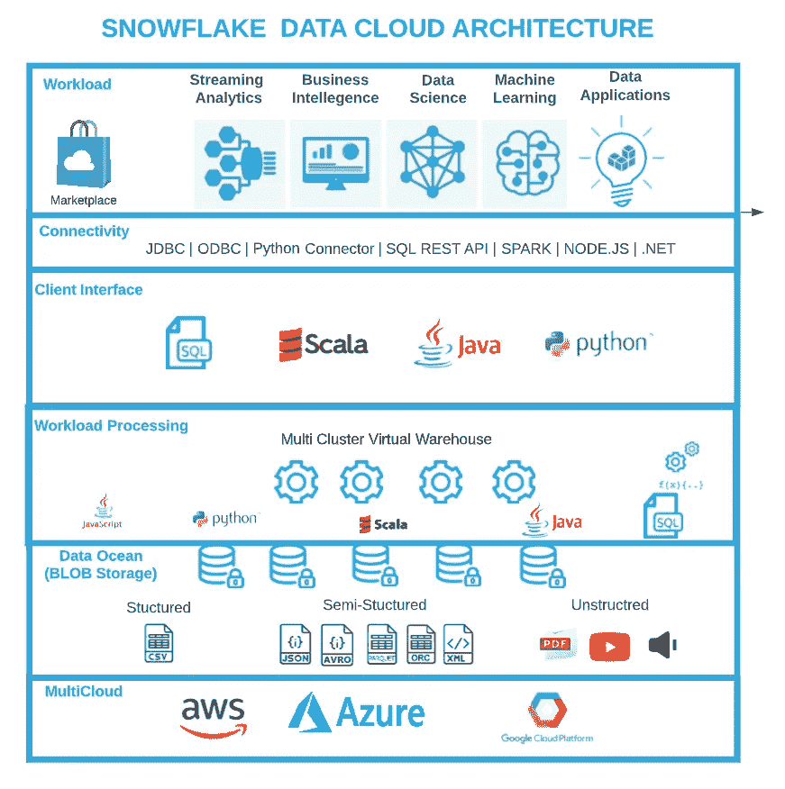
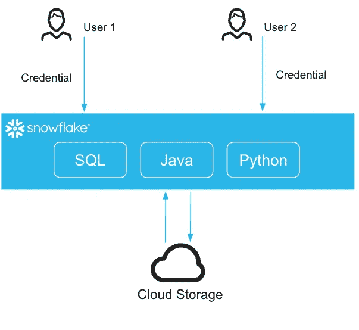
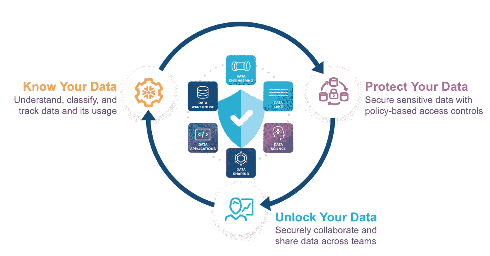
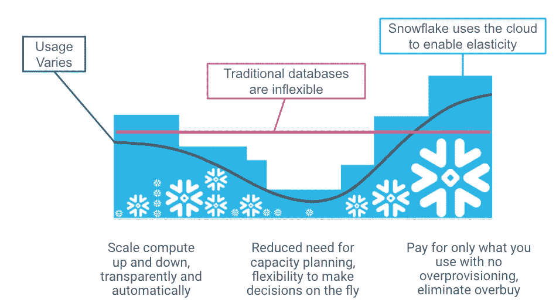
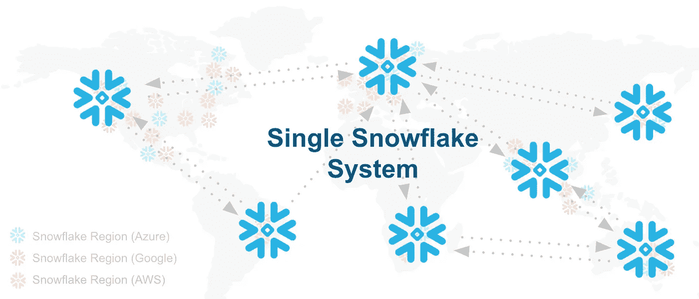

# 为什么在 Lakehouse 架构上部署雪花数据云

> 原文：<https://medium.com/codex/why-snowflake-data-cloud-over-lakehouse-architecture-647b27ecf59e?source=collection_archive---------1----------------------->

# 介绍

从历史上来说，数据仓库一直用于将来自不同系统的数据集成到一个数据库中，以分析和获得业务洞察力。在数据库领域工作了 30 年之后，我看到了如此多的技术，以及在此期间基于这些技术创建的架构。

# 挑战

所有这些技术面临的基本挑战是可伸缩性、安全性以及为多个用户运行多个工作负载的能力(并发性)。客户正在努力满足各种工作负载的需求，不断增长的用户群，结果是在性能方面无法满足服务级别协议。除此之外，无论是在云中还是在本地，都存在与管理基础架构、配置和性能调整相关的挑战，以保持环境正常运行。最重要的是，在运行开源技术时，安全威胁问题需要应用补丁来确保环境安全。

Lakehouse 体系结构在基础架构管理、管理 IAM 策略以及加密数据和密钥管理方面也面临类似的挑战。他们必须为用户想要使用的每个版本/每种编程语言创建单独的 Spark 集群。Spark 集群启动/暂停时间为 3-5 分钟，因为它很重，因此许多客户通常让它在运行集群上的时间比需要的时间长。这些加起来都是成本。在创建数据模型和跟踪历史维度等方面有更多的挑战。此外，Spark 分析作业、分派任务以及将部分结果组合成最终结果的开销也很大。所以 Spark 对于较小的工作负载来说并不是很好。

对于那些不熟悉**雪花数据云**的人来说，雪花数据云是一种软件即服务，其管理几乎为零，可以接受所有类型的数据(结构化、半结构化、非结构化和流数据)，存储在(高度压缩格式和加密的)低成本存储中，具有 ACID 属性，以微分区组织，生成元数据以获得更好的性能，允许使用 RBAC、列级和行级策略保护和管理访问，运行多种工作负载，如 ETL、分析、机器学习和分析/交易应用程序，具有极高的性能和近乎无限的规模它允许您使用自己选择的编程语言(Python、Java、Scala)和 ANSI SQL。在运行各种工作负载的同时，您还可以加入可从合作伙伴、共享数据的客户以及第三方来源(如人口普查、经济、人口统计、金融、医疗保健、消费者数据等)获得的数据。雪花市场中有 1200 多个精选的数据表可供使用，无需建立任何管道。雪花有巨大的合作伙伴生态系统，所以你可以使用各种不同的工具，从 ELT 工具到安全到机器学习。雪花有 JDBC、ODBC、Python、SQL REST API、Hive、Golang 等开放连接。net，Spark，R，node.js，Kafka 等。它允许您对雪花使用任何技术。将会有对开源表格式——Iceberg——的支持，它让你可以选择将数据保存在你的存储器中。冰山表具有雪花所有特性的优点，比如治理、数据共享等。

所有这一切都在一个完全包含开放协议、流行语言、API 和开放标准的单一服务中。因此，雪花数据云允许您选择部署 lakehouse 架构，以及数据网格和其他流行的架构。如您所见，Lakehouse 架构是雪花数据云的一个子集。见下图雪花架构:

> Lakehouse 架构是雪花数据云的一个子集。

以下是我认为雪花数据云是我们数据平台所需要的一些原因。

# 1.真相的单一来源——数据民主化

包括数据科学家在内的所有类型的用户都可以去单个地方访问数据，无论是公司的数据还是来自市场的第三方数据，他们都可以非常快速地处理非常大量的数据。他们可以使用雪花虚拟仓库(即托管集群)来实现这一点，该虚拟仓库可以在几秒钟内启动，并在不使用时自动关闭，从而节省成本。更重要的是，他们可以随时纵向扩展集群，而无需停机，运行工作负载，然后暂停它，因此真正实现了按您使用的模式付费。数据科学家和数据工程师可以选择他们喜欢的工具，如 Jupyter 笔记本或任何 IDE，并可以在他们的笔记本电脑上运行，使用 Python 和 Scala 等编程语言。不仅如此，他们还可以使用带时间旅行的零拷贝克隆进行即席分析，快速回到过去，根据历史数据运行模型。同样，数据分析师可以使用相同的数据集进行实时控制面板和报告。应用程序开发人员可以使用相同的数据集开发 Customer 360 或事务性应用程序。数据工程师可以执行 ETL/ELT 和流处理，SCD 类型 2/3，以管理数据。雪花支持所有各种数据模型，如维度模型、数据仓库，并支持可在任何报告工具中使用的星形和雪花模式。

如您所见，雪花允许任何类型、大小和速度的数据；用户可以到一个地方获取数据，并使用他们选择的任何工具和编程语言来运行任何工作负载。是的，他们的工作量不会互相干扰。

雪花支持多种语言

# 2.通过数据治理和安全性降低风险

雪花数据云使用各种安全功能提供端到端安全性，如静态加密(包括自带密钥)、动态加密(TLS 1.2)、与基于 SAML 2.0 的 SSO、Oauth2.0、SCIM、网络策略(列入 IP 地址白名单)、私有连接等集成。

雪花支持 RBAC，除此之外，它还提供各种数据治理特性，如标记化、列和行级安全性、标记、基于标记屏蔽策略、数据分类和匿名化。还提供关于谁访问数据、在哪里访问、何时访问、如何访问、数据沿袭和对象依赖的访问历史。关键在于，一旦实施了这些治理策略，它就适用于用户访问数据的任何地方。

这些功能不仅可以帮助公司提高数据质量，还可以降低业务风险、提高安全性以及更好地遵守 PCI、HIPPA、GDPR 等法规。

雪花数据提供 11 个 9 的持久性，这来自底层 CSP。除此之外，您还可以使用时间旅行、故障保护和数据库复制来保护数据，这允许您设置灾难恢复。

# 3.以性价比降低成本

当您实施解决方案时，会有各种各样的相关成本，通常我们会忘记无形成本。运营成本是最容易被忽视一个因素。雪花是一个 SaaS，因此不需要安装、配置或持续管理硬件和软件。没有修补或数据库备份/恢复过程。它是自我管理的。这意味着当你使用雪花的时候，操作成本是非常低的。数据工程师和数据科学家变得更加高效。

雪花存储使用每月 23 美元/TB(与云提供商相同)的 blob 存储，但雪花对压缩数据收费。雪花压缩效率极高，比拼花格式高 10-20%。这不仅有助于降低存储成本，还能提高性能，因为它需要扫描的数据文件更少。

雪花计算，又名虚拟仓库，是根据你每秒使用的时间来收费的(1 分钟后)。您可以为各种团队和工作负载创建多个虚拟仓库，并且只在他们使用时收费。这允许您仅在需要时使用它，从而节省大量成本。创建仓库不会收你一分钱，只在你使用的时候收费。仓库运行时，您可以在不停机的情况下扩大规模。例如，如果您需要处理大量数据，您可以动态地扩大和缩小规模，当您处理完数据时，它会自动挂起，您只需为扩大规模的时间付费。该虚拟仓库支持系统内置的高可用性，跨底层 CSP 中的三个可用性区域(AZ ),无需额外成本。因此，当一个 AZ 出现故障时，您不必在每个 AZ 中设置单独的集群来进行故障转移。您不必创建单独的集群来运行 SQL、Python 或 Java，所有工作负载都可以在同一个集群中运行。使用雪花服务无需 CSP 单独支付计算和存储费用。下图显示了雪花仓库为您节省成本的效率。

# 4.易用性

雪花是非常简单的使用和用户界面非常直观，所以没有正式的培训需要开始，雪花文档是组织良好，以获得帮助，做你需要的。有许多[操作指南](https://quickstarts.snowflake.com/)可供使用。雪花是一个多云多地区，这意味着您可以在自己选择的 CSP(AWS、Azure、GCP)中拥有雪花，并且您不需要详细学习底层云技术。雪花使得使用与云无关的命令变得容易。因此，将任何工作负载交给雪花，它就能正常工作。

**雪花最重要的部分是它是一个单一的服务，没有多个产品需要缝合在一起才能工作。**这使它变得更加简单、可用，并立即从中获得价值。

# 结论

雪花将存储从计算中分离出来，提供事务性支持，可以运行包括事务性工作负载在内的各种工作负载，支持所有类型的数据，提供端到端安全性、最先进的数据治理、突破性的数据共享和市场、数据复制、端到端流、BI 和 ML 支持、多种编程语言和工具选择，以消费数据和构建应用程序，这些应用程序可以共享以实现盈利。简而言之，雪花数据云可帮助您简化数据处理，并以安全且经济高效的方式在整个组织中实现数据民主化。雪花架构是面向未来的，因为您可以实现各种架构设计模式。

*根据 JP 摩根 2022 年首席信息官调查:“雪花在客户中有很好的地位，值得注意的是，在他们 2022 年的年度首席信息官调查中，它的地位飙升至精英领域，该调查调查了 142 名控制超过 1000 亿美元 IT 支出的首席信息官。”*

感谢你阅读这篇博文。快乐解题！

*免责声明:本文所表达的观点是我个人的，不一定代表我的雇主(雪花)。*