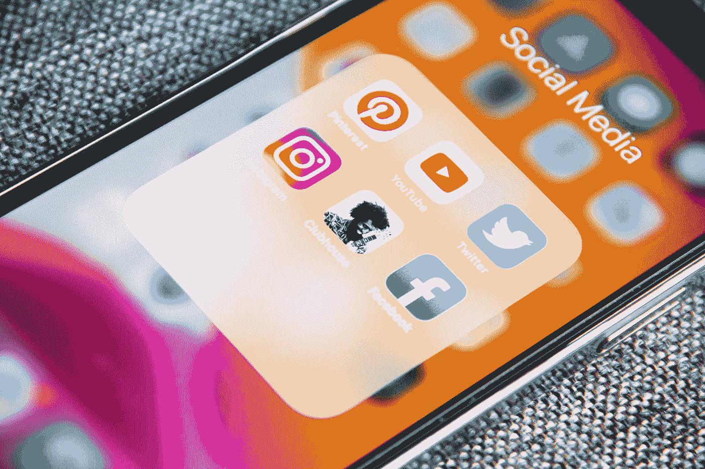

# 为什么社交媒体如此受欢迎

> 原文：<https://medium.com/codex/why-social-media-is-so-popular-d1968f3dc8c5?source=collection_archive---------5----------------------->

在 [Unsplash](https://unsplash.com?utm_source=medium&utm_medium=referral) 上[Adem may](https://unsplash.com/@ademay?utm_source=medium&utm_medium=referral)拍摄的照片

社交媒体已经成为我们生活中的一个重要部分，仅在 Android 上，抖音就有超过 10 亿次下载，脸书有超过 50 亿次下载。事实上，社交媒体如此受欢迎，以至于抖音最近取代谷歌成为最受欢迎的领域。

乍一看，你不会想到人们会花几个小时看别人生活的照片或短片。那么我们为什么要这样做呢？

每当我们看到一张可爱的狗的照片，一张美丽海滩的照片，或者其他一些很酷/有趣/可爱的东西，我们就会得到一点多巴胺，这让我们感到快乐。社交媒体使用智能算法不断向我们传递小的多巴胺点击，这导致我们上瘾，并无限向下滚动以查看更多可爱的狗图片或我们最喜欢的任何东西。这些算法的目标是让你留在应用上，当他们真的让你想要更多时，他们会为你提供一个也是为你量身定制的广告，所以你有最高的概率点击它或在其他时间考虑它。

这似乎不是一件坏事，当然，它让我们浪费时间，但这就是它的全部，对吗？简单地说，不是。人类有与周围人竞争的自然倾向，这并不坏，这是创新的驱动力。社交媒体的作用是将整个世界变成我们的竞争对手。每天我们都会看到一些名人过着令人惊叹的生活的照片，起初这可能会让我们产生多巴胺，但当我们关闭应用程序时，我们意识到他们的生活比我们好得多，我们感到很糟糕。人们只在社交媒体上发布他们生活中最美好的部分，这一事实放大了这种感觉。例如，没有人会拍下和妈妈吵架的过程，然后发布到社交媒体上，除非他们很怪异。这就是为什么现在这么多人抑郁。

我希望你喜欢这篇文章，如果你喜欢，如果你不喜欢，请让我知道我如何在评论中改进。也请遵循它真的帮助我了！