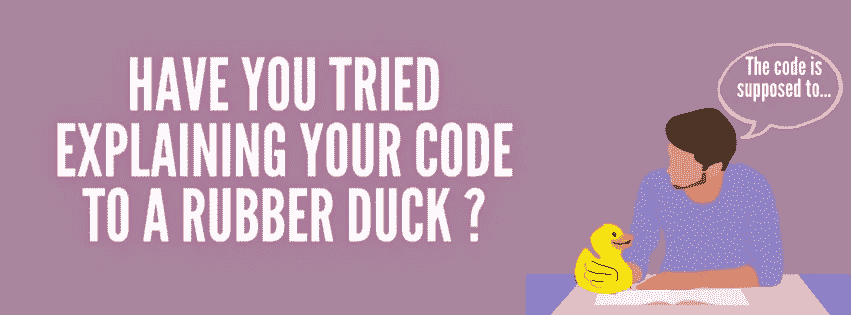
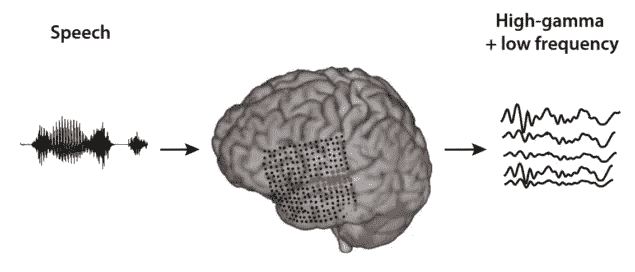
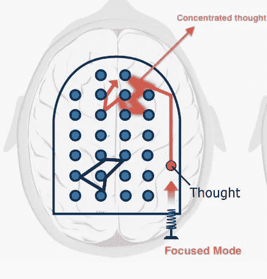

# 软件工程师为什么要用橡皮鸭调试

> 原文：<https://medium.com/codex/why-software-engineers-use-rubber-duck-debugging-351b6d0409ae?source=collection_archive---------15----------------------->

与橡皮鸭交谈的概念可能看起来完全荒谬可笑，所以你可能会惊讶地发现，各种口径的程序员几十年来一直在使用这种方法。这个名字是参考了一本叫做 [*的书《务实的程序员*](https://en.wikipedia.org/wiki/The_Pragmatic_Programmer) *在*中有一个故事，一个程序员通过强迫自己一行一行地向一只橡皮鸭解释来调试他的代码。这个概念与全球范围内最顶尖的学习方法之一[费曼技巧](https://collegeinfogeek.com/feynman-technique/)紧密相连。

# 那么，为什么是橡皮鸭？

不，你不用开始带着一只橡皮鸭到处跑，其实物品是不是橡皮鸭根本不重要。这个想法是，你要解释你的代码的对象不是你自己。你可以发挥你的想象力，和你的宠物说话，或者任何桌面物品。

编者按:宠物通常不被推荐，因为它们会分散注意力。但是对于一个和她的猫一起编程的人来说，我说去吧！但是，要知道最专业的推荐是无生命的物体。

人类和计算机以极其不同的方式处理信息；计算机需要极其精确的数据。人类能够*推理，*通过模糊甚至假设来理解信息。你可以拿起牙刷，不假思索地执行刷牙的所有步骤，而计算机则需要精确详细的逐步算法来完成最简单的任务。

当一个程序员在修复一个 bug 时陷入困境，通常问题源于缺乏精确性，程序员对他们委托代码的指导者不够精确。其他时候，问题源于程序员很难理解他们自己的代码。

这就是橡皮鸭调试发挥作用的地方，通过强迫你自己一行一行地解释你的代码，你也被迫真正理解你在说什么，你的措辞，以及你说话的顺序。

# 为什么有效？

你见过孩子连珠炮似的问大人“为什么”吗？你肯定已经注意到成年人似乎变得越来越沮丧，或者不知如何回答。这是为什么呢？两件主要的事情发生了:成年人意识到他们必须向比他们知识少得多的人解释一个概念，因此他们被迫寻找有效的方法来这样做。此外，前述的紧张或沮丧来自于我们不一定习惯于每天都参与的神经变化的组合——至少没有那么深入。

## 神经转移:从思想到语言和聚焦模式

[物理世界](https://physicsworld.com/a/thinking-aloud-translating-thoughts-directly-into-speech/)

说话，甚至想象说话，会产生复杂的大脑活动模式，而这只是常规的说话。现在，带着解释代码的意图说话不仅会产生这些模式，还会同时激活大脑的**聚焦模式。**

[学习如何学习](https://www.coursera.org/learn/learning-how-to-learn)

**专注模式**被认为是我们大脑学习和解决问题的主要模式之一。它涉及一种直接解决问题的方法，通过将你的思维能力集中在大脑的前额叶皮层，使用理性、顺序和分析的方法。这对于数学、科学和编程等学科来说是必不可少的。

当你面对思考复杂的话题，并把这些想法转换成连贯的演讲，以达到教育的目的时，你在学习的同时也解决了问题。你的大脑正在积极寻找翻译你的想法的最佳方法，参与[主动回忆](https://aliabdaal.com/activerecallstudytechnique/)，并最终处理语音。智力杂技的结合确实可能是严格的，但它的好处是巨大的。

# 所以，我在教我的鸭子如何编程？

没有什么比一个无生命的物体更无知的了，它完全没有任何知识，计算机也是如此，直到程序员给它们加载信息。他们不能问问题，他们不能确认他们是否理解你在说什么，这完全取决于你想出的问题和答案。橡皮鸭调试因此高度成功。

# 我该怎么做？

要知道，或者，你可以通过写作来做到这一点，它可以作为文档，你可以在以后重新访问。有[证据](https://redbooth.com/blog/handwriting-and-memory#:~:text=Writing%20by%20hand%20tends%20to,actually%20remembering%20the%20important%20stuff.)支持书写，尤其是手写，有助于我们的记忆(打字对于橡皮鸭调试也很好)。然而，传统上这是通过说话来完成的，因为自言自语也与强化记忆有关。

1.  你可以从一般意义上解释你的代码开始:它应该做什么？你面临着什么问题？
2.  然后深入你的解释，进入细节。探索代码的每一行。注意哪怕是最小的细节，比如你在哪里放了一个括号，为什么你用那种方式格式化算术(你是否遵循了 PEMDAS 或其他原则，它们的应用是否恰当？).甚至那些感觉像“初学者的东西”的东西。
3.  如果您发现自己很难记住某个函数、方法或任何类型的执行是做什么的，不要害怕在可靠的来源中查找它。这可能是你缺乏的理解。
4.  此外，这是我个人做的事情:列出自己的优点和缺点。你最有信心解释的事情是什么？你在哪些事情上挣扎过？你可以重温这一点，研究你的问题领域。

**资源**:

*   [学习如何学习电子学习计划](https://www.coursera.org/learn/learning-how-to-learn)
*   [数字思维:如何擅长数学和科学(即使你代数不及格)](https://www.amazon.com/-/es/Barbara-Oakley-ebook/dp/B00G3L19ZU)
*   [橡皮鸭问题解决](https://blog.codinghorror.com/rubber-duck-problem-solving/)
*   你在想什么？跨文化心理学中的大声思考方法