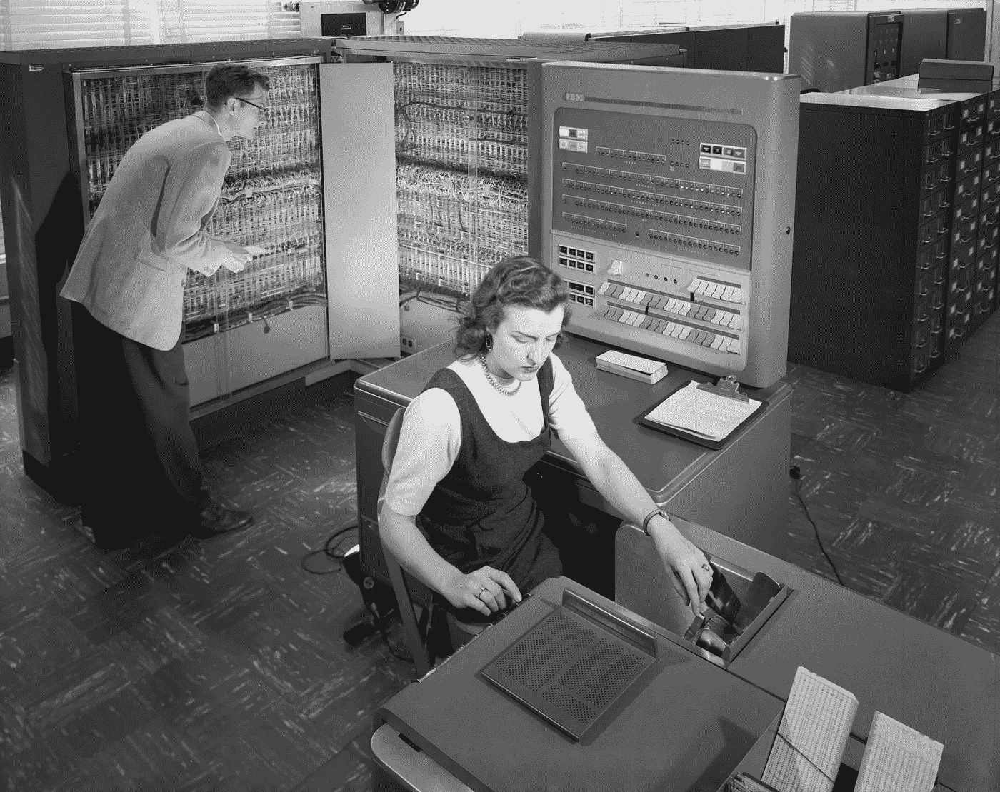
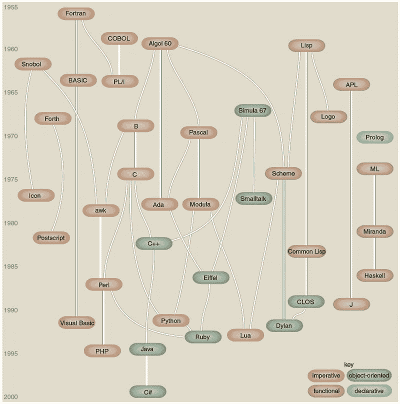
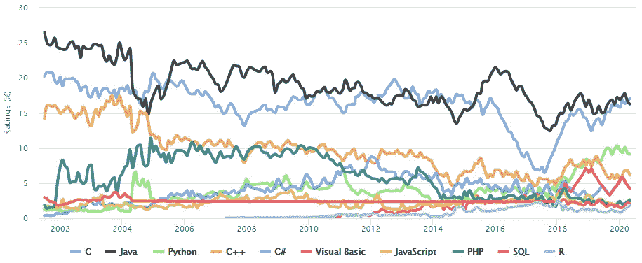

# 为什么一些信息技术在几十年后仍然适用？

> 原文：<https://medium.com/codex/why-some-information-technologies-remain-relevant-after-many-decades-a65ffe882323?source=collection_archive---------7----------------------->

## 如果您曾经有机会使用或接近大型机，您会想，在几十年后，这项技术怎么可能仍然在大多数商业交易中使用和相关。

一方面，简单的问题是哪些软件技术经得起时间的考验；这意味着他们仍然能够/支持企业基本上赚钱。另一方面，更复杂和有趣的问题是为什么。

不要陷入无休止的争论，即哪些是或应该在列表中。我们来回顾一些，提取精华，明白为什么。本文灵感来源于 GOTO 2021 线上发布会[ [1](https://youtu.be/lnMvLePCHmU) 。

# 大型机

IBM 大型机是 IBM 自 1952 年以来生产的大型计算机系统。在 20 世纪 60 年代和 70 年代，IBM 主宰了大型计算机市场。[ [2](https://en.wikipedia.org/wiki/IBM_mainframe)

2022 年的今天:财富 100 强的 67 位；50 强银行中的 45 家；10 大保险公司中的 8 家；前 10 大电信公司中的 8 家；10 大零售商中的 7 家；5 大航空公司中的 4 家；还是用大型机。[ [3](https://www.zdnet.com/article/inside-why-the-mainframe-is-alive-and-thriving/)

## **为什么大型机仍然有意义？**

它们在 70 年后仍然适用，因为大型机中内置了大量业务逻辑，而迁移这些逻辑的成本很高，因为它们仍然能够提供处理大量事务所需的吞吐量；也因为他们可靠。

鸣谢:NASA 的伟大图像，[公共领域](https://commons.wikimedia.org/w/index.php?curid=6455009)

# 结构化查询语言(SQL)

结构化查询语言(SQL)是一种特定于领域的语言，用于编程，设计用于管理关系数据库管理系统(RDBMS)中的数据，或用于关系数据流管理系统(RDSMS)中的流处理。它在处理结构化数据，即包含实体和变量之间关系的数据时特别有用。它首次出现在 1974 年。[ [4](https://en.wikipedia.org/wiki/SQL)

2022 年的今天:我找不到统计数据，但是，无论如何，使用 SQL 的公司肯定在 99%以上。

## **为什么 SQL 仍然相关？**

我喜欢 SQL 的一个关键特征是它是一种声明性语言。你告诉数据库你想要什么，它决定如何去做。有趣的是，并不是所有的声明性语言都经得起时间的考验，比如 XSLT 就因为 XML 而遭受了很多。另一个原因是 SQL 是专门为数据设计的，而且它做得非常好。更重要的是，这很容易理解。

# 应用编程接口

应用编程接口(API)是计算机之间或计算机程序之间的连接。它是一种软件接口，为其他软件提供服务。描述如何构建或使用这种连接或接口的文档或标准被称为 *API 规范*。符合这个标准的计算机系统被称为*实现*或*公开*一个 API。术语 API 既可以指规范，也可以指实现。[ [6](https://en.wikipedia.org/wiki/API)

API 起源于 20 世纪 40 年代，尽管这个术语直到 20 世纪 60 年代和 70 年代才出现。后来这个术语从计算机扩展到软件界面，再扩展到软件到软件，现在扩展到网络。如今，web API 是术语 API 最常见的含义。

## **为什么 API 仍然有用？**

API 作为在计算机或计算机程序之间实现连接的概念比以往任何时候都更加重要。在 2022 年，API 为整合业务提供了惊人的商业机会，组织的高层将它们作为支持业务的概念进行讨论。

# C

作为编程语言 *B* 的继承者，C 语言最初是由 Dennis Ritchie 在 1972 年到 1973 年间在贝尔实验室开发的，用于构建在 Unix 上运行的实用程序。在 20 世纪 80 年代，C 语言逐渐流行起来。它已经成为使用最广泛的编程语言之一。[ [7](https://en.wikipedia.org/wiki/C_(programming_language))

信用:Brian Hayes 编写的一份精选编程语言年表

## 为什么 C 仍然相关？

自 2000 年以来，C 一直是 TIOBE 指数中排名前两位的语言，TIOBE 指数是衡量编程语言受欢迎程度的指标。

鸣谢:由 MediaNik-Own 工作，CC BY-SA 4.0

c 支持一些最相关的操作系统，如 Windows、LinuxiOS、Android 和 iPhone 的内核；像 Oracle、MySql、Postgres 这样的数据库；像传感器、控制器、读卡器等嵌入式系统很可能是用 c 语言编程的。

使 C 无与伦比的关键特性是可移植性和效率、内存操作、代码大小和资源的确定性使用。

# 电子邮件

电子邮件是一种无处不在的交换信息的方式，如此受欢迎以至于它似乎已经存在很久了。电子邮件的最早发展始于 20 世纪 60 年代，但起初用户只能向同一台计算机的其他用户发送电子邮件。1971 年，第一封 ARPANET 网络电子邮件发出，引入了现在熟悉的地址语法，用“@”符号表示用户的系统地址。简单邮件传输协议(SMTP)协议于 1981 年推出。

## 为什么电子邮件仍然有意义？

电子邮件在商业和个人生活中都很普遍。我相信它仍然相关的主要原因是可用性；使用的简单性使其有效且易于理解。

# 结论

已经存在了很长时间的软件技术呈现出以下特征:

*   几十年来的可靠和高性能使得很难证明这种变化是合理的
*   可移植性和效率使得它很容易在许多解决方案中推广
*   简单易用吸引了用户的注意力，并产生了一种网络效应，即如果你拥有它，我就想要它
*   你想要什么和如何做之间的高度抽象
*   接口提供了计算机、计算机程序和组织之间的高度抽象
*   由于能够在不影响抽象本身的情况下替换实现，抽象和解耦为解决问题提供了很长的时间

## 你的观点

你认为哪些技术仍然适用？你认为是什么原因？

# 参考

*   经受住时间考验的软件技术-走向 2021 年
*   来自维基百科的 IBM 大型机
*   [ [3](https://www.zdnet.com/article/inside-why-the-mainframe-is-alive-and-thriving/) ]王雷《主机为什么活着并茁壮成长》
*   来自维基百科的 SQL
*   SQL 已经有 43 年的历史了——以下是我们至今仍在使用它的 8 个原因
*   来自维基百科的[ [6](https://en.wikipedia.org/wiki/API) ] API
*   来自维基百科的[ [7](https://en.wikipedia.org/wiki/C_(programming_language)) ] C(编程语言)

# 放弃

*这是一篇个人文章。此处表达的观点代表我个人的观点，不代表我雇主的观点。*