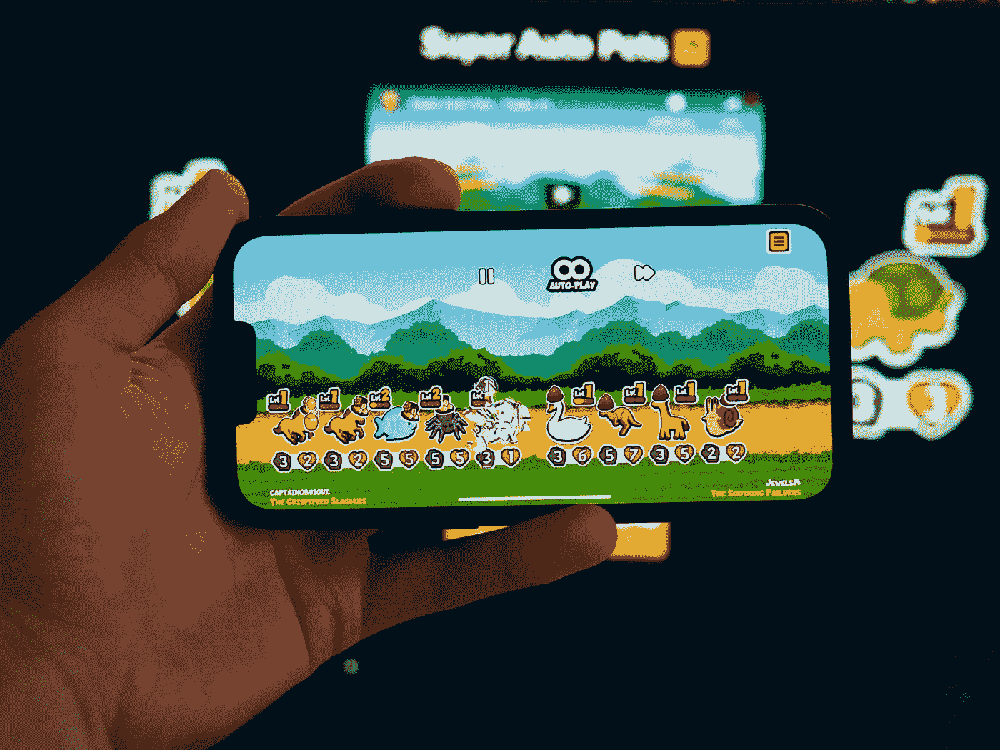
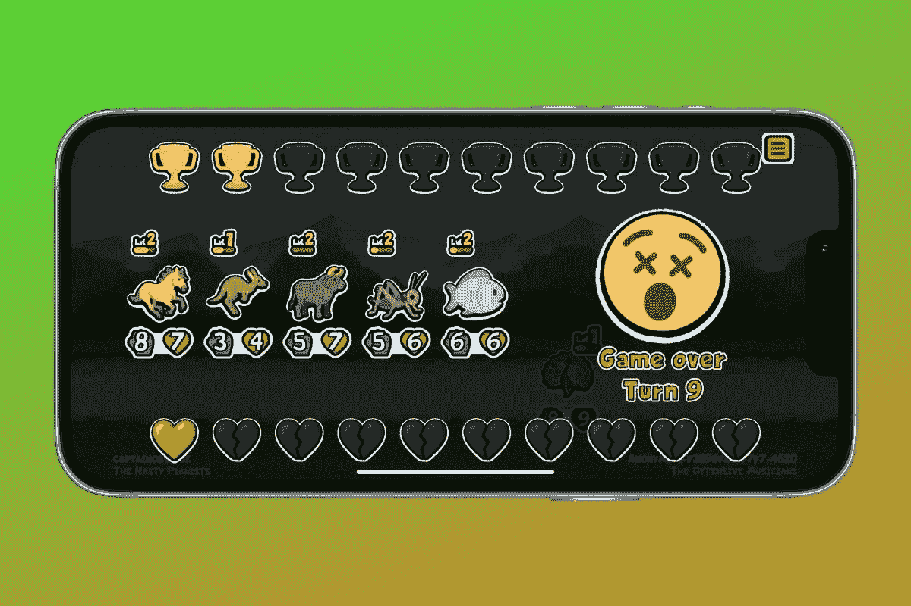
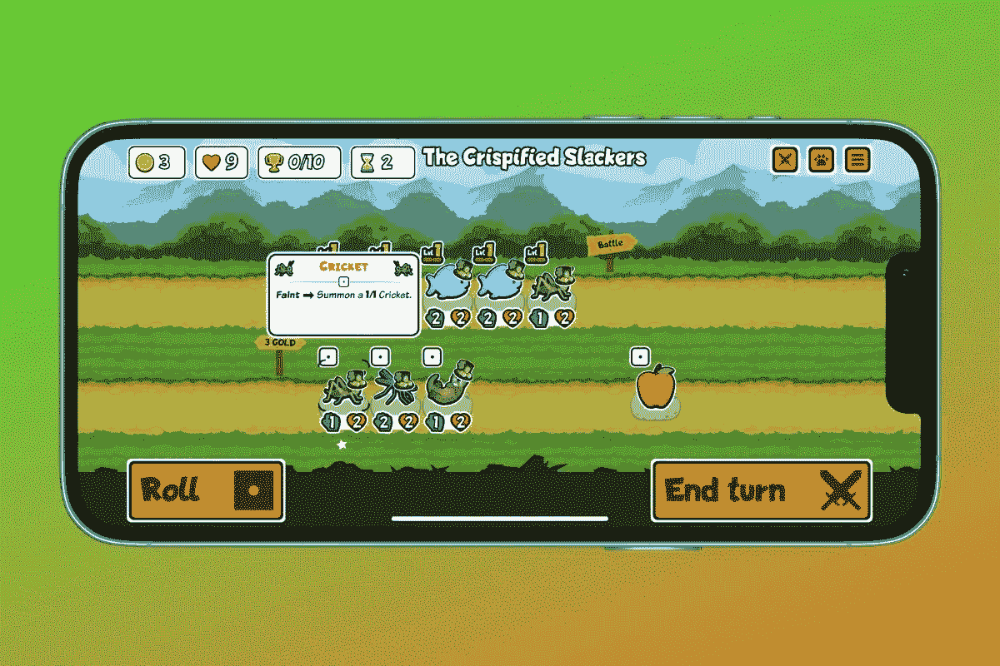
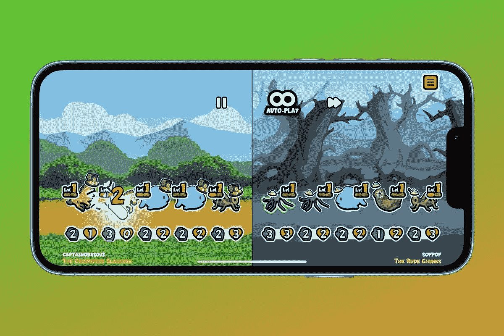
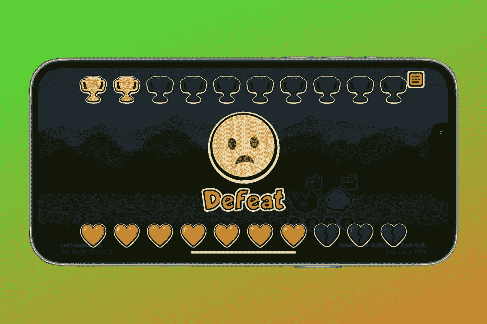
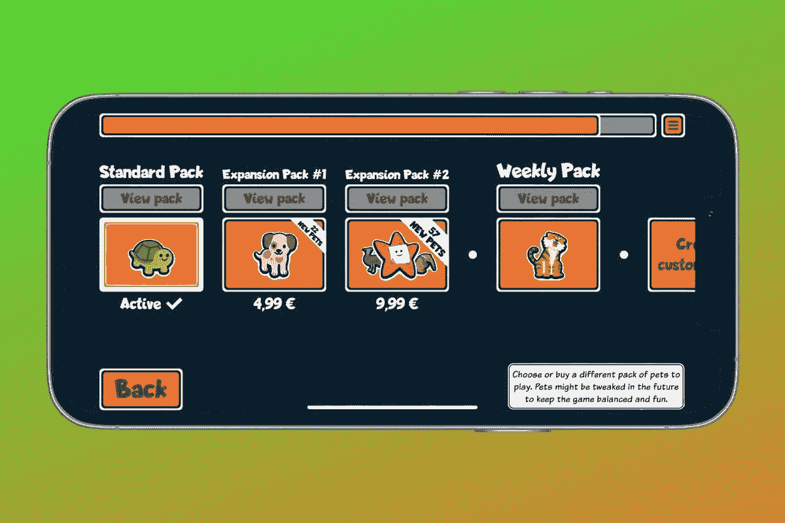
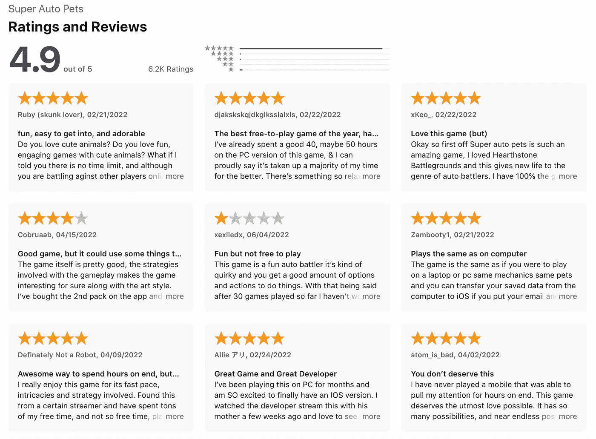
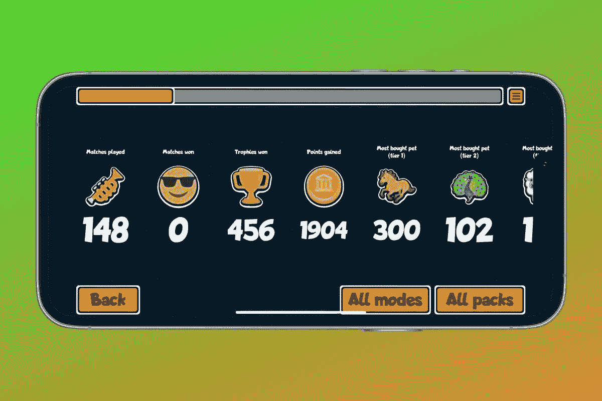

# 为什么超级汽车宠物是如此之好，还有什么是未来

> 原文：<https://medium.com/codex/why-super-auto-pets-is-so-good-and-what-is-still-to-come-5c02854c675b?source=collection_archive---------23----------------------->

什么是好游戏？其实规则只有一个:易学，难精通。目前几乎没有任何智能手机游戏能比*超级汽车宠物*更好地描述这一点。这款迷你游戏非常适合在两者之间快速回合，但它也会很快引发真正的上瘾。

除了游戏性之外，还有什么因素使这款游戏如此出色，为什么*超级汽车宠物*在应用商店获得了疯狂的好评，你可以在下面找到答案——**以及开发者的下一步计划。**

# 游戏部分

比赛分为两个阶段:准备阶段和战斗阶段。只有在准备阶段才能做出积极的决定，宠物们逐渐相互竞争的战斗是完全自动化的。每个玩家有五个位置来填充不断增长的动物池。这些有能力，攻击值和生命值。

如果你购买相同的动物三次，它可以升级，提高能力和地位值。每轮可以花费十个硬币，每只动物花费三个硬币，也可以是永久或暂时效果的物品。一个刷新按钮，有点像老虎机，一枚硬币的价格带来了新的动物和奖金选择。

**到目前为止，一切都很简单——但是即使在最初的几个回合中，你也会很快了解到这个看起来非常适合儿童玩的游戏的深度。**当然，目标是尽可能有效地组合动物，这不仅需要策略，还需要相当的运气。你对游戏和不同的宠物了解得越多，你就越有可能对提供的一套做出反应，并以此为基础建立你的卡片组。

每个玩家在锦标赛开始时都有 10 点生命值。随着回合数的增加，每一次失败也耗费更多的心。我们的目标是在总共 10 轮比赛中获胜——但这将需要数百次锦标赛尝试。毕竟，即使你赢了不到十个回合，你还是取得了一些进步。

# 货币铸造

软件可能甚至必须花钱。最起码要清楚一个 app 是怎么挣钱的。无论是通过订阅、广告，甚至是近年来充斥手机游戏市场的不受欢迎的微交易。超级汽车宠物很好地解决了这个问题。

游戏的基础版完全免费，也没有广告。然而，如果你想要访问更大的角色集，你将被要求支付一次费用(在此期间，有两个资料片，22 只动物 4.99 欧元，57 只动物 9.99 欧元)。

这些并没有带来任何游戏性的优势，只是增加了游戏的复杂度。作为一个基本包的用户，你可以选择只和其他拥有基本包的玩家比赛。这确保了只有花很多时间玩游戏的玩家才会掏钱。

而且:与该行业的许多其他代表不同，大多数化妆品，即人物和游戏板的不同外观，都是用来之不易的胜利货币支付的。

> 超级汽车宠物有多少玩家，特别是有多少人付费，开发者没有透露。

“我不知道。似乎很多。可能超过 10 个，”回复说。无论如何，谷歌 Play 商店有超过一百万的下载量。根据 Sensor Tower 的数据库，据报道，超级汽车宠物在苹果应用商店已经获得了 90，000 次下载和 80，000 美元的收入。

# 跨平台

想想《火箭联盟》、《使命召唤》或《PUBG》——来自游戏行业的大牌第一眼就出现在智能手机的小屏幕上，但只有完全独立的版本。除了炉石、TFT 或堡垒之夜，真正的跨平台游戏体验只出现在少数大片中。

然而，由于超级汽车宠物的简单结构，无论是在智能手机、平板电脑上，还是在客户端或网络浏览器的桌面上，体验总是相同的。如果你登录了，你甚至可以在回合之间从一个设备跳到另一个设备，没有太多的延迟——你还想要什么？

**事实上，超级汽车宠物可以在许多不同的平台上使用，这一点在开发的早期就被考虑到了。【2021 年 4 月，在个人电脑上推出了第一个测试版，随后不久，安卓智能手机和平板电脑也在谷歌 Play 商店推出了测试版。iOS 玩家不得不等到 2022 年初。花了很长时间，原因与开发和苹果无关。只是没人关心的纯粹官僚主义的商业事务。"**

# 社区

超级汽车宠物的成功，社区起了很大的作用。“因为流行的彩带定期播放我们的游戏，”超级汽车宠物的创作者向他们不断增长的粉丝群解释说。**“我们倾向于认为他们在玩超级汽车宠物，因为它对观众非常友好，并且提供了每个人都会感到兴奋的优秀流媒体内容。”**

伍德团队也善于让队员参与开发。在一个拥有超过 35，000 名成员的 Discord 服务器上，玩家可以直接与其他玩家和创作者交流。

> 但来自社区的最佳建议与游戏没有直接关系:“休息一下，不要给自己太大压力。”

**毕竟只有两个开发者做了 1.5 年左右的超级汽车宠物，现在有三个全职员工和两个自由职业者。**

玩家们在谷歌 Play 商店和 App Store 中对创作者的评价一直都很积极，在 Android 上平均为 4.3 星，在 iOS 上高达 4.9 星。Play Store 中较差的评级主要是因为据称难度太高，有些人抱怨技术错误。

但男高音在哪里都是一样的:“这是我在店里玩过的最好的游戏之一，现在还在玩。一个人写道:“真正的格言是:容易学习，难以掌握，玩家必须面对越来越困难的对手组合，这就形成了一个彻头彻尾的上瘾螺旋。”。“棋盘游戏机制和赌博的良好结合，”另一个。

# 下一步是什么？

如果你已经读到这里，你可能会同意超级汽车宠物已经很不错了。但是总有改进的余地。开发者现在的议程是什么？“翻译。下一个资料片。更虚荣的东西，”这是简洁的答案。

分级模式可能还没有出现。“我们仍在试图找出我们想要如何去做。”这尤其会再次产生额外的长期动力。到目前为止，你只收集了胜利的硬币，这为动物和你自己的那一半游戏场地提供了视觉变化。

正如你所看到的，经过几次尝试，我仍然没有赢得一个回合。但是超级汽车宠物也许是最好的游戏实现:旅程是目的地。也许下一场我会赢？

*这篇文章已经在前段时间的*[*smartdroid . de*](https://www.smartdroid.de/dieses-spiel-hat-sich-jede-5-sterne-bewertung-mehr-als-verdient/)*上用德语发表了。这个翻译通过 DeepL.com 得到了机器的支持。*