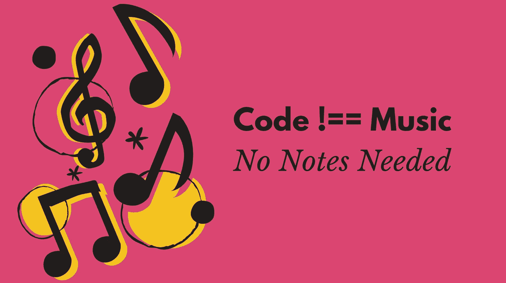

# 为什么偷偷记笔记会偷走你的时间，让你更快成为一名开发人员

> 原文：<https://medium.com/codex/why-taking-notes-secretly-steal-your-time-becoming-a-developer-faster-d96c13093f80?source=collection_archive---------3----------------------->

把音符留给音乐家，然后做这三件事

作者通过 Canva.com

我希望我早点学会的几个技巧之一是跳过笔记。大多数人认为他们需要对每件事都做笔记，但是他们错了。**如果你不知道什么是重要的，你就不能做有用的笔记。**