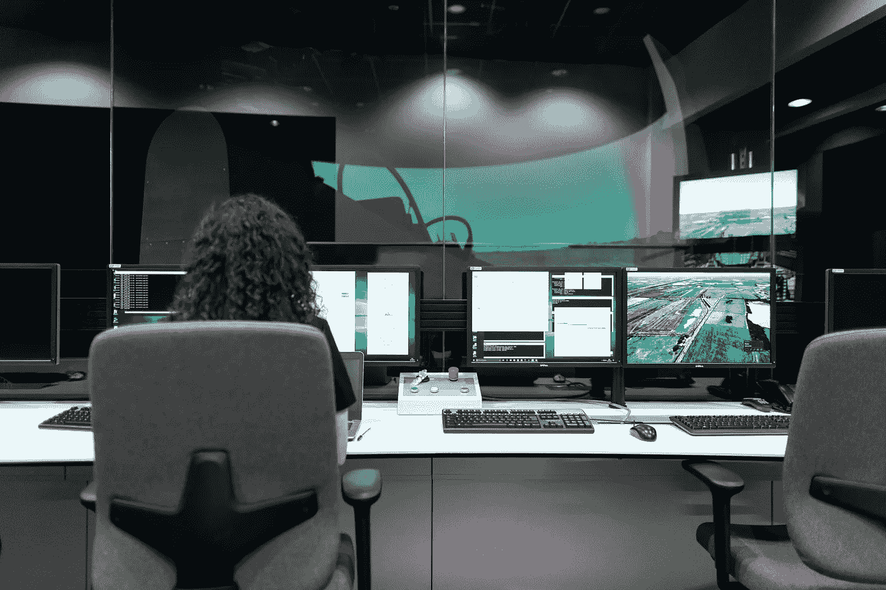

# 为什么测试人员既不测试也不运行，软件开发人员应该做些什么

> 原文：<https://medium.com/codex/why-test-runners-neither-test-nor-run-and-what-software-developers-should-be-doing-instead-54afd3732161?source=collection_archive---------5----------------------->

## 不要仅仅依靠手工测试。

来自 [Pexels](https://www.pexels.com/photo/female-engineer-controlling-flight-simulator-3862132/?utm_content=attributionCopyText&utm_medium=referral&utm_source=pexels) 的 [ThisIsEngineering](https://www.pexels.com/@thisisengineering?utm_content=attributionCopyText&utm_medium=referral&utm_source=pexels) 摄影

我第一次了解单元测试是在 2004 年。

前提很简单。使用测试库，您可以在开发应用程序时为应用程序中的组件开发测试工具。测试和代码一起发展。

# 测试驱动开发

从业者将此进一步发展为 TDD——测试驱动开发。规则很简单。

1.  写一个失败的测试。
2.  编写足够的代码来通过测试。
3.  清理你的代码。
4.  重复一遍。

人们在实践中走得更远，迈出微小的步伐。编写足够失败的测试。未能编译计数。然后编写足够通过的产品代码。还是那句话，编译算数。

测试的形状决定了代码。类似地，代码的形式通知了测试。该设计在清理阶段有机地浮现出来。清理成功进行，因为测试继续通过。

我在 2006 年开始从事 TDD 工作。

# 回到未来

我不认为自己是早期采用者。我选择实用的工具和技术，并尝试在工作中使用它们。但我不认为自己处于危险边缘。

当我在 2017 年和 2020 年了解到一个“测试跑步者”软件时，我感到很惊讶。微软在他们的产品中内置了一个。另一个很受欢迎，因为它嵌入了项目跟踪软件吉拉。

这些工具会在你第一次看到它们时欺骗你。他们有一个“播放”按钮。我相信这些工具会运行测试套件。

这些工作是因为有人在工具中输入了各种测试用例。我期望看到代码，但我看到的是一个文档。系统让你把你的测试用例分解成步骤。然后，您可以进一步设置每个步骤的预期行为。最后，您可以将测试用例分组到套件中。

运行测试包括人工按 play，阅读步骤，在软件中手动执行测试，比较预期的行为，最后检查步骤通过的框。

这种方法是我在 2005 年经历的一个改进，当时我们做了 4 天的代码冻结，这样我们的测试人员可以手工检查 4 个测试用例的活页夹。

# 投资你的团队来学习 TDD

手动测试容易出错。它也很慢。最后，维护和运行测试的团队压力很大。手工测试会耗尽你的团队。

测试可能会很快与应用程序失去同步。哪个系统是正确的？

# 投资你的团队来学习 TDD

更好的投资发展你的开发者。投资你的团队，让他们学会做自动化测试。

自动化测试运行迅速。它们是确定性的，意味着它们每次都以相同的方式运行。因此，当您每天多次运行自动化测试时，它们不会感到疲劳。

最后，通过使用 TDD，您将改进代码的设计。

*👏🏻给我鼓掌* ***跟着*** *如果你喜欢这篇文章。*

# 📋关于米洛

我是一名科技高管、作家、演说家、企业家和发明家。我从 1995 年开始开发软件，十多年来一直在开发团队。🚀

我写关于软件、工程、管理和领导力的文章。

*你也可以* [*在 Twitter 上关注我*](https://twitter.com/milotodorovich) *。🐦*