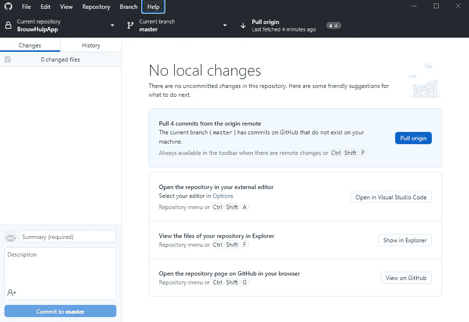
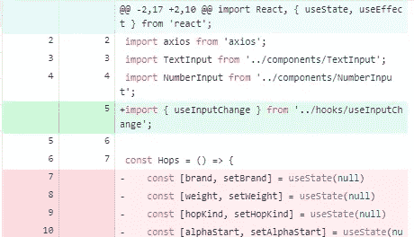

# 为什么 GitHub 桌面应用更好

> 原文：<https://medium.com/codex/why-the-github-desktop-application-is-better-24968eed4e1d?source=collection_archive---------5----------------------->

## 使用命令行界面是一个很难做到的事情，但是现在已经没有必要了。


[Jexo](https://unsplash.com/@jexo?utm_source=unsplash&utm_medium=referral&utm_content=creditCopyText) 在 [Unsplash](https://unsplash.com/s/photos/computer-programming?utm_source=unsplash&utm_medium=referral&utm_content=creditCopyText) 上的照片

Git 和 GitHub 已经存在很久了。他们通过创建一种使用拉请求、分支、比较和合并特性来正确实现变更的方法，彻底改变了项目的协同工作。我确信大多数程序员甚至用它来完成个人项目(就像我一样)。

# Git CLI

这对高级开发人员来说可能有争议，但是我认为 Git CLI 对于新手程序员来说太难使用了。我接触过的大多数学生已经很难使用 Github 和合适的 GUI，更不用说他们需要记住所有的 CLI 选项和命令了。

```
**git add** [--verbose | -v] [--dry-run | -n] [--force | -f] [--interactive | -i] [--patch | -p]
	  [--edit | -e] [--[no-]all | --[no-]ignore-removal | [--update | -u]]
	  [--intent-to-add | -N] [--refresh] [--ignore-errors] [--ignore-missing] [--renormalize]
	  [--chmod=(+|-)x] [--pathspec-from-file=<file> [--pathspec-file-nul]]
	  [--] [<pathspec>…​]
```

您不会使用这里显示的大多数选项，但我认为它设置了场景。那么我们为什么还要使用它呢？大多数 IDE 都实现了某种版本控制，即使您的 IDE 没有，您也应该使用 Github 桌面应用程序。*至少如果你用的是 Github* …

# GitHub 客户端

GitHub 桌面应用程序在不久前发布。尽管还有好几个月。在我看来，这可能是迄今为止最好的可视化协作工具。



应用程序

每当您没有任何本地更改时，这将是您将看到的屏幕。在存储库上做了一些更改，它告诉我从 origin 或从 repo 本身进行提取。我在“主”分支中，可以通过单击黑色大按钮快速更改它。我可以很快看到我所做的任何更改。



所做的更改

最棒的是它的视觉效果。代替黑白终端，我们有一个完整的可视化 GUI，有漂亮的按钮供我们使用。它是如此容易使用，你几乎不用考虑你在做什么。

# 结论

除非您非常熟悉 CLI 设置，否则您很可能会更好地使用 GitHub 桌面应用程序，甚至是您的 IDEs 内置版本控制。感谢您的阅读，祝您度过美好的一天。