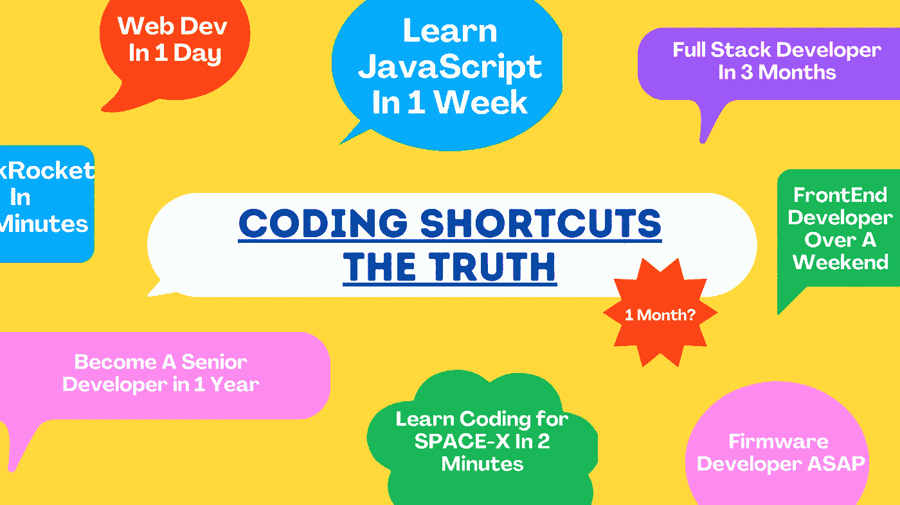

# 为什么快速学习编码会花费你更多的时间

> 原文：<https://medium.com/codex/why-the-hard-truth-about-learning-to-code-quickly-will-cost-you-more-years-df2250b78c05?source=collection_archive---------9----------------------->

## 人们说一个月足够了

图片由[作者](http://www.arnoldcode.com)制作

这里有唯一的真理:*学习学习学习*。

无论哪种语言，都要找到自己的学习方法。最终，将是你在学习这门学科。做无数的项目，像我一样，上教程或课程，这都不重要…