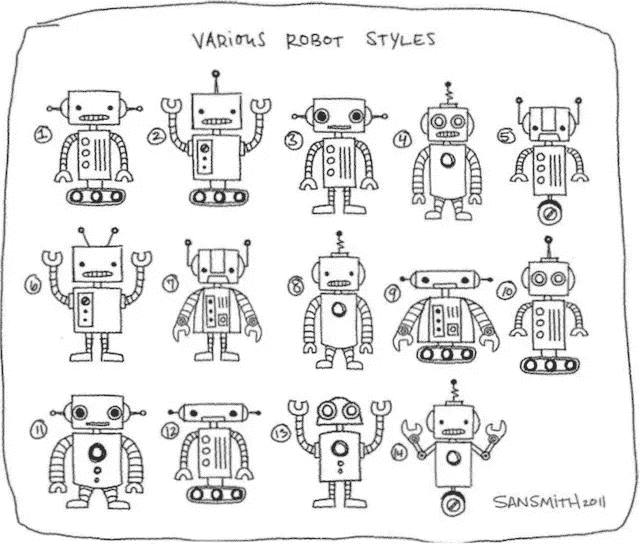

# 为什么老式的人形机器人梦想不会破灭

> 原文：<https://medium.com/codex/why-the-old-fashioned-dream-of-humanoid-robots-refuses-to-die-4967b30a1498?source=collection_archive---------25----------------------->

## 软银搁置了它的机器人 Pepper，但替代者正在准备中

照片由 [**圣史密斯**](https://www.flickr.com/photos/sanasaurus/) 上 [**flickr**](https://www.flickr.com/photos/sanasaurus/5554662440/)

当软银最近冻结其人形机器人 Pepper [的生产](https://www.reuters.com/technology/exclusive-softbank-shrinks-robotics-business-stops-pepper-production-sources-2021-06-28/)时，专业机器人观察家开始写讣告和假笑我早就告诉过你了。

此后，软银不厌其烦地表示，它只是进行了一点重组，但上市 7 年后的销售数据显示，这并不容易:全球仅售出 27，000 台。相比之下，据报道，仅在 2018 年的前三个月，索尼[就在日本售出了超过 11000 只艾博机器狗](https://www.japantimes.co.jp/news/2018/05/07/business/tech/sales-sonys-new-aibo-robot-dog-off-solid-start/)。

Pepper 的挣扎很重要，因为推动其发展的愿景在今天的机器人专家中仍然存在。

这个愿景是什么？Pepper 的最初创造者阿鲁迪巴计划让它成为第一个人形“伴侣”机器人，供消费者带回家，一起生活，并(希望)爱上它。

它的创造者为 Pepper 配备了人工智能，因此它可以通过语音和手势阅读和响应人类的情感。出于这些目的，他们给了 Pepper 富有表现力的手和巨大的眼睛，并试图赋予它进行对话的能力。为了理解这种雄心的规模，考虑一下即使在八年后的今天，Alexa、Siri 和 Google Nest 仍然在为后续问题而挣扎。

交谈的能力也带来了性别和声音的问题。高管们选择给 Pepper 注入 12 岁男孩的智慧和好奇心，大概是为了让它有资格问很多问题来支持机器学习。

但是“伴侣机器人”并不像乍看上去那样对普通消费者有价值。我这么说是因为我是 Sprint 美国团队的顾问，该团队正在制定 2013 年推出 Pepper 的营销计划。(技术问题将实际推出推迟到 2015 年。)自发布以来，媒体上的评论与我们在测试中听到的一致。

即使在非常先进的技术中，对机器人的第一要求也是有用。人们问一些版本的“它能帮我洗碗吗？”在我们采访的几乎所有团体中。考虑到 Pepper 的价格接近 2000 美元，每月数据费用只有几百美元，这并不是不合理的。但是即使有多关节的手指和相对的拇指，胡椒也不能给你带来一杯饮料。

[亚历山大·奈特](https://unsplash.com/@agk42?utm_source=unsplash&utm_medium=referral&utm_content=creditCopyText)在 [Unsplash](https://unsplash.com/s/photos/pepper-robot?utm_source=unsplash&utm_medium=referral&utm_content=creditCopyText) 上拍照

它的人形是一个令人惊讶的症结。机器人专家说[把期望抬得太高](https://www.wsj.com/articles/humanoid-robot-softbank-jobs-pepper-olympics-11626187461?mod=trending_now_news_3)，导致失望。其他人指出，你的手机可以做 Pepper 应该能做的几乎所有事情，除了在房子里跟着你。即使在那里，胡椒也有它的局限性。它不能爬楼梯，因为它靠轮子移动。

也许这种硬塑料、友好的人形机器人只是一种老式的未来愿景。

那么，是什么让梦想继续存在呢？

最有可能的是，这种性质的东西有一个大得不容忽视的市场。

软银曾设想向消费者销售 Pepper，但后来它将重心转向了工业。它在其网站上对零售、金融和医疗保健等类别的推介似乎建立在两个主要支柱上:新颖性和容忍重复的能力。

新奇感只对初次见面有效，这是玩具制造商和父母都害怕的“有趣的一天”。但是容忍重复也是让机器人进入工厂工作的美德。

这似乎使它成为医疗保健行业某些角色的自然选择。谁能比机器人更好地监控和忍受阿尔茨海默氏症患者的重复对话呢？据估计，全世界大约有 4400 万人患有老年痴呆症。另外有 7500 万人是自闭症患者。看起来市场是存在的。

即使软银真的决定拔掉 Pepper 的插头，其他机器人也会争相取代它的位置。其中一个因极其相似而引人注目。像*中满怀抱负的哈灵顿一样潜伏在后台的是[亚伯](https://www.euronews.com/next/2021/06/10/a-real-boy-abel-the-12-year-old-child-robot-is-coded-to-read-your-emotions)，这是另一个模仿一个十几岁男孩的情感反应机器人，这次是一张表情丰富的脸，而不是硬白色塑料的大眼睛。*

尽管有非常充分的理由对机器人和人工智能保持警惕，但这暗示了另一个更平淡无奇的警告:坠入爱河，但不要太依恋。就像你的笔记本电脑一样，当它出来的时候，你可能会想要升级。