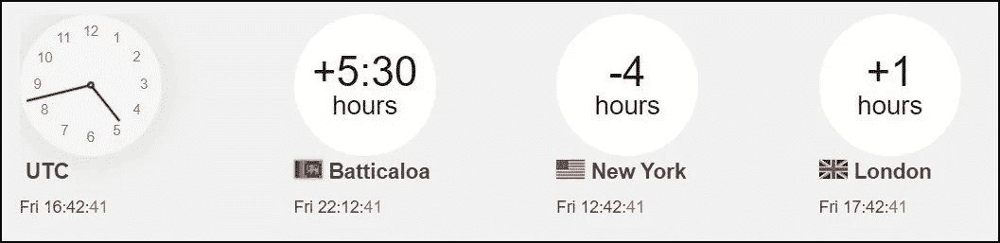
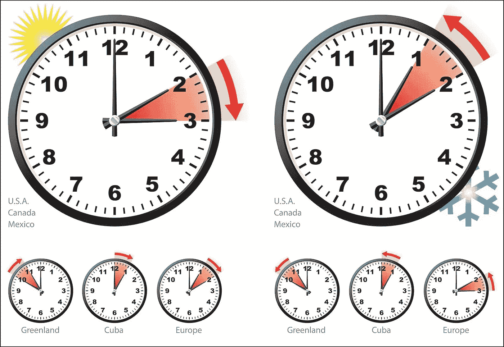

# 为什么时区对开发人员很重要？

> 原文：<https://medium.com/codex/why-time-zones-matter-for-developers-f8c5f7665dd2?source=collection_archive---------12----------------------->

文斯·维拉斯在 [Unsplash](https://unsplash.com?utm_source=medium&utm_medium=referral) 上的照片

作为开发人员，您可能需要处理不同的时区。有时候，你可能需要开发一些受时间影响的项目。然后，如果你在一个地区，你开发项目在另一个地区使用。就像那种情况，你会明白了解时区有多重要。

# **时区**

**1。什么是时区？使用相同标准时间的地理区域。**

**2。为什么我们有时区？如果我们同时拿走整个世界。他们中的一些人将经历中午，而他们中的一些人将经历早晨。有时，有些人可能有晚上的时间。所以你可以理解如果全世界都有相同时间会发生什么。我们需要有一种方法来清楚地识别这一点。所以我们有时区。**

**3。时区会变吗？是的**

**4。时区为什么会变？:**通常情况下，行星会自转。有些地方接受阳光或黑暗的原因是地球自转的一个结果。地球自转是各国遵循不同时区的主要原因。当地球旋转到阳光下时，你可以看到日出。当地球转离阳光时，你会看到日落。

如果只有一个时区，这是不可能的，因为地球每小时自转 15 度。

**5。时区是如何工作的:**它将世界分成 24 个部分。因为 360/15 等于 24。它获得 15 度的切片，并相应地设置每个区域的时钟。一个特定区域的所有人都以相同的方式设置他们的时钟，每个区域都与下一个区域相差一个小时。

**6。我们如何能得到我们的当地时间？:**我们可以得到 UTC，根据我们的地区偏移量，我们可以得到我们的本地时间。

例如，在斯里兰卡，我们需要在当前的 UTC 上加 5 个半小时来获得当地时间。

## GMT 和 UTC

**什么是 GMT？:** GMT(格林威治标准时间)是没有 UTC 时差的时区的名称。

**GMT 和 UTC 的区别？:**

GMT →格林威治标准时间

UTC →世界协调时间

GMT 是时区，UTC 是时间标准。

GMT 是一些欧洲和非洲国家正式使用的时区。可以使用 24 小时制(0–24)或 12 小时制(1–12am/pm)来显示时间。

UTC 不是一个时区，而是一个时间标准，它是全球民用时间和时区的基础。这意味着没有国家或地区正式使用 UTC 作为当地时间。

> 有一些有趣的事情。住在赤道附近的人，白天和黑夜几乎一样长(12 小时)。但是，有一些国家夏天的日光比冬天多得多。
> 
> 举个例子，如果你住得离北极或南极更近，他们在夏天有很长一段时间的日照。因为这个原因，有个东西叫夏令时(夏令时)。

# 夏令时(DST)

这也被称为夏令时。这对赤道附近的国家没有帮助。但是那些在夏天经历长时间日照的人。这是为了更好地利用日光。

在夏季的几个月里，他们会调整时钟，将白天的一个小时从早上移到晚上。

# 事情需要知道 java 开发的日期和时间

## **本地日期时间类**

[**Java . time . local datetime**类](https://www.geeksforgeeks.org/java-time-localdate-class-in-java/)在 Java 8 中引入。Local Date Time 类是一个不可变的日期时间对象，表示日期时间。默认格式为 **yyyy-MM-dd-HH-mm-ss.zzz** 。

这提供了没有时区信息的对象。

它继承了 object 类并实现了 **ChronoLocalDateTime 接口**。

只要我们需要在没有时区引用的情况下表示时间，我们就可以使用 LocalDateTime 实例。

## SQL 日期时间

在 SQL 中，DateTime 日期数据类型用于包含日期和时间的值。微软将其定义为**一个日期和一天中基于 24 小时制的带小数秒的时间**。

日期、时间和时间戳是大多数数据库支持的日期时间字段。它们都扩展了 **java.util.Date** 。

**java.sql.Date** 、 **java.sql.Time** 和 **java.sql.Timestamp** 是 JDBC 的相关类。

## Java 中的时间 API

Java 日期时间包。在 JDK 8 中引入的日期时间 API 是**一组对日期和时间**最重要的方面建模的包。java 中的核心类。时间包使用 ISO-8601 中定义的日历系统(基于公历系统)作为默认日历。

这个 API 为这样的操作提供了许多实用方法。

**Java 8 日期时间 API 的优势？**

不变性和线程安全。另一个优势是 Java 8 日期时间 API 中的所有时间表示是不可变的，因此是线程安全的。所有的变异方法都返回一个新的副本，而不是修改原始对象的状态。java 之类的老类。