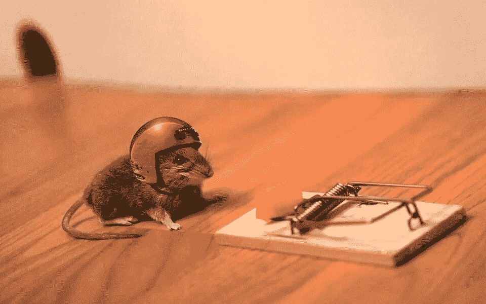

# 为什么交易机器人被高估了(作为一个交易机器人工程师)

> 原文：<https://medium.com/codex/why-trading-bots-are-overrated-as-a-trading-bot-engineer-babbb2e40cd7?source=collection_archive---------5----------------------->

来源:Pinterest

交易员:金融界的角斗士。我认为这是一个恰当的比较。毕竟，大多数角斗士都过着艰苦而短暂的生活。当然，你不是在交易中与野生动物搏斗至死。但有时候，感觉更糟。这是一个杀人的职业。我的意思是，看看统计数据就知道了。话虽如此，如果没有一线希望，这就不是一篇文章，至少…