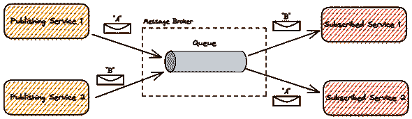
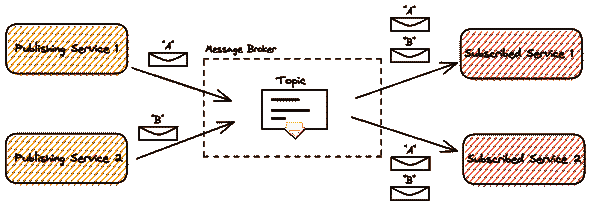

# 为什么在你的系统设计面试中使用消息代理？

> 原文：<https://medium.com/codex/why-use-message-brokers-in-your-system-design-interview-a10ff24a9c63?source=collection_archive---------0----------------------->

## 系统设计

## 消息代理在分离分布式系统方面非常强大。了解核心概念，以便在下次系统设计面试中使用它们！

以我的经验来看，搞定系统设计面试并不是要了解 youtube、谷歌搜索、dropbox、网飞、Twitter、脸书等的真实架构。用心。**不**，这一切都是为了了解概念和技术，以便当场起草这些系统。如果你系统地学习这些，整个面试准备归结为学习和练习大量的组件和概念。

在其核心，你只需要学习如何回答四个问题来设计任何系统。

1.  **如何传输数据？**
2.  如何存储数据？
3.  如何转换数据？
4.  如何显示数据？

在本文中，我将向您介绍如何在分布式系统中传输数据的一个广泛使用的解决方案，您可以使用它来起草几乎任何系统面试设计问题的答案。

# 使用分布式消息传递来扩展系统

当您开始设计一个没有可伸缩性的系统时，最简单的数据传输方式是直接向系统的其他部分发送消息。

一旦你的系统由几个服务和异步操作组成，包括你的一些服务，事情就会变得非常混乱。如果您坚持原来的方法，用不了多久，您的分布式系统就会变得如此紧密耦合，以至于您难以前进。我将这种反模式称为“分布式整体”。

如果您选择实现分布式消息传递来促进消息通信，那么您的系统架构就是为可伸缩性而设置的！

# 分布式消息传递的核心概念

分布式消息传递是健康的微服务架构的基础。基本思想是实现一个叫做**消息代理**的组件。它处理不同服务之间的数据传输，而这些服务彼此之间并不了解。

代理允许松散耦合的通信，这意味着消息发送者不知道谁将接收消息。代理负责将消息路由到正确的目的地。分发消息系统允许根据需要增加订户来处理更多的消息。它还增加了所需的属性，如可靠性和持久性。

这通过多个服务的组合产生了一个更松散耦合的应用程序，这些服务可以独立地部署和伸缩，而系统的其余部分并不知道。

# 分布式消息传递的工作原理

大多数消息传递解决方案支持两种分发方法:基于队列和基于主题。

# 队列(点对点消息传递)

点对点通信允许发布者向订阅者池中的单个服务发送消息。代理选择将接收发布消息进行处理的订阅者。只有一个订阅者会收到发布到队列的消息，除非该订阅者未能在给定的超时期限内处理该消息。

# 主题(发布/订阅消息传递)

基于主题的消息传递允许将每条消息发布到一个主题，该主题将消息分发给当前注册的每个订阅者。代理不关心消息是由所有订阅者处理的，还是仅由一部分订阅者处理的。

# 应用于系统设计面试问题

在大型科技公司(尤其是 FAANG)的面试过程中，被问到系统设计问题是很常见的。通常情况下，你会被要求为优步、谷歌、Airbnb 或网飞等著名系统进行高层次设计。消息代理是确保服务间可靠和可伸缩通信的绝佳选择。

感谢阅读这篇文章！如果你想和我联系，就在 [LinkedIn](https://www.linkedin.com/in/fabianhinsenkamp/) 、 [Twitter](https://twitter.com/hinsencamp) 上和我联系。

如果你想用我在文章中用到的元素来练习你的系统设计技巧，你可以**下载我的免费系统设计元素库**，它是一个天才草图工具 Excalidraw。

 [## Excalidraw 系统设计库

### 要通过 FAANG 系统设计面试，你需要准备和练习！为了帮助你，我创建了一个…

bigtechcoach.gumroad.com](https://bigtechcoach.gumroad.com/l/excalidraw-system-design-symbols) 

*最初发布于*[*https://big tech . coach*](https://bigtech.coach/blog/why-use-message-brokers-in-your-system-design-interview/)*。*