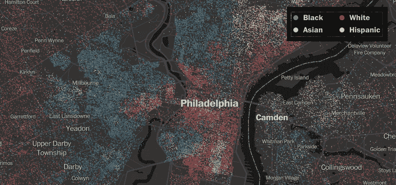
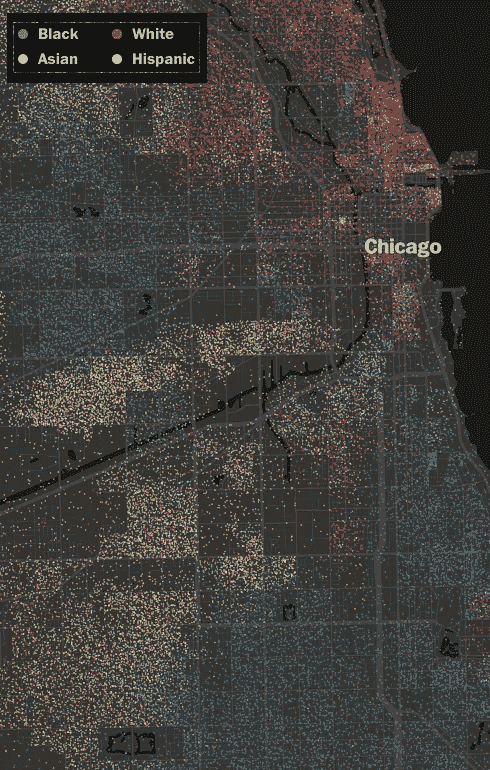
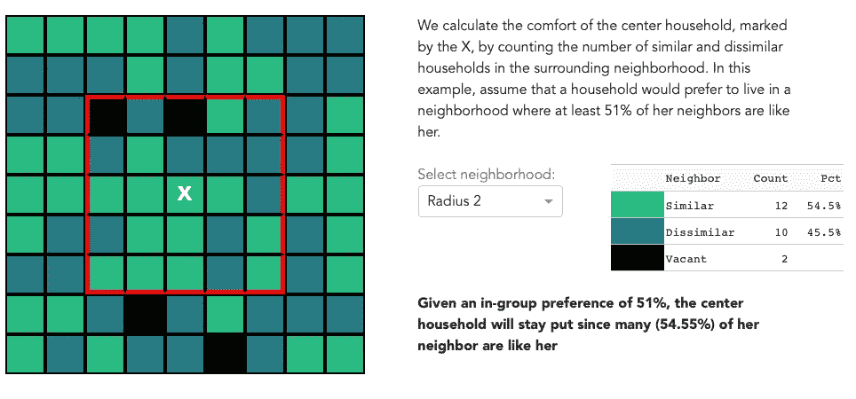
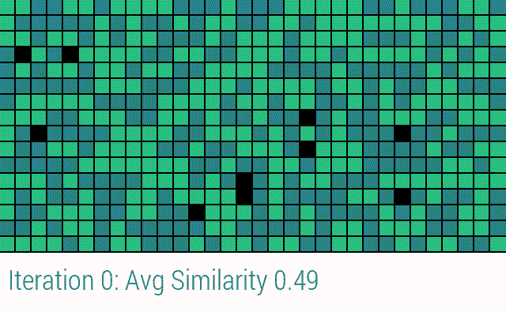

# 为什么我们不住在一起:使用基于代理的建模复制居住隔离

> 原文：<https://medium.com/codex/why-we-dont-live-together-replicating-residential-segregation-using-agent-based-modeling-708235ad7a7d?source=collection_archive---------21----------------------->

## [法典](http://medium.com/codex)

图 1:使用 2010 年人口普查数据的费城少数民族人口。来源:华盛顿邮报

*   我们再现了托马斯·谢林从 20 世纪 70 年代开始的里程碑式的实验，该实验使用基于主体的建模(ABM)来展示住房隔离模式。
*   这个实验表明，即使所有人都喜欢住在融合的社区，住房隔离，即个人与相似的人聚集在一起，也会产生结果。
*   这个实验经常被用作基于主体的建模的介绍，并证明了由于群体动力学的复杂性，在社会层面上可能会出现与直觉相反的结果。

*以下是我们为什么不住在一起的浓缩版。带交互元素和底层代码的完整版* [*此处*](https://www.quantviews.com/schelling-segregation) *。*

# 介绍

社会科学家观察到，相似种族的人倾向于聚集在一起，形成以白人、黑人或西班牙裔为主的社区，而不是多种族混合的社区。为什么会这样呢？有些人可能会说，种族进步虽然不稳定，但在过去几十年中有所增加，因此持久的隔离必然是结构性差异的结果。

但是，包容性的种族态度一定意味着融合的种族结果吗？一个完全直观的思路是，如果人们在个人观点上是宽容和包容的，那么作为一个整体的人口将反过来发展成为一个一体化的社会。不幸的是，这可能是一个例子，说明我们的直觉是错误的，一个完全合理的理论无法反映复杂的现实。

该工具将展示基于主体的建模(ABM)在解释居住隔离中的应用，并揭示 ABM 本身的概念和过程。基于代理的建模是一个自下而上的框架，它包括用行为和目标对单个代理进行编程，并模拟它们彼此之间以及与环境之间的交互。这个应用程序的目标是展示 ABM 如何经常用于分析群体行为，以及 ABM 如何揭示从看似简单的设置中出现的意想不到的动态。

# 居住隔离

芝加哥是美国最多元化的大都市之一，拥有近 300 万居民，各主要族裔群体占很大比例(56%为白人，32%为黑人，29%为西班牙裔，7%为亚裔)。然而，芝加哥也是美国种族隔离最严重的大城市之一。例如，使用最新的 2010 年人口普查的人口信息地图显示了以种族构成为界限的不同社区。

种族隔离的现实有许多促成因素，包括蓄意的政府政策，这些政策在历史上通过土地使用条例或抵押歧视来隔离少数群体。此外，一个更消极的现象是种族导向，房地产经纪人可能会根据种族将客户导向特定的社区。

然而，除了这些外部因素，住房模式也可能源于个人喜好。这些因素包括家庭喜欢某些特定的社区，因为这些社区离家人近，有熟悉的食物可供选择，或者有可能与价值观相似的人组成社交网络。总的来说，这些偏好相当于社会科学家所说的群体内偏好，或对自己文化的偏好，这将是这个应用程序的重点。

虽然这个应用程序将使用居住隔离作为讨论 ABM 的一种方式，但它并不是所有适用的社会、政治和经济动态的全面概述。虽然计算机科学家能够为对话做出贡献，正如本应用程序将展示的那样，但对这一主题的严肃讨论需要采用多学科方法，从历史学家、统计学家、经济学家和其他人的角度出发。

# 模拟方法学

为了对我们的分离模拟进行编程，我们建立了一个简化的现实模型。我们把一个城市描绘成一个 2D 网格，就像一个棋盘，网格中的每个方块代表一个家庭可以居住的住所。在我们的课程中，真实的邻域在物理上看起来并不像拥挤的棋盘，但是我们假设这种简化，在我们将要做的许多假设中，对分析并不重要。

接下来，我们在我们的模型中假设有两种类型的家庭(比如白人和亚洲人)，每个家庭主要关心的是属于一个充满类似家庭的社区。为了测量一个邻居相对于一个给定家庭的相似性，我们将一个邻居定义为在某个半径范围内的相邻房屋，然后计算属于“相同”组的家庭的比例和属于“其他”组的家庭的比例。根据一个家庭的容忍水平，这个家庭可以决定搬到一个新的社区或者留下来。

我们通过构建一个城市并随机将黑人和西班牙裔家庭安置在房子里来构建一个计算机模拟。我们想象在第一个月，每个家庭根据他们邻居的构成来评估他们在他们的邻居中有多幸福。周围有足够多“相似”人的家庭很满足，决定留在自己家里。不满的家庭，因为相似家庭的数量低于他们的舒适水平，决定搬到不同的家。

现在是第二个月，每个家庭重复他们的评估过程，并决定留在家里或移动。我们重复这个循环，直到城市开始稳定，也许是几个月后，很少有家庭四处迁移。城市的稳定意味着几乎所有的家庭都满足于他们各自的社区。值得注意的是，虽然一个家庭在一段时间内对他们的邻居感到满意，因此决定留下来，但随着老住户的搬走和新住户的搬进来，邻居本身可能会随着时间而改变。随着这些变化，以前满足的家庭将来可能会搬走。

# 结果和分析

我们的分析使用上述方法进行，该方法基于一个简单的前提，即家庭可能偏好居住在反映其种族身份的社区。当这种偏好非常强烈时，一个白人家庭只有在 90%的邻居也是白人的情况下才会满意。另一方面，如果偏好相对较弱，那么一个拉美裔家庭可能会非常满意一个只有 20%拉美裔人的社区。

下面我们用一个 16x32 的小网格和大约 512 户家庭进行模拟。每户有 40%的相对包容性组内偏好。

随着时间的推移，两个群体从最初的融合状态最终分离。

上面动画中的每个方块代表一个家庭，该家庭正在考虑是留下还是搬到网格中的另一个点(黑色方块是空房子，家庭可以搬进去)。家庭基于一个简单的逻辑做出决定:如果至少 40%的邻居是相似的颜色，就留下来，否则就搬走。即使每个人都满足于做一个少数民族，并生活在一个融合的社区中，随着时间的推移，网格变得分离，与开始状态相比，两个群体之间有明显的分离。

模拟显示，即使 1)景观从一个整合的状态开始，并且 2)所有的家庭都不反对生活在一个混合的社区中，最终也会产生一个隔离的结果。

为什么会出现这种情况？即使这些家庭是随机放置的，偶然也会有少数家庭发现自己是令人不安的少数群体(在这种情况下，平均相似性小于 40%)。当这些家庭搬出他们的社区，或者新的家庭搬进一个社区，这反过来会产生一个小的影响，导致少数家庭在下一个时期想要搬家。每次一个家庭搬家，都会产生连锁效应，迫使其他家庭随后搬家，直到最终形成一个以同质社区为特征的系统。

## 结论:关于隔离的思考

如果我们认真对待这个简单模拟的结论，我们可能会得出一个悲观的观点，即即使我们要消除所有形式的结构性歧视，我们也会发现这些并不一定会产生隔离，仅仅偏好就足够了。

然而，如前所述，本文并不打算说明隔离的全部复杂性，也不打算说明潜在纠正的有效性。不过，谢林模型最终表明，偏好可能是对话的一个重要部分，因为偏好可能“解释”居住隔离。正如[克拉克和福塞特所总结的:](https://www.pnas.org/content/105/11/4109)

*文献中更重要的区别是偏好和歧视之间的区别……对于这两个因素，促进融合的政策选择大相径庭。*

*法律禁止歧视，歧视可获得各种法律补救。优惠不在公平住房法的范围之内，如果寻求补救，必然会有根本的不同。有鉴于此，更好地理解偏好对隔离的影响至关重要。*