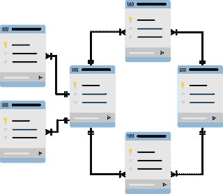

# 为什么我们需要结构化数据|大数据分类

> 原文：<https://medium.com/codex/why-we-need-to-structured-data-classification-of-big-data-11a64baa303d?source=collection_archive---------13----------------------->

[结构化数据](https://www.mayhemcode.com/2022/01/why-we-need-to-structured-data.html)是一种基于其性质和结构的数据分类，让我们看看为什么这种类型的数据在大多数组织中很重要，以及拥有这种类型的信息有什么好处。

# 我们为什么需要数据？

值得注意的是，21 世纪的**信息是最强大的武器**。这些信息可以是任何类型的，无论是个人信息、组织信息还是机密信息，一切都很重要。它讲述了一个人或一个组织或政府的特征。例如，如果我们有某人的个人信息，我们可以进行社会工程攻击，并获得所需的东西，如金钱或其他任何东西。

每天都有大量的数据从不同的资源中产生，比如搜索引擎、社交媒体应用、视频、音频，甚至是这篇文章。因此，为了理解和处理数据，我们需要首先以适当的结构安排数据，这样我们就可以将它输入到一些程序或计算机中。这就是数据分类发挥作用的地方。大数据处理大量信息，以便**发现特定特征、模式或预测未来**为了实现这一点，我们需要整理数据并对其进行分类。

# 结构化数据:

如果你学过 DBMS，你可能知道 schema，它将数据保存在不同属性或特性的预定义表中。结构化数据还有其他特性，我们将在本文中进一步探讨。大多数**组织都致力于实现这种类型的数据**或将他们当前的信息/数据转换成这种数据。数据以适当的方式存储，如行和列，常见的例子是 RDBMS。

# 半结构化数据:

半结构化数据也是一种数据分类类型，其中它具有不一致的结构，但它是自描述的。例如，如果您制作一个表单来填写一些成员的个人详细信息，那么它将是半结构化数据的一个示例，因为大多数成员可能没有填写所有必需的信息，一些成员可能填写了错误的数据，但是我们可以说所有的数据都对应于个人信息。它以 XML、JSON 等**标记语言的形式存储。这没有任何特定的规则或结构，但我们可以通过查看数据获得更广泛的信息。**

# 非结构化数据:

任何不以预定义格式或模式排列的数据都称为非结构化数据。**大约 80–90%的组织数据都是这种形式**。信息源大多会生成非结构化数据，需要某种方式或方法将这种形式转换为结构化信息，如音频、视频、聊天消息、社交媒体数据、电子邮件、word 文档。PowerPoint 演示文稿、网页都属于这一类。

# 结构化数据的优势是什么？

当信息以预定义的方式或模式存储时，对于计算和存储效率都有几个优点。主要的优点是计算机或程序可以很容易地理解和解释这些数据。

*   **CRUD 操作**:当我们想要执行插入、更新、删除和查看数据等操作时，这可以通过结构化数据轻松完成，因为可以使用不同的索引或 RDMS 存储中的主键来访问它们。 **DML 或数据操作语言**可以很容易地用来对它们进行操作。
*   **可扩展性和安全性**:我们可以根据需要在存储中添加或删除数据，换句话说，它完全可以**扩展到任何规模**。如果所有数据都以预定义的方式存储，则很容易应用加密方法来保护数据，从而实现信息的安全性。

欲了解更多信息，请访问:

[https://www . mayhemcode . com/2022/01/why-we-need-to-structured-data . html](https://www.mayhemcode.com/2022/01/why-we-need-to-structured-data.html)

*原载于 2022 年 1 月 3 日 https://www.mayhemcode.com***。**