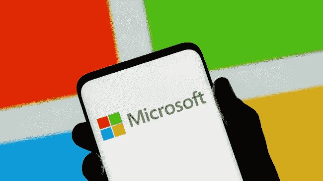
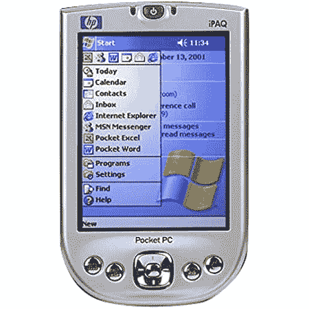
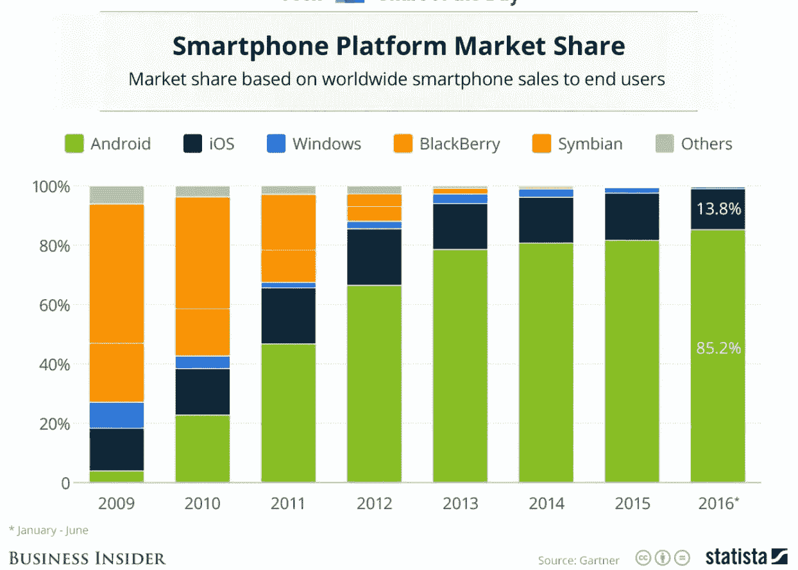

# Windows Phone 为什么会失败？

> 原文：<https://medium.com/codex/why-windows-phone-failed-c0a33a8dee74?source=collection_archive---------15----------------------->

[源链接](https://www.gamereactor.dk/nyheder/1051083/Microsoft+suspenderer+al+salg+og+alle+tjenester+i+Rusland/)

2010 年 10 月，微软推出了 Windows Phone 操作系统的 Windows Phone 7 版本，该版本由当时的许多大型科技巨头运行，如 HTC、三星、戴尔等。但 Windows Phone 是微软最昂贵的失败。在这个故事中，我将解释为什么 Windows Phone 在与谷歌和苹果的竞争中失利。

2007 年 1 月，史蒂夫·乔布斯发布了一款革命性的设备——iPhone。我说“革命性”是有原因的，因为该产品彻底改变了手机市场的游戏。该设备没有传统按钮(除了 Home 键)。因此，它改变了游戏，苹果的竞争对手如谷歌不得不完全停止正在进行的产品项目，并以触摸屏设计重新开始，谷歌花了一年时间发布了新的移动操作系统 Android。苹果凭借其高质量的设备已经处于市场的顶端，这使得苹果能够以高于市场上其他设备的价格(499 美元)出售该产品。谷歌选择了一种不同的方法来取得成功，他们让 Android 更便宜，让每个人都能买得起。Android 发布后，市场相当平衡，苹果和谷歌的市场份额相当，直到另一家科技巨头微软加入这场游戏。

手机行业对微软来说并不是全新的，相比苹果和谷歌，该公司有更多的经验。微软已经开发了 Windows CE 操作系统，它是为像“掌上电脑”(类似小型笔记本电脑)这样的小型计算机设计的，多年来，微软越做越深，制造了“掌上电脑”，它与当时的移动电话非常相似，但运行在 Windows CE 上。正如你所看到的，微软在移动设备方面有足够的经验，他们在 2007 年甚至占据了 15%的市场份额。

[来源链接](https://www.amazon.com/HP-iPAQ-4150-Pocket-PC/dp/B0000TFCFO)

在其中一次采访中，微软前首席执行官史蒂夫·鲍尔默被采访者问及当他看到 iPhone 时的第一反应是什么。他回答说，*“500 美元，完全有计划补贴，这是世界上最贵的手机，它对商业客户没有吸引力，因为它没有键盘，这使它不是一个非常好的电子邮件机”。*微软在移动设备上的愿景(或者仅仅是史蒂夫·鲍尔默个人的愿景)就像是“一台电子邮件机”,这与史蒂夫·乔布斯的愿景完全相反。也许这就是为什么微软花了 4 年时间才意识到苹果和谷歌接管了市场，他们应该做点什么。

[源链接](https://itsocial.fr/enjeux-it/enjeux-strategie/business/steve-ballmer-ne-diagnostique-plus-de-cancer-linux/)

微软开始为触摸屏移动设备开发操作系统，并花了 2 年时间才发布。该公司推出了苹果和谷歌从未做过的新功能。但是操作系统有非常严格的要求才能运行。这使得手机制造商很难生产支持 Windows Phone 操作系统的设备。因此，手机制造商开始用更容易运行的 Android 操作系统取代 Windows Phone。那是微软的一大失误。与苹果不同，微软没有生产移动设备。

微软很幸运，微软前高管史蒂芬·埃洛普在诺基亚担任首席执行官，他决定用 Windows Phone 操作系统取代诺基亚的 Symbian 操作系统。此举之后，微软向诺基亚“投资”了数十亿美元作为“平台支持付款”。此外，微软没有从诺基亚获得其操作系统的许可费。显然，HTC、三星和 LG 等其他公司不喜欢它，因为虽然他们为使用 Windows Phone OS 支付许可费，但诺基亚却免费获得它。这导致其他公司转向 Android。

[来源链接](https://www.businessinsider.com/smartphone-market-share-android-ios-windows-blackberry-2016-8)

苹果 4 年后，2010 年，诺基亚推出了运行 Windows Phone 的新设备，但为时已晚，无法帮助微软与霸主苹果和谷歌竞争。由于苹果和谷歌正在主导市场，开发者和公司专注于为 AppStore 和 Google Play 开发应用程序，但没有人想为 Windows Store 开发应用程序。到 2013 年，诺基亚陷入困境，股票下跌了 75%。股东们要求摆脱 Windows Phone，但是没有，后来微软以 72 亿美元收购了诺基亚。微软最终解雇了 8000 多名员工，并可能让 Windows 手机存活到 2017 年。