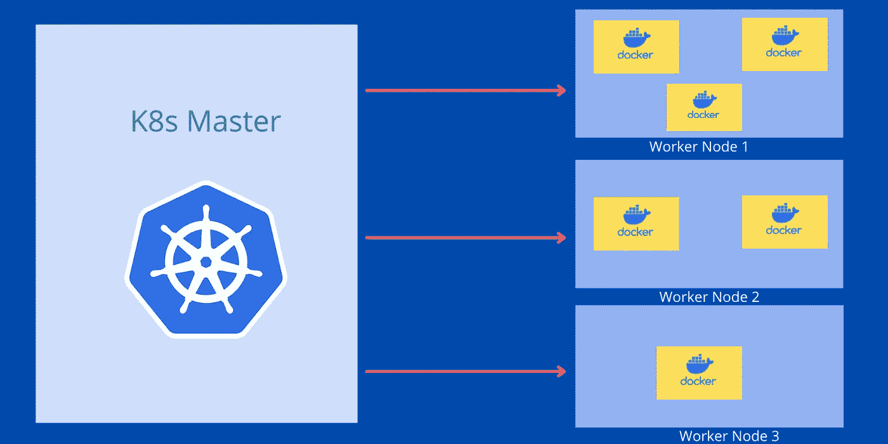

# 为什么你需要 Kubernetes

> 原文：<https://medium.com/codex/why-you-need-kubernetes-511eb4948bf2?source=collection_archive---------5----------------------->

## Kubernetes 的实时用例解释。

Kubernetes 主节点和工作节点

什么是 Kubernetes？。我们为什么需要 Kubernetes？。Kubernetes 有哪些实时用例？。这些是每个开发人员在开始探索库伯内特时都会想到的问题。许多人未能理解库伯内特。第一次尝试时，我也不理解 Kubernetes。诀窍是，你必须先了解 Docker