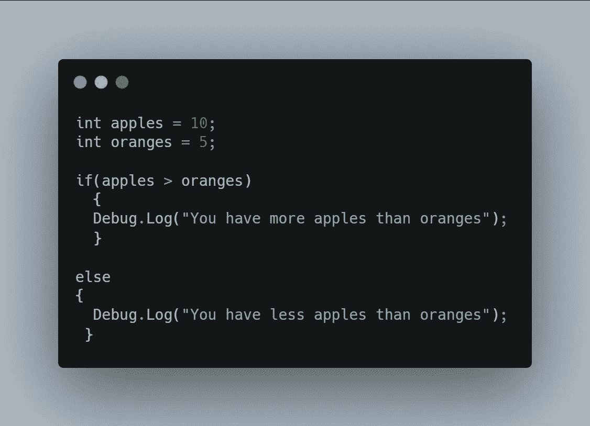
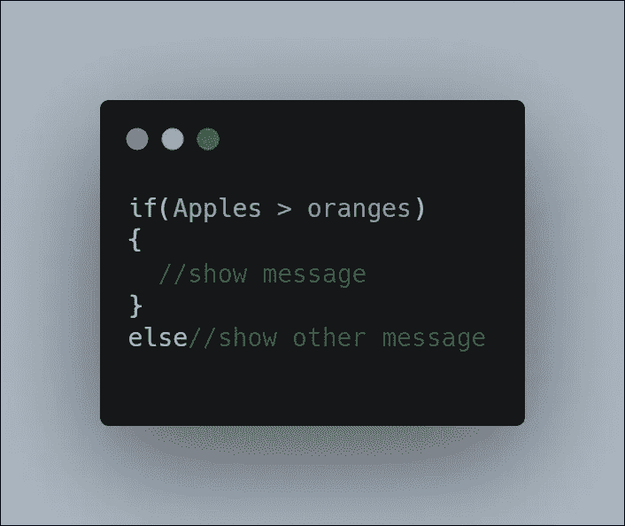

# 为什么你应该写伪代码

> 原文：<https://medium.com/codex/why-you-should-be-writing-pseudocode-e58971c2ab49?source=collection_archive---------21----------------------->

## 什么是伪代码？

用自然语言编写单个语句、一组语句甚至整个程序的逻辑的简单方法。伪代码不需要编程语法或任何其他复杂的结构，这使得任何人都非常容易使用。

**举例:**

**伪代码:**比较苹果的数量和橙子的数量，**如果**苹果的数量大于橙子的数量，**则**显示一条消息，说苹果多了。否则，显示一条消息说还有更多橙子。

**代码:**

编程时伪代码也可以写在注释里:

## 它是用来做什么的？

伪代码是一种创建你需要你的程序做什么的草稿或大纲的方法，也是一种优秀的解决问题的工具。通过用简单的术语陈述您的编程需求，您可以将复杂的问题分解成最基本的形式，并逐步构建您的解决方案。

## 使用伪代码的好处

*   谁都能理解。所有类型的程序员，不管他们的主要编程语言是什么，都可以看看伪代码，从中提炼出连贯的语法。
*   文档在任何软件开发行业中都是基础和重要的。伪代码在工作文档的草稿中非常有用。
*   分解复杂的问题寻求更好的解决方案。
*   可以用来解释每一行代码，不仅使开发的早期阶段更容易，而且提高了程序员对程序的知识和理解。
*   使代码更具可读性。
*   实现算法的最好和最常见的方法之一。
*   可用于从流程图转换到实际代码。

## **编写伪代码的技巧:**

1.  要简洁但要精细；努力做到不那么抽象，不那么暧昧。独立工作时可以不那么严格，尽管建议你确保理解自己的写作。当和其他程序员一起工作时，他们需要你尽可能的清晰。
2.  尝试使用正确的命名法/命名惯例。如果你团队中的一个程序员发现了你的伪代码，在可能的情况下，你应该说明什么是变量，什么是方法，或者其他什么。
3.  尽可能使用简化的编程术语来帮助可视化逻辑。其中包括“如果-那么”、“格”、“当”、“for”。

就像前面的例子:“**如果**苹果的数量大于橘子的数量，**那么**显示一条消息”