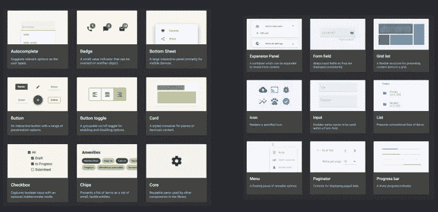

# 为什么你今天要学 Angular！我们将为您提供开始的第一步！

> 原文：<https://medium.com/codex/why-you-should-learn-angular-today-we-will-give-you-the-first-steps-to-get-started-243f2c5fd0ab?source=collection_archive---------14----------------------->

欢迎来到 Startuphakk！今天，我们将讨论为什么你应该学习 angular，为什么它是构建客户端框架的最佳 UI 框架；来构建您的前端，所以让我们深入研究并开始吧。

# 你为什么要学棱角？

1.什么是有角？

2.使用角度的优势

3.使用 Angular 开发的流行网站

4.棱角分明的材料

# 1.什么是有角？

Angular 是一个 Javascript 框架，开发人员使用它来构建 web、桌面和移动应用程序。Angular 应用程序的开发涉及到 Typescript 的使用，Typescript 是 Javascript 以及 HTML、CSS 等的超集。

这个框架是谷歌工程师 Misko Hevery 和 Adam Abrons 的心血结晶。谷歌在 2012 年正式发布了第一个版本 AngularJS，之后一直维持。

2012 年刚过不久，我第一次使用它。嗯，当 angularjs 推出第一个版本时，我们开始将我们正在构建的应用程序移植到 angular 2，这时他们放弃了 js，转而使用 angular 2，在这一点上，angular 2 是一个很大的修订，但自 angular 2 以来，一切都是线性升级。

Angularjs 是一个伟大的现代 web 开发框架。它帮助你在所有的网络平台上开发。这是你能得到的最快的 UI 平台之一，它有着令人惊叹的工具，而且它已经在世界各地使用了超过 10 年，所以这是一个非常棒的框架，我绝对推荐它。

# 2.使用角度的优势:

● Angular 支持单页应用(又名 spa)

*   spa 是一个单页应用程序，它可以与后端服务器通信，而无需刷新整个页面，以便在 angular 或更高版本中实时加载数据。

●双向数据绑定

*   双向数据绑定几乎是自动的。当数据存储更新时，ui 也会立即更新。

●角度模块化

*   你可以把模块化和角度化看作是把代码组织成桶。这些桶在角度上被称为模块。应用程序代码被分成几个可重用的模块。一个模块有相关的组件指令管道和服务组在一起，这些模块可以相互组合来创建一个应用程序。模块还提供了几个好处。其中之一是延迟加载，在这种情况下，可以按需加载一个或多个应用程序特性。如果使用得当，延迟加载可以大大提高应用程序的效率。

●简化编码

*   许多 web 开发人员希望编写简短而有效的代码。Angular 支持 MVC，这是一种模型视图控制器架构，开发人员只需将他们的代码分成大使馆结构，其余的由 angular 处理。没有必要编写 MVC 管道。

●易于集成

●跨平台

您可以使用 angular 开发 web 应用程序、本地移动应用程序和桌面应用程序。

# 3.使用 Angular 开发的流行网站

1.《卫报》

2.贝宝

3.向上工作

4.网飞

5.乐高牌塑料锁定式积木

6.自由记者

7.天气

8.捷蓝航空

**9。iStock 照片**

# 4.角度材质用户界面

[Angular materials](https://material.angular.io/) 是一个用户界面组件库，开发者可以在他们的 Angular 项目中使用它来加速开发优雅一致的用户界面。Angular materials 为您提供了可重复使用的漂亮的 UI 组件，如卡片、输入数据表、日期选择器等等。

实际上，你可以设计页面的风格，你可以设计整个网站的主题，这样你就可以改变网站上的一切。这里有一个列表，列出了所有使用角形材料的组件，所以没有必要编写任何代码，所以如果你想使用进度微调器，你可以看到基本的进度微调器。你还可以用它做其他事情。更换不同的部分真的很简单，然后它会给你所有的代码样本，这样你就可以从一开始就知道如何正确地编写代码。为了使用代码，这就是你所要做的一切。

许多不同的东西，如不同的卡属性，这些都是开箱即用的。所有这些使得开发你的网站变得非常简单，也非常优雅，你只需要做很少的编码工作，就可以获得很大的优势，所以 angular materials 绝对是另一个巨大的优势，也是使用 angular 的一个很好的理由。

今天就学习 Angular！！

报名 StartupHakk！

# StartupHakk:

无论是做一些专门的业务流程。我们专门让这些专家进入他们的领域，教他们如何开发，教他们成为全栈开发人员。你将会得到的是，你将会得到一个既能成为全栈开发者，又能成为其领域专家的人，我们认为这最终将会是， 这是最好的混合体之一，也是企业界的最大受益者，他们可以让这些专业人士成为开发人员，这最终将帮助他们在他们的领域变得非常优秀，我认为这是我们将真正努力的专业之一，所以请确保您了解 startuphakk.com 的。

这是一个很好的机会，我们刚刚开始启动我们的编码训练营，这样你就可以找到你所在领域的专家，教他们成为一名开发人员，然后开始构建和学习你所获得的所有这些最重要的技能。所以一定要去看看 startuphakk.com 的。