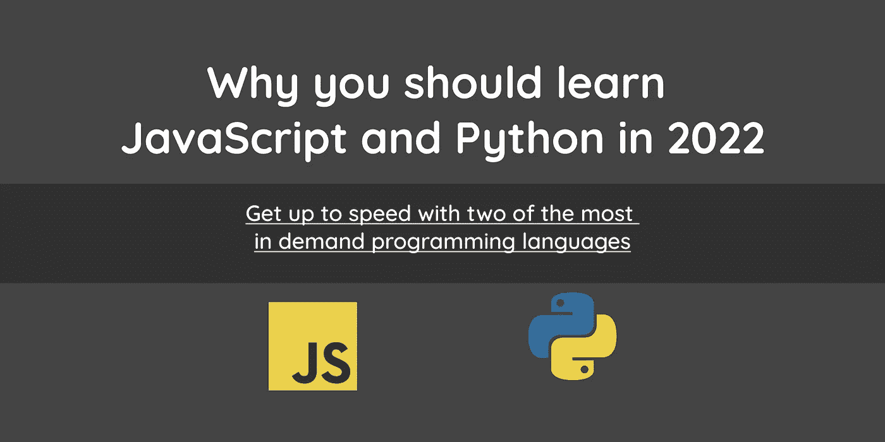

# 为什么要在 2022 年学习 JavaScript 和 Python

> 原文：<https://medium.com/codex/why-you-should-learn-javascript-and-python-in-2022-796034f6810c?source=collection_archive---------3----------------------->



新的一年为有抱负的开发人员和那些试图离开非技术岗位以便被聘为开发人员的人带来了新的机会。这些人面临的最常见的困境之一是，当从头开始学习一门新的编程语言时，要弄清楚应该学习什么技术堆栈以及应该朝什么方向前进。有无尽的选择和许多不同的道路，有人可以选择下去。

可以说，JavaScript 和 Python 是世界上最受欢迎和谈论最多的两种编程语言。如果你在任何一个求职论坛上搜索 JavaScript 和 Python 职位，你很可能会看到成百上千的结果。这两种备受追捧的语言的市场现在和将来都会很热，而且这种情况不会很快改变。两种语言也有很多相似之处。它们都是基于 C 的语言，这意味着它们是通用的、过程化的，并且具有词法作用域。

# 动态与静态

最突出的一点是 JavaScript 和 Python 是动态类型语言。从某种意义上说，动态类型编程语言不需要在使用变量之前显式声明变量。相反，静态类型的编程语言防止变量被重新分配到不同的类型。所有这些将在下面的例子中变得更加清楚。

# Java 示例

```
String myName; // Variable with a type of string
myName = "Tony Stark"; // The string is called Tony Stark
myName = 24; // Reassigning the string into a number
```

如果您要运行这个 Java 代码，您将得到一个编译错误或运行时错误。不可能将静态类型重新分配给不同的类型。你只能用另一个类似“史蒂夫·罗杰斯”的字符串。

# JavaScript 示例

```
let myName; // Variable that has no type
myName = "Tony Stark"; // The variable has a type of string
myName = 24; // The variable has changed its type dynamically to a number
```

现在，如果您运行这段 JavaScript 代码，您将不会得到任何错误，因为它是完全有效的。变量名现在是数字 24。

# Python 示例

```
my_name = "Tony Stark" # The variable has a type of string
my_name = 24 # The variable has changed its type dynamically to an int
```

同样，如果您运行这段 Python 代码，您也不会得到任何错误，因为它是完全有效的。变量名现在是 Int 24。

# 数据类型

数据类型本质上是在应用程序内部存储数据的方式。数据类型的类型指定了可以存储什么以及如何管理它。下面你会发现每种语言的一些数据类型的列表。

# JavaScript 数据类型

文本类型:字符串
数值类型:数字
布尔类型:布尔
映射类型:对象
序列类型:数组

# Python 数据类型

文本类型:字符串
数值类型:int、float、complex
布尔类型:布尔
映射类型:dict
序列类型:列表、元组、范围

# 比较语法

接下来，我们将比较两种编程语言的语法，这样您就可以看到在它们之间进行转换是多么容易。首先让我介绍一下这两种语言之间的一些差异。

**JavaScript**

*   使用分号
*   对代码块使用花括号
*   对变量使用 CamelCase 命名约定，例如 **firstName**
*   使用`console.log`向控制台输出消息

函数使用以下语法:

```
function myFunc() {
    console.log('Hello World');
}const myFunc2 = () => {
    console.log('Hello World 2');
};myFunc();myFunc2();
```

**巨蟒**

*   不使用分号
*   不使用花括号
*   对变量使用 Snake Case 命名约定，例如**的名字**
*   对代码块使用缩进
*   使用`print`向控制台输出消息

函数使用以下语法:

```
def my_func():
    print('Hello World')my_func()
```

# 文本

两种语言都输出字符串类型变量

## JavaScript 语法

```
let myName = "Tony Stark";
console.log(typeof myName); // string
```

## Python 语法

```
my_name = "Tony Stark"
print(type(my_name)) # str
```

# 数字的

在这个例子中，两个变量都用 JavaScript 输出一个数字

## JavaScript 语法

```
let num = 9000;
let num2 = 9.0;
console.log(typeof num); // Number
console.log(typeof num2); // Number
```

## Python 语法

在这个例子中，Python 能够看出数字和浮点数之间的区别，因为它们是建立在数据类型中的

```
num = 9000
num_2 = 9.0
print(type(num)) # Int
print(type(num_2)) # Float
```

# 布尔代数学体系的

输出几乎完全相同，唯一的区别是 JavaScript 使用小写的“T”表示 true，而 Python 使用大写的“T”。

## JavaScript 语法

```
let wizard = true;
console.log(wizard); // boolean
```

## Python 语法

在这个例子中，Python 能够看出数字和浮点数之间的区别，因为它们是建立在数据类型中的

```
wizard = True
print(wizard) # bool
```

# 绘图

JavaScript 使用对象数据结构，而 Python 使用字典数据结构。从这些例子中你可以看出它们非常相似。区别在于 JavaScript 不要求键使用引号，而 Python 要求键/值对中的键使用引号。

键在左边，例如**名**，值在右边，例如**托尼·斯塔克**。

## JavaScript 语法

```
const myprofile = {
    name: 'Tony Stark',
    age: 48,
    superhero: 'Iron Man',
};console.log(myprofile);
```

## Python 语法

```
my_profile = {
    "name": "Tony Stark",
    "age": 48,
    "superhero": "Iron Man",
};print(my_profile);
```

# 顺序

JavaScript 使用数组，这是一种对象数据结构，而 Python 使用列表数据结构。正如你所看到的，它们在你写的语法方面有很多相似之处。

## JavaScript 语法

```
const myArr = [1, 2, 3, 4, 5, 6, 7, 8, 9, 10];
console.log(typeof myArr); // object
```

## Python 语法

```
myArr = [1, 2, 3, 4, 5, 6, 7, 8, 9, 10]
print(type(myArr)) # list
```

# 从这里去哪里

想学 JavaScript 和 Python 可以去很多平台。我个人认为 freeCodeCamp 和 Udemy 都有很好的课程。这些是我推荐的。

# 学习 JavaScript

[https://www . freecodecamp . org/learn/JavaScript-algorithms-and-data-structures/](https://www.freecodecamp.org/learn/javascript-algorithms-and-data-structures/)

[https://www . udemy . com/course/the-complete-JavaScript-course/](https://www.udemy.com/course/the-complete-javascript-course/)

# 学习 Python

[https://www . freecodecamp . org/learn/scientific-computing-with-python/](https://www.freecodecamp.org/learn/scientific-computing-with-python/)

[https://www . udemy . com/course/complete-python-developer-zero-to-mastery/](https://www.udemy.com/course/complete-python-developer-zero-to-mastery/)

[https://www.udemy.com/course/complete-python-bootcamp/](https://www.udemy.com/course/complete-python-bootcamp/)