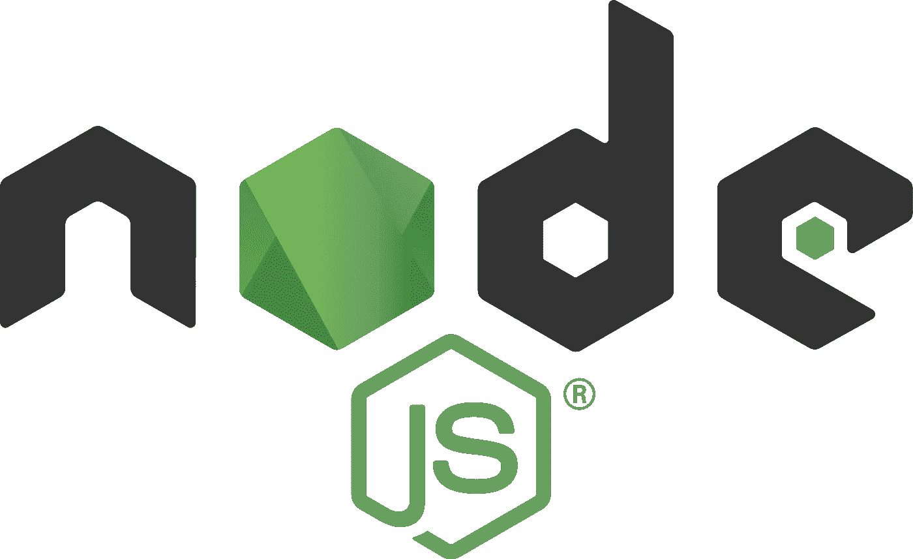

# 为什么应该学习 Node.js

> 原文：<https://medium.com/codex/why-you-should-learn-node-js-f1d665e264dd?source=collection_archive---------12----------------------->

## [法典](http://medium.com/codex)

# **这是谁的常见问题？**

这是针对 Java 和。NET 开发人员想知道在后端(即 Node.js)学习 JavaScript 对他们的职业生涯是否值得。

# 我为什么要相信这个常见问题？

作者是这样一个人，他职业生涯的第一个十年是用 C++编程的，第二个十年…