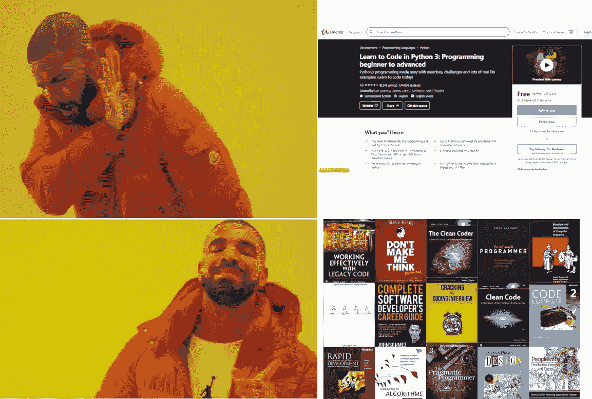

# 为什么应该通过书籍学习编程

> 原文：<https://medium.com/codex/why-you-should-learn-programming-through-books-672f1148abbb?source=collection_archive---------2----------------------->

如你所知，有很多在线课程，我指的是很多在线课程，比如在 **Udemy** 、 **Coursera** 、 **YouTube** 等等

关于在线开发的学习材料的数量正在快速增长，人们阅读的越来越少，想要成为一名全面的开发人员，只需要参加一个经常承诺过多且无法交付的在线课程。