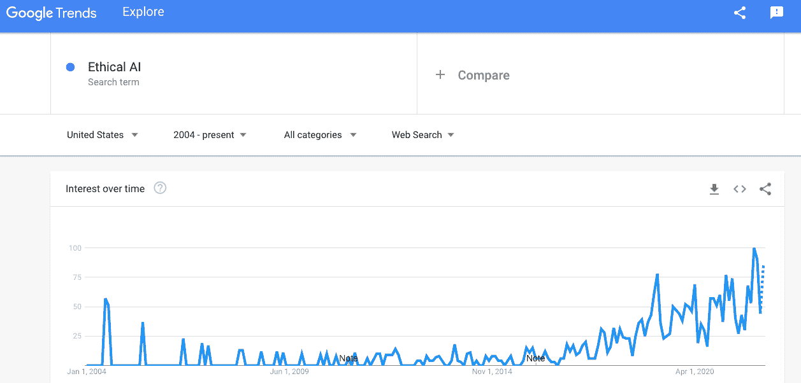
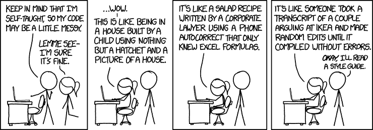
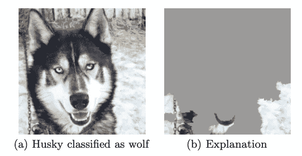

# 为什么你应该批判性地思考你的机器学习模型输出

> 原文：<https://medium.com/codex/why-you-should-think-critically-about-your-machine-learning-model-outputs-864bc7d80709?source=collection_archive---------6----------------------->

## 数据科学

## 有些模特并不像他们看起来的那样

丹尼尔·麦卡洛在 [Unsplash](https://unsplash.com/s/photos/architecture-draft?utm_source=unsplash&utm_medium=referral&utm_content=creditCopyText) 上的照片

随着时间的推移，“道德人工智能”运动一直在稳步发展。这一运动的重点是制造减少偏差(减少，而不是消除——这是不现实的)的人工智能，同时控制差异。理所当然，如果这些模型正在帮助更多的人做出重要决定，我们希望确保他们按照我们期望的方式行事。一个以数据为中心的社会只有在我们所依赖的数据产品可靠并按预期运行的情况下才是有益的。对数据专业人员依赖的增加意味着更深入了解我们工作成果的责任也相应增加。

与一些人认为道德人工智能对于防止未来“类似终结者”的场景非常重要的想法相反，这是目前必须实施的事情。

来源:[谷歌趋势](https://trends.google.com/trends/explore?date=all&geo=US&q=Ethical%20AI)

埃隆·马斯克多次表达了他对人工智能安全的担忧，但主要是指无所不知的 AGI(人工通用智能)。我们也需要对当今狭隘的人工智能有一个健康的关注。

来源:[今日美国](https://www.usatoday.com/story/tech/talkingtech/2017/08/14/elon-musk-more-worried-artificial-intelligence-than-north-korea/564341001/)

如果你是一名数据专家，你很可能非常熟悉 QA(质量保证)。不管有多烦人，你可能至少会尊重某种形式的问答。在我自己的工作中，我也开始欣赏使用最佳实践来生成高质量的代码(例如格式化)。

作为数据专业人士，在你的职业生涯中，侵蚀你生存核心的东西，就是无法让人们信任你所做的工作。这对我们的工作至关重要。没有信任，我们所有的数字永远不会导致行动。我相信这是所有分析师都渴望的一件事(如果他们关心自己的工作不仅仅是薪水的话)。这些错误可能很简单，比如在 SQL 脚本的 WHERE 子句中留下一个参数，从而改变了数据输出的定义，或者意外地包含了重复项(这是我们作为分析师存在的祸根)。作为一名分析师，你不断地检查和再检查你的输出。因此，如果我们作为分析师如此频繁地犯错误，尽管我们在基于规则的系统和非涌现模型上工作，那么我们在创建机器学习模型时需要多加警惕？

来源: [xkcd](https://xkcd.com/1513/)

## **“罪犯”典型范例——典型曲解**

以最终用户体验的方式来考虑你的模型是很重要的。我们需要批判性地思考模型的输出。在《说废话:数据驱动世界中的怀疑艺术》一书中，作者博格斯特伦和韦斯特给出了一个用于识别罪犯的分类模型的例子。

为了总结这个故事，2016 年两名研究人员向 arXiv(一个开放访问的研究论文档案)提交了一篇题为“使用人脸图像对犯罪行为进行自动推断”的文章。他们声称，他们的模型可以使用对象的照片以 90%的准确率预测犯罪行为。作者评论道，“如果这让你觉得与《T4》少数派报告、和其他反乌托邦科幻小说中的菲利普·K·蒂克预防犯罪警察惊人地接近，你并不孤单。”⁴:幸运的是，有一个比我们的面部特征更简单的解释来决定我们犯罪的可能性。

作者仔细回顾了那些被预测为罪犯的人和那些不是罪犯的人之间的区别。结果发现，在用于做出决定的其他面部特征中，模型预测的罪犯具有较高的上唇曲率。作者接着说，

> “这可能是什么？对于口鼻角和嘴唇的弯曲有一个显而易见的解释。当一个人微笑时，嘴角会张开，上唇会变直……看来作者混淆了天生的面部特征和不稳定的面部表情。如果是这样的话，他们所谓的侦查犯罪都是扯淡。他们没有发明犯罪探测器；他们发明了一种微笑探测器。”⁴

那么我们能从这个例子中学到什么呢？第一件事显然是我们需要小心不要曲解我们的发现。此外，我们也需要从一开始就保持谨慎。那些是罪犯的人有被使用的面部照片，而那些不是罪犯的人有来自社交媒体的照片。考虑到他们的图像来源没有可比性——面部特征和面部表情被混淆了，很容易看出研究人员最终是如何得到“微笑探测器”的。我们需要小心我们如何解释我们的模型在做什么，因为其含义可能会像预先确定的罪犯与简单的微笑探测器一样不同。

## **哈斯基模型——获胜模型的可解释性**

一些研究确实经历了额外的步骤来理解他们的模型输出。Carlos Guestrin 和他的同事就是这么做的，然而，他们的重点实际上是开发人工智能可解释性的软件。他们的论文介绍了他们的软件 LIME，题目是“我为什么要相信你？“解释任何分类器的预测”。他们在论文的开头写道:

> “尽管被广泛采用，但机器学习模型仍然主要是黑箱。然而，理解预测背后的原因对于评估信任非常重要，如果一个人计划根据预测采取行动，或者在选择是否部署新模型时，信任是最基本的。”⁵

在论文的后面，他们进行了一项实验来评估分类器的可信度，该分类器可以预测图像中是否有狼或哈士奇。他们向他们的研究对象，即大学生，展示了一组对 10 幅图像的平衡预测。其中一个有哈士奇的图像有雪的背景，其余的哈士奇图像没有。而狼的图像除了一张以外，背景都是雪。

他们评估了学生的信任度，在此之前和之后，他们表明该模型实际上没有使用任何动物特征来预测犬科动物之间的差异，而是基于背景中的雪进行预测。

来源:[“我为什么要相信你？”解释任何分类器的预测](https://arxiv.org/pdf/1602.04938.pdf)

这表明机器很难理解相关性不是因果关系。很明显，当学生们意识到模型并没有发现动物之间的差异，而只是背景时，他们的信任度直线下降。

## **刑事司法系统模型示例—模型偏差**

最后一个例子，我想回到人工智能在刑事司法系统中的应用。一个共同的主题似乎是，人们对模型有一种固有的信任，因为它们是复杂的，但是由于可解释性的降低，模型越复杂，信任可能会降低。同样的主题在这个最后的例子中被重复。

研究人员开发了一个模型来预测那些被逮捕的人的再犯风险。研究人员声称，这是有益的，因为它“减少了影响过程的任何偏见，因为法官是根据数据驱动的建议而不是直觉做出决定的。”⁶

然而，这个模型做的恰恰相反。它是根据历史犯罪数据进行训练的，因此只会延续以前存在的偏见。理论上，该模型应该节省时间并减少偏差，但因为研究人员没有清楚地了解他们的模型输出，它可能节省了时间，但它肯定没有减少偏差——它使偏差永久化。

## **外卖**

读完这篇文章后，我希望您能有所启发，更好地理解您的 ML 模型。《说屁话》这本书有很多有趣的内容，不仅是关于机器学习，也是关于理解一般数据，到目前为止，这本书是一本很好的读物。

我希望你能养成更好地理解你的机器学习模型的习惯。这绝对是我正在努力的事情。理解驱动预测的因素可能像确定要素重要性一样简单，也可能像使用石灰一样复杂。如果你刚刚开始你的数据科学之旅，你应该谷歌一下重要性和决策界限，开始提高你在这方面的技能。无论使用何种方法来更好地理解您的模型，这些故事都有望证明这个概念作为您作为数据专业人员的工作的一部分是多么重要。

 [## 加入我的介绍链接-安德烈亚斯马丁森媒体

### 作为一个媒体会员，你的会员费的一部分会给你阅读的作家，你可以完全接触到每一个故事…

medium.com](/@andreasmartinson/membership)  [## 每当安德烈亚斯·马丁森发表文章时，就收到一封电子邮件。

### 每当安德烈亚斯·马丁森发表文章时，就收到一封电子邮件。通过注册，您将创建一个中型帐户，如果您还没有…

medium.com](/subscribe/@andreasmartinson) 

## 来源:

1.  [伦理 AI](https://trends.google.com/trends/explore?date=all&geo=US&q=Ethical%20AI)
2.  [搜索](https://trends.google.com/trends/explore?date=all&geo=US&q=Ethical%20AI) (2022)，谷歌趋势

2.B. Molina， [Musk:人工智能安全比朝鲜带来更多风险](https://www.usatoday.com/story/tech/talkingtech/2017/08/14/elon-musk-more-worried-artificial-intelligence-than-north-korea/564341001/) (2017)，《今日美国》

3.R. Munroe， [xkcd:代码质量](https://xkcd.com/1513/)，xkcd 网络漫画

4.c .博格斯特伦和 j .韦斯特，[称之为扯淡:数据驱动世界中的数据推理](https://www.callingbullshit.org/) (2020)，《称之为扯淡》一书

5.m .图里奥·里贝罗，s .辛格和 c .盖斯特林，[“我为什么要相信你？”解释任何分类器的预测](https://arxiv.org/pdf/1602.04938.pdf) (2016)，arxiv 在线研究期刊

6.郝，[人工智能正在把人送进监狱——并且弄错了](https://www.technologyreview.com/2019/01/21/137783/algorithms-criminal-justice-ai/) (2019)，麻省理工学院技术评论在线杂志