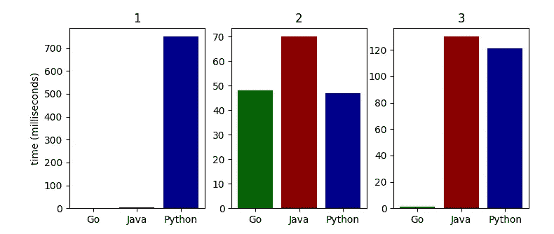

# 为什么你应该尝试 Golang

> 原文：<https://medium.com/codex/why-you-should-try-out-golang-7d8628797bb7?source=collection_archive---------15----------------------->

## 与旧语言相比，Golang 提供了一些令人耳目一新的方面，让我们探索一下。


罗斯·芬登在 [Unsplash](https://unsplash.com?utm_source=medium&utm_medium=referral) 上的照片

编程语言 Golang，或 Go，最初是由谷歌人在 2009 年开发的，此后定期更新，以确保它不缺乏最重要的功能。但是，在探索它还需要从其他语言中复制什么之前，让我们先关注新的。

## 并发成为一种乐趣(几乎)

Go 中的并发性(意味着让多个线程同时运行不同的操作)变得非常容易，这要感谢该语言的一个伟大特性，称为 goroutines。只需在函数调用前添加按键 ***go*** 即可使其并发，并且您的代码继续执行，而无需等待函数结束。

```
go func() {
    fmt.Print(1)
}()
fmt.Print(2)
```

根据两个线程的速度，上面的代码可能会打印“1 2”或“2 1”(它很可能会打印“2 1”，因为 goroutine 需要很短的时间来启动)。

有了它，我们就可以开始构建更强大、更复杂的分布式并发系统，让多个节点在它们之间共享信息。要管理未知的并发世界，也要利用通道。作为锁的替代，它们允许 goroutines 进行同步。

```
channel := make(chan int)
go func() {
    i:=<-channel
    fmt.Print("After ", i)
}()
fmt.Print("Before ")
channel <- 42
```

这一次，我们肯定地知道输出将是“42 之后之前”，因为 goroutine 中的通道阻塞，直到它接收到一个值，该值仅由主线程在写入“之前”之后发送。

## 错误管理

虽然不是每个人都欣赏它，但我个人认为它做得很好，而且不令人讨厌。事情是这样的:Go 处理像变量这样的错误。正如我们在 Java 中所能发现的，Go 希望用户在需要时使用并返回错误，并检查它们的空性(Go 中的 ***nil*** )。

```
result, err := operationWithPossibleError()
if err != nil {
    fmt.Println("We have an error here")
    return error
}
```

在这里，当使用操作函数时，如果发生了错误，它可能会返回一个错误。我们将它作为一个值接收，然后用这个臭名昭著的“if err！=零”。因在每个围棋程序中重复使用而臭名昭著。然而，它允许容易地跟踪错误，简单地感觉像一个尝试/捕捉组合。

## 表演呢？

去被编译成一个可执行文件，它会比例如 Python 执行更快。与 Java 相比，如果没有 JVM 的帮助，Go 将无法在很多平台上工作，但它会更快，因为它最初不需要加载一个。

对于 10000000 次迭代的同一个 For 循环(1)，向“www.google.com”发出 GET 请求(2)，或者实现 1000 个线程递增一个计数器值并等待该值为 1000 (3)，我们可以在下面观察每种语言所需的时间，以毫秒为单位。



多任务下 Go、Java、Python 的速度比较。

> 请注意，Python 的 for 循环是出了名的慢，Jython 或 Cython 会超过这个时间。此外，如果可能的话，应该使用 Numpy 的方法来加快数组上的循环操作。

这些例子并不全面，但仍然展示了这种语言的一些优点。

## 还有更多！

*   Go 通过不允许声明未使用的变量，迫使用户编写更好的代码。根据 Go 团队的说法，“[一个未使用的变量的存在可能表明一个 bug](https://go.dev/doc/faq#unused_variables_and_imports) ”。
*   Go 是强类型和动态类型的，这意味着它允许使用 ***:=*** 语句创建变量而无需指定其类型。
*   Go 提供了 ***defer*** 语句来复制 Java 的 ***最后*** 的想法。这有助于确保在使用代码的函数结束时清理代码。
*   说到清理，Go 也有一个垃圾收集器，它不能让你控制内存中发生了什么，但是让语言更容易使用。
*   Go 1.18 将包含泛型，在类型和函数声明中添加可选的类型参数
*   Go 包含了一个很棒的测试框架，包含了所有需要的东西，1.18 版本还将包含 fuzzing 的实现。

> 模糊化是一种自动修改输入以搜索程序中的错误的测试。它用于发现程序中可能的漏洞，因此在测试的同时进行模糊处理可以防止这些漏洞。

*   Go 允许开发人员非常简单地将他们编写的库发布到 GitHub 上，使它们公开和可用。任何人都可以在他们的程序中导入一个公共库，这使得发布变得容易。
*   开发人员可以使用一些命令来管理项目，例如 ***go get*** 下载要导入的库， ***go build*** 将项目构建为可执行文件， ***go fmt*** (可能在每次保存时运行)以传统方式格式化代码以增强其可读性，等等。

## 关于缺点

正如我们所看到的，一些缺失的特性正在一个又一个版本中被添加，所以语言变得越来越成熟。

但是，我们可以举例说明声明变量的两种不同方式， ***:=*** 和 ***var*** 。它们略有不同，因为 ***var*** 只允许声明一个变量而不初始化它，而 ***:=*** 可以混合使用新的和已经声明的变量。

接口实现在我看来感觉怪怪的，因为不需要显式编写。如果一个类型定义了一个接口中定义的所有类型，那么它实现了后者。

Go 将使您熟悉竞争条件，这是当不同 goroutines 达到相同数据时发生的一种错误。

```
array := make([]int, 0)
go func() {
    array = append(array, 1)
}()
go func() {
    array = append(array, 2)
}()
```

例如，在上面带有标志 ***-race*** 的代码段上运行测试将会检测到可能的竞争情况，因为对映射或数组的访问不应该同时进行，并且您很快会感觉到需要创建自己的具有线程安全函数的数据结构类型。

正如我们前面看到的，错误处理非常特别，它的重复性会受到用户的喜爱或厌恶。

当编写 go 代码时，你必须注意大小写，因为它表明这个函数是否可以被其他包(或其他 Go 文件)使用。比如重用 Java 的术语时，函数 ***print()*** 是私有的而 ***Print()*** 是公共的。您可以观察到，从导入的包中调用的每个函数都是大写的。

Go 允许使用指针，这在开始时既有用又令人困惑。

最后，每个对象都有一个零值的事实导致可能的结构实例化时没有定义任何字段，而结构本身不是零。

## 围棋流行吗？


围棋 TIOBE 指数

根据 TIOBE 排名，Golang 在 2022 年 3 月被列为最受欢迎语言的第 13 位。我们可以看到 Go 有过更好的日子，该语言背后的社区明显小于 Python、C 或 Java，分别排名前 1、2 和 3，评分超过 10%。然而，它已经足够出名，已经有大量的图书馆可以使用，关于常见问题的问题也可以在互联网上得到解答。

## 最后的话

最后，每种语言都有其优点和缺点，Golang 也是如此。它没有 Python 为机器学习提供的库，也没有 Java 的社区和智慧，但在开发微服务和分布式系统时，Go 肯定会有很大用处。

> 感谢阅读！
> 
> 我希望你喜欢发现 Golang 的一些特点，如果你有任何问题和/或建议，请在评论中告诉我。