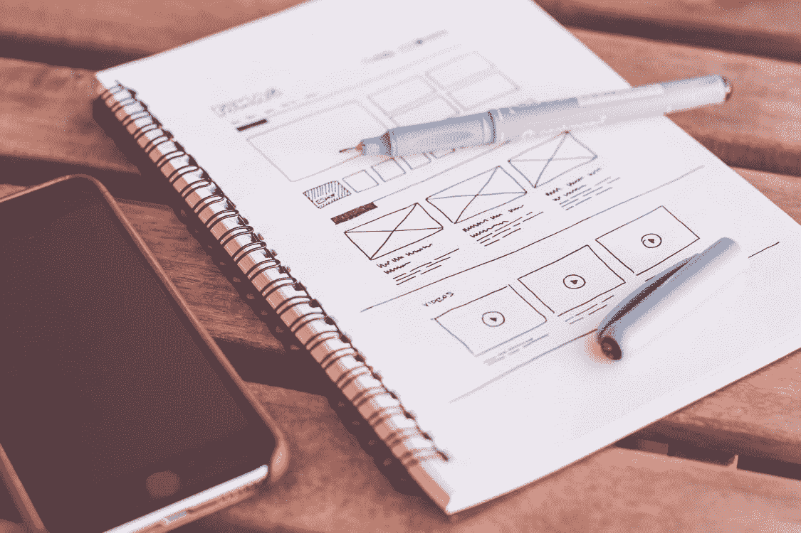

# 为什么你应该理解你产品的最初目标

> 原文：<https://medium.com/codex/why-you-should-understand-your-products-original-goals-27a73981070e?source=collection_archive---------16----------------------->

*免责声明:所有观点都是我自己的*

[照片](https://www.pexels.com/photo/notebook-beside-the-iphone-on-table-196644/)来自 Pexels 的 picjumbo.com

作为一名软件工程师，你应该花时间去理解你正在开发的产品的最初设计目标。这并不是说你不应该使你的项目适应变化的需求，或者最初的设计一开始就把一切都做对了。