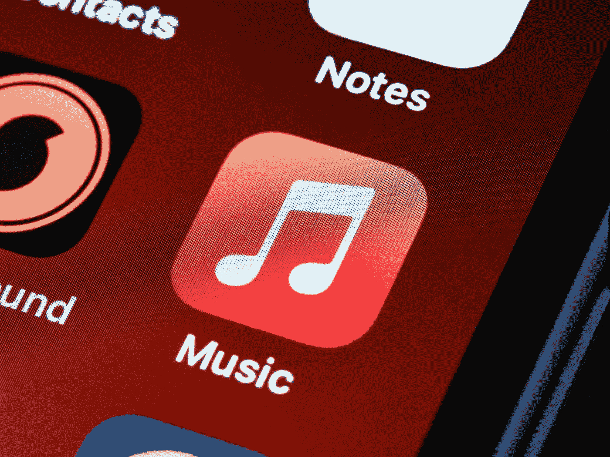
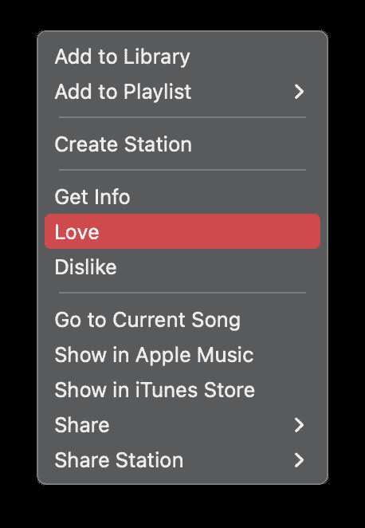
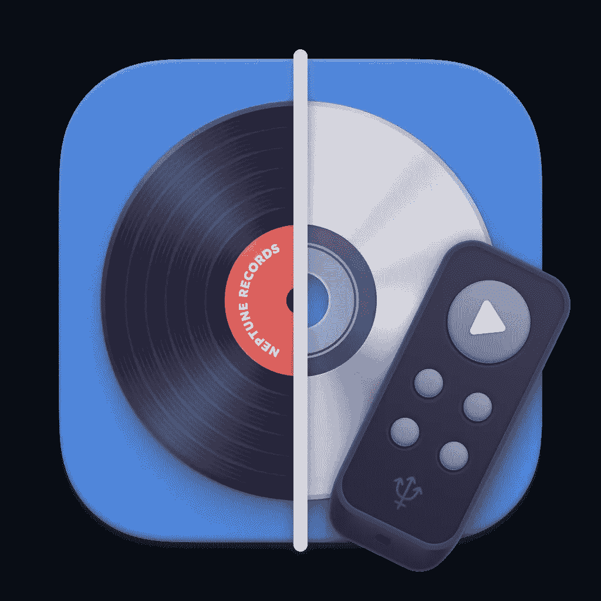

# 为什么应该在 Apple Music 中为歌曲使用 Love(附带一个额外提示)

> 原文：<https://medium.com/codex/why-you-should-use-love-for-songs-in-apple-music-with-a-bonus-tip-e12681288da?source=collection_archive---------9----------------------->

## 个性化 Apple Music，用爱发现新的艺术家和歌曲。

布雷特·乔丹在 Unsplash 上拍摄的照片

# 什么是苹果音乐

Apple Music 是一个流媒体平台，可以让你听数百万首歌曲。您可以浏览流派、播放列表、艺术家、专辑、电台等。没有广告或其他干扰，你可以将歌曲下载到你的设备上进行离线收听，有些歌曲已经提供了杜比全景声的空间音频(听你周围的声音，但你需要像 AirPods Pro 耳机这样的配件)。

在 iPhone、iPad、Mac、Apple Watch 等多个设备之间同步你的音乐库非常方便。它也适用于 Windows 和 Android，但主要是为苹果设备设计的。你可以在官网[这里](https://www.apple.com/apple-music/)了解更多关于 Apple Music app 的信息。

# 价格

Apple Music 不是免费的。他们提供免费试用，我推荐你熟悉这项服务。Apple 提供语音、学生、个人和家庭订阅。我认为与其他服务相比，它们相当便宜，尤其是 T2 家庭计划(T3)。此计划非常有利，因为您可以与其他五个用户共享您的订阅。点击这里查看价格。

喜欢家庭计划，也来看看[苹果 One](https://www.apple.com/apple-one/) 。这是一个捆绑服务，包括 iCloud+、Apple Music、Apple TV+和 Apple Arcade。根据您所在的国家，您还可以通过这个捆绑包获得苹果新闻和苹果健身。在此处检查服务可用性[。](https://support.apple.com/en-us/HT204411)

我选择这个计划主要是因为我将 iCloud+用于我的自定义域、音乐和电视。此外，游戏在街机上也有。此外，你可以与苹果家族的其他成员分享所有这些，所以我觉得这非常方便，是满足我(我们)需求的完美解决方案。

# 可供选择的事物

Apple Music 是一项流媒体服务，在这一领域并不孤单。有许多选择一样好，或者对某些人来说甚至更好。一些替代产品有 **Spotify** 、 **Deezer** 、 **YouTube Music** 、 **Tidal** 以及许多其他产品。这主要取决于用户的偏好，用户将需要哪种服务，以及用户每个月将不得不花费多少钱。

# 为什么要在 Apple Music 里用爱来做一首歌

我一直用苹果音乐。音质极好，我能足够快地找到我喜欢的音乐。与我所有苹果设备的无缝集成是另一个优势。

偶尔也不知道听什么。对我来说最简单的方法是去*现在收听*并选择我的电台。使用 Apple Music 背后的算法，该服务将挑选你可能喜欢的歌曲，一些你已经知道并听过的歌曲，以及一些新的歌曲。或者我可以去*为你制作*区，选择一个预先制作的混音。

但是，你如何缩小你的口味，使服务“知道”你喜欢什么？我一直用**爱**。这是您告诉 Apple Music 您更喜欢哪些歌曲或专辑的方式。你也可以不喜欢音乐；这项服务会减少你不喜欢的音乐。

情歌

# 如何喜欢 Apple Music 中的一首歌或一张专辑

我大多在家用 Mac 听音乐，但也喜欢在开车时听。有几种方法可以让你喜欢上苹果音乐**中的一首歌。在专辑或曲目视图中，找到并单击三点菜单，然后选择爱。您也可以单击窗口顶部音乐播放器中的三点菜单。**

在 iPhone 或 iPad 上的 Apple Music **中，你可以类似地喜欢或不喜欢(是的，这就是 Apple Music 在移动设备上所说的不喜欢功能)一首歌。只需点击三点式菜单，就能轻松找到。**

另一种方式是使用 **Siri** 。我不习惯，所以一直忘了用，至少开车的时候在车里。你只要说‘嘿，Siri，我喜欢这首歌’就行了。这是 Siri 的苹果音乐命令列表。

NepTunes 应用程序图标。来源:官方网站

# 额外小费

当我在 Mac 上听音乐甚至做一些重要的事情时，我不喜欢因为我对歌曲的喜爱和不喜欢而分心。对于这些情况，我使用一个名为[Neptune](https://www.neptunesmac.app)的第三方应用，在那里我可以为爱情功能设置一个快捷方式。我把它设置为⌘+L，不管我在哪个应用程序中，我只要按下这个快捷键就能喜欢上这首歌。您还可以设置不喜欢功能的快捷方式。我认为其他应用程序允许这样做，但这个对我来说很有用，我非常喜欢它。太方便了。

# 结论

如你所见，你可以用*喜欢*和*不喜欢*的功能来个性化 Apple Music。我经常使用它，并且我发现了许多我喜欢的流派的其他艺术家。但偶尔，手动浏览音乐来寻找全新的东西也是不错的。外面有这么多优秀的音乐家。

我非常想知道你用哪种流媒体服务来听你的音乐。如果是 Apple Music，用爱情功能吗？请在评论中告诉我。

感谢您的阅读。一直很感激。

汤姆(男子名)

*原载于 2022 年 10 月 11 日*[*【https://www.tomathosblog.com】*](https://www.tomathosblog.com/why-you-should-use-love-for-songs-in-apple-music-with-a-bonus-tip/)*。*