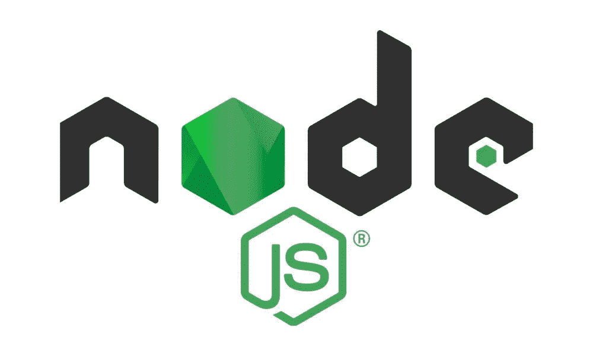

# 为什么应该使用 NodeJS

> 原文：<https://medium.com/codex/why-you-should-use-nodejs-2f2881b31a1e?source=collection_archive---------23----------------------->

所以你的老板让你领导一个项目，你需要为这个项目挑选技术。如果您正在考虑使用 NodeJS 作为后端，这篇文章肯定会对您有所帮助。此外，我将在本文中提倡使用 typescript。

## 什么是 NodeJS？

NodeJs 是一个异步事件驱动的 javascript 运行时。它旨在构建可伸缩的网络应用程序，如 web APIS。为了实现这一点，它使用非阻塞 I/O 操作。由于所有的操作都是异步的，这导致 Web API 的正常运行时间更长。

## 什么是 TypeScript？

TypeScript 是一种开源语言，通过添加静态类型定义构建在 JavaScript 之上。这些类型提供了一种描述对象的方法，从而提供了更好的文档，并允许 TypeScript 验证您的代码。在 TypeScript 和 JavaScript 之间做出选择应该不会耗费你太多的时间，因为这种语言的开发方式是，你可以从 JavaScript 开始，随着时间的推移，完全转换你的代码库。

## 为什么使用 TypeScript？

TypeScript 为 NodeJS 带来了一些在后端开发中令人垂涎的编译语言优势。您将注意到的主要区别是 TypeScript 强制执行强静态类型。反过来，这有助于支持 OOP 概念，使代码结构化、自文档化、可读，并且更容易调试。

## NodeJS 是框架吗？

不，它只是一个后端框架运行的环境。一个非常流行的是 Express.js，用于 HTTP 服务器和 WebSocket 服务器。

## NodeJS 安全吗？

NodeJS 源代码可以在 GitHub 上公开审计，它的更新由一个技术指导委员会管理。由于它是一个运行时环境，NodeJS 本身并不提供任何固有的安全性，除了您将在其上运行的代码。您很可能会使用第三方库来补充您的代码，因此您还必须对此类库进行安全评估。

## NodeJS 和 TypeScript 有许可吗？

NodeJs 是在 MIT 许可证下授权的，TypeScript 是在 Apache 许可证 2.0 下授权的，允许两者免费分发。

## NodeJS 能提供什么？

NodeJS 与其他运行时环境的区别在于，NodeJS 在单线程系统中使用非阻塞、事件驱动的 I/O。这使它能够在跨分布式系统服务数据密集型应用程序时保持轻量级和高效。在传统的服务器端框架中，当发出新请求时，系统会创建一个新线程来处理该请求，每个新线程都会消耗机器上的额外资源。

作为一个单线程系统也有它的缺陷，你应该考虑它们。如果一个任务有非常复杂的计算，它可能会阻塞单线程并延迟对其他客户端的响应。此外，您需要小心处理您的代码，不要导致异常冒泡到 NodeJS 事件循环，这将导致实例结束并使您的程序崩溃(服务器离线)。

## 什么时候使用 NodeJS？

对我来说，这是最重要的话题。开发人员需要明白，仅仅因为你学会了如何使用一种工具，现在你就可以在任何地方使用这种工具(并不是因为你可以使用锤子，所有东西都是钉子)。那么有哪些使用 NodeJS 的好案例呢？

*   I/O 受限的 API
*   排队系统
*   流动
*   物联网
*   委托书
*   无服务器功能

## 什么时候不用 NodeJS？

*   图像处理
*   人工智能
*   数据科学
*   生物信息学

## NodeJS 靠谱吗？

NodeJS 最初是由 Ryan Dahl 在 2009 年引入的，现在它是一个由 OpenJS 基金会资助的完全成熟的项目，该基金会得到了 Google、微软和 IBM 等公司的支持(这里有一点“大技术糖”来吸引你的老板)

2015 年，OpenJS 基金会采用了一种[发布节奏](https://nodejs.org/en/about/releases/)，它指定了一个严格的发布周期，有助于更好地理解新的/不推荐的功能。每个主要版本发布 6 个月，这给了库作者时间来添加对它们的支持。6 个月后，奇数版本被弃用，偶数版本转移到 LTS。这确保了您总是使用稳定的版本。

## 依赖项和库

NodeJS 与名为 Npm 的包管理器一起分发。这将处理包的安装、版本和依赖性管理。

有大量的库存在，Npm 可以处理来自许多来源的依赖，但它与 npmjs.com 有很强的关联，它是 NodeJS 包的最大注册中心。需要注意的是，虽然您可能使用来自 npmjs.com 的软件包，但这并不意味着该软件包是安全的，不包含任何恶意软件。不久前有一个[已知的案例](https://threatpost.com/discord-stealing-malware-npm-packages/163265/)某个包可能被用来集成包含恶意软件的语音/聊天应用程序 Discord。因此，确保您添加到项目中的包的安全性完全是您的责任。

## 结论

NodeJS 是一个很好的环境，您可以在其中构建与网络相关的项目，使您能够轻松地交付高质量的产品，但是如果您的项目必须处理一些非常占用 CPU 的请求，NodeJS 可能不是最佳选择，因为您的服务器会滞后于其他请求。

NodeJS 不会很快消失，并且会定期更新，这对技术本身和任何有抱负的“NodeJs 开发者”来说都是好兆头。

我自己已经在多个与工作相关的项目中使用了 NodeJs with Express，我必须说我对结果很满意。虽然当我有选择堆栈的自由时，我的工作场所不采用这种技术，但我总是尝试选择 NodeJS。

我希望你喜欢这本书。下次见。