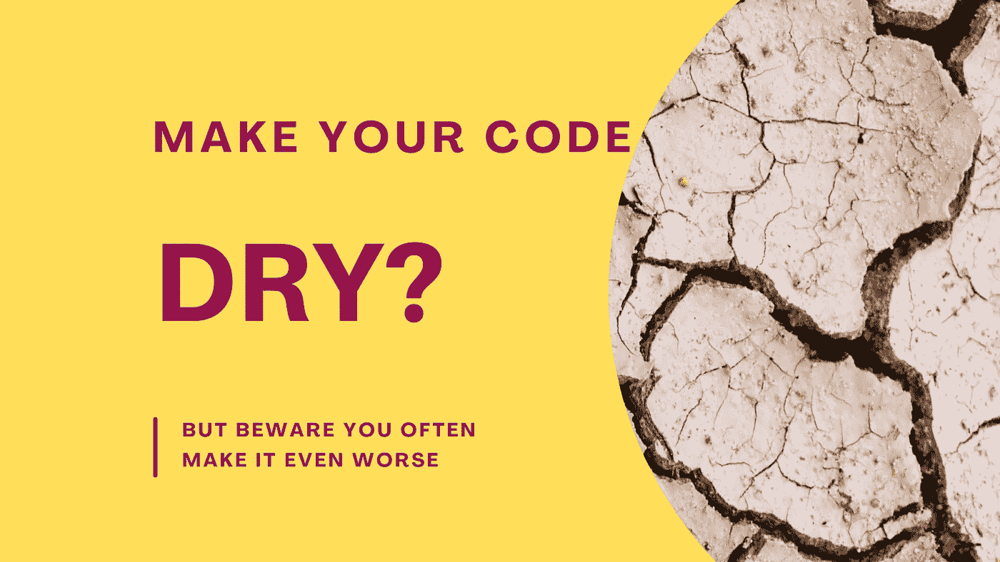

# 为什么你在使用干爽的时候会无意中违反这个原则

> 原文：<https://medium.com/codex/why-you-unintentionally-violate-this-principle-when-you-apply-dry-4cf22d8313c9?source=collection_archive---------5----------------------->

## 您经常违反 IOS 原则，这使得您的代码更难测试，对变化不稳定，并且根本不正确

图片由[作者](http://www.arnoldcode.com)经由 Canva.com 制作

你没有做一个好的重构，甚至可能把它变得更糟。