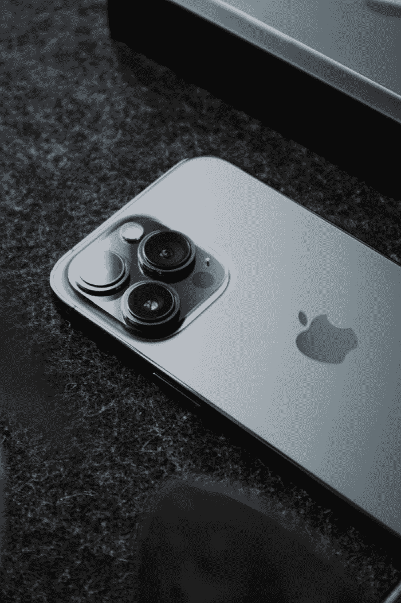

# 为什么你的 iPhone 侧面有静音键而别人没有？

> 原文：<https://medium.com/codex/why-your-iphone-has-a-mute-button-on-the-side-and-why-others-dont-71b84ed9303b?source=collection_archive---------15----------------------->

# 为什么你的 iPhone 侧面有静音键而安卓没有！

**静音开关**是**苹果**的主要产品，一些用户无法想象没有它的世界，但是为了理解它的重要性，我们必须回到 iPhone 的前身 **iPod。**

照片由 [Nubelson Fernandes](https://unsplash.com/@nublson?utm_source=medium&utm_medium=referral) 在 [Unsplash](https://unsplash.com/?utm_source=medium&utm_medium=referral) 上拍摄