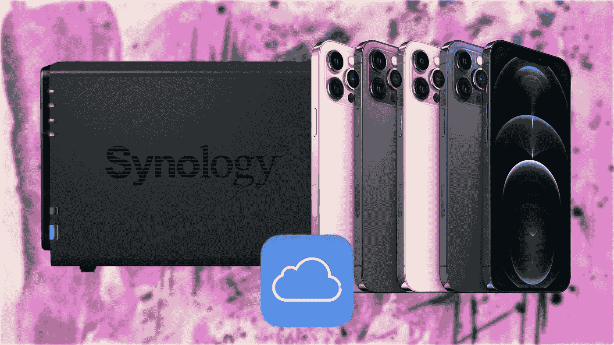

# 为什么您的 NAS 永远不会取代 iCloud

> 原文：<https://medium.com/codex/why-your-nas-will-never-be-an-icloud-replacement-462a9c96204b?source=collection_archive---------0----------------------->

## 然而，它似乎是作为一个广告。

很少会有什么事情会引发我的激烈争论，但在晚餐和写作之间，在 YouTube 上滚动，试图教育自己，一个视频出现在我的推荐源中，它有一个有趣的标题:*“为什么每个 iPhone 用户都需要一个 Synology”*。如果这是一个随机内容…