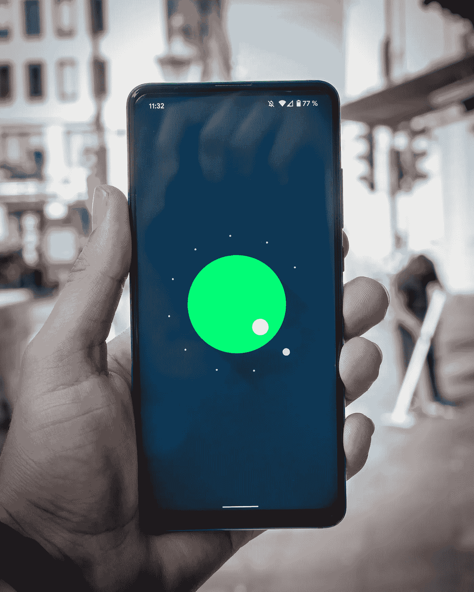

# 为什么你的手机如此智能却如此昂贵

> 原文：<https://medium.com/codex/why-your-phone-so-smart-but-expensive-fd8cb6a892f8?source=collection_archive---------18----------------------->

## 回归基本:智能手机专利

米卡·鲍梅斯特在 [Unsplash](https://unsplash.com/s/photos/patent-smartphone) 上的照片

几乎每项技术都有几项专利。当产品越复杂，专利就越多。智能手机是拥有许多专利的小型技术的一个很好的例子。总的来说，专利权给了公司和工程师创造创新的理由。自从…