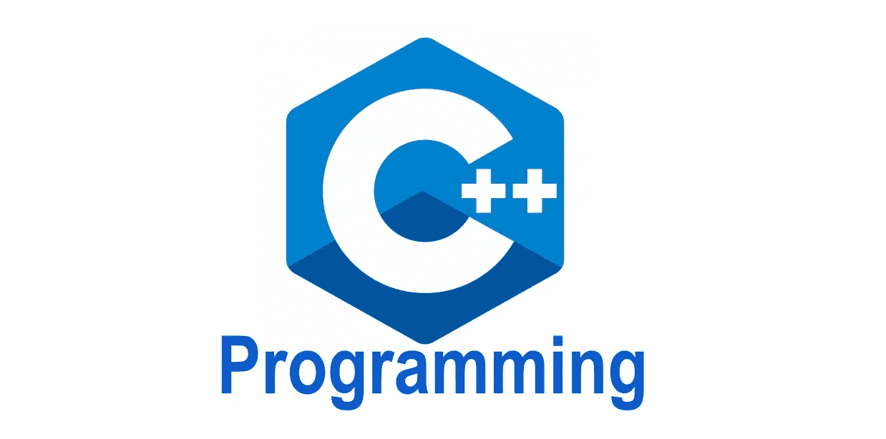

# 为什么你用错误的方式思考 C++

> 原文：<https://medium.com/codex/why-youre-thinking-about-c-in-the-wrong-way-68c0f5dde0b0?source=collection_archive---------9----------------------->

*声明:这些物品最初改编自 Scott Meyers 的* [*有效 C++*](https://www.amazon.com/gp/product/0321334876/ref=as_li_tl?ie=UTF8&camp=1789&creative=9325&creativeASIN=0321334876&linkCode=as2&tag=agarza-20&linkId=4243f81d6a157054164ecfdd496248c7) *。这是我回顾和总结 Meyers 讨论的 55 个项目的系列文章中的第一篇。这些帖子的目的是作为我个人对所讨论的概念的回顾，也为读者提供一个带有附加评论的精简版本。*

*免责声明:这篇文章包含亚马逊会员链接*

## 为什么是 C++？

C++是一种比它被认为的更有冒险精神的语言。通常，它被认为只是在教室或大学环境中使用的东西。你对 C++理解得越多，它在从系统编程到机器学习的一系列任务中就变得越有用。在性能很重要的地方，C++很重要。然而，C++确实在内存管理和各种其他任务(如线程和并发)方面给程序员带来了很多责任。正因为如此，很多 bug 往往是看不见的，等到发现的时候已经太晚了。学习编写有效的 C++应该是所有工程师能够自立的基础。掌握 C++将使你掌握高效的应用程序开发，编写有效的代码，并深入了解软件工程和计算机科学的基础知识。

## **c++的进展**

C++最初是作为一种升级，在 C 中包含面向对象的功能。考虑到 C++最初的名字是“带类的 C”，这个目的是很明显的这个简单的加法孕育了新的编程范式。正如 Meyers 指出的，“例外需要不同的方法来构建功能。模板带来了新的设计思维方式，STL 定义了一种不同于大多数人所见过的可扩展性方法。”尽管我们将 C++视为一种恐龙语言，但它有着改变范例和技术本身的记录。

> “例外需要不同的构造函数的方法。模板带来了新的设计思维方式，STL 定义了一种不同于大多数人所见过的可扩展性方法。”

C++将发展成为一种多种语言。它的应用包括过程化、面向对象、函数式、泛型和元编程能力。C++是现存的最强大的技术之一。无论是增强现实、机器学习、物联网、机器人、系统还是许多其他领域，它的各种用途和访问低级和高级功能的能力通常都使它处于进步的前沿。

## **C++作为一个联盟**

C++的这些应用程序违反直觉地提出了一个问题:“C++是用来做什么的？”当一个人把 C++看作是一种语言，而不是它实际上是一种语言联盟时，这个问题就出现了。C++是几个子语言的组合，其中每个子语言都有自己的规则和范例。Meyers 列出了 4 种初级子语言:

*   **C**—C 对 C++的影响是无法逃脱的。从预处理器到内置数据类型的一切都源于 C。然而，C++提供了几种优于原始 C 实现的方法
*   **面向对象的 C++**——这是 c++的一部分，体现了类、封装、继承、多态、虚函数，以及面向对象语言和设计中常见的所有其他东西。
*   **模板 C++** —这部分 C++主要用于泛型编程。Meyers 指出，这是程序员对 C++最缺乏经验的领域。模板 C++的规则很少与主流 C++交互。
*   STL 文件 —这是模板库。C++ STL 的突出特点是容器、迭代器、算法和函数对象的约定融合在一起的方式。Meyers 说“STL 有特殊的做事方式，当你使用 STL 时，你需要确保遵循它的惯例。

重要的是要记住这些子语言，并在需要时调整策略。这是掌握的关键。Meyers 列举的一个例子是，对于 C 类型，按值传递比按引用传递更有效。然而，在面向对象的 C++中，通过引用传递给 const 通常是一种更有效的编程方法。这是由于用户定义的构造函数和析构函数的存在。在 Template C++中，这也是正确的，因为你甚至不能确定你正在处理的类型。然而，在 STL 中，迭代器和函数对象是在 C 类型上建模的；这意味着对于 STL 来说，传递值将是默认的启发式方法，就像处理 C++的 C 子语言一样

## **总结**

C++的每个子语言都有自己的规则和惯例。了解这些对掌握很重要。日本武士宫本武藏在《五环之书》*中说，一个武士必须知道大事，知道小事；从一件事，要知道一万件事。学习和理解 C++的各个部分:它们的不同、相似和相互联系。*

*跟随我的项目 2 页。*

***自己阅读正文**，点击此链接购买[有效 C++](https://www.amazon.com/gp/product/0321334876/ref=as_li_tl?ie=UTF8&camp=1789&creative=9325&creativeASIN=0321334876&linkCode=as2&tag=agarza-20&linkId=99525c74d51b81776bcb9eb02f35d88a)*