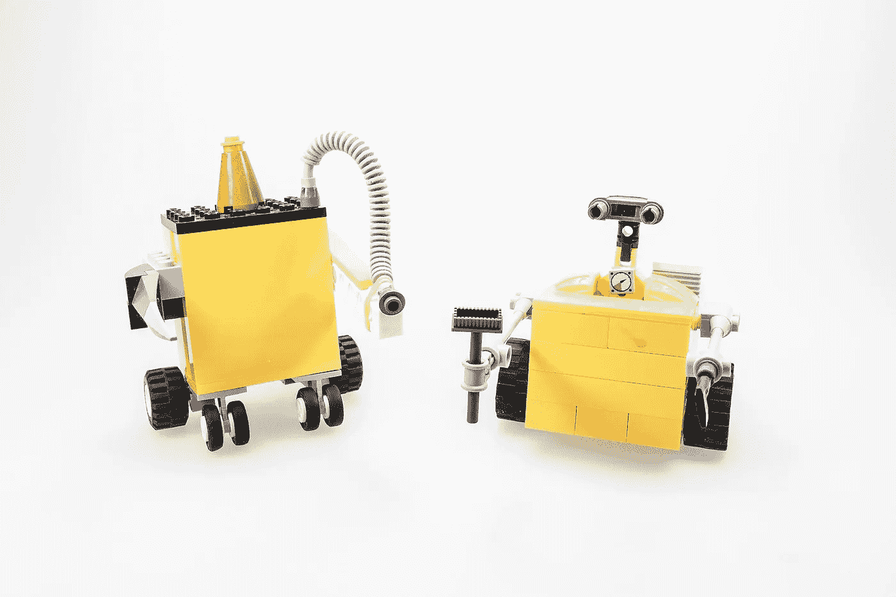

# 人工智能会接管我们的工作吗？

> 原文：<https://medium.com/codex/will-artificial-intelligence-take-over-our-jobs-5a87494d64e8?source=collection_archive---------3----------------------->

就像人类在整个历史中采用和使用的所有技术和技能一样，人工智能是一种新的技术形式，可以以各种可以想象的不同方式开发和使用。这项技术将对我们的社会产生积极还是消极的影响，完全取决于政府、企业和社区如何引导它的发展和增长，以及我们如何在社会中为促进技术和人类的和谐共处奠定基础。

当谈到人工智能拥有的潜力时，这项技术很可能对经验丰富的专业人员以及低技能工人产生影响，我相信，你一定已经充分意识到，有许多尝试正在进行中，将人工智能应用于各种商业环境中的商业表现。

当然，对于普通人来说，假设“人工智能将剥夺我们的工作”或“人工智能将取代人类扮演的角色”是非常合理的。根据一些研究人员和他们引用的统计数据，从 1993 年到 2007 年，每引进一台工业机器人，平均就有 3 到 6 名工人失业。事实上，许多关于人工智能在企业中应用的讨论都集中在“如何减少某些任务所需的劳动力数量”(总的来说，这是一个全球现象。)

然而，应该指出的是，一种“职业”从未被“完全和彻底地取代”，而是随着新兴技术的引入而“改变”。例如，我们非常熟悉的 ATM 机，大多数人都懒得再去想它了，它在 1970 年首次推出，在整个 90 年代变得越来越流行和普及，并且仍然在积极使用，但是出纳员的职业还没有消失。我想，年轻一代肯定对他们的移动支付应用程序感觉更舒服。无论如何，这一职业的范围和内容已经从“处理基本的金融交易”转变为“执行为每个客户量身定制的营销/销售活动”

根据这一观点，更重要的是理解人工智能不会简单地取代现有的工作，而是通过在商业实践的整体背景下自动化“特定任务”来提高某些员工的表现，同时努力找到其应用的适当方向。通过这样做，我们都可以从有时乏味和低价值的活动中解脱出来，被允许更多地关注只有人类才有能力做的事情。就业市场的规模也将扩大，其多样性将不断增强，创造更多的就业机会。

还应该注意的是，如果没有巨大的努力，我们永远也不会容易看到人工智能和人类在完美的和谐中并肩生活的未来。我相信，至少有三个关键因素促成了我们梦寐以求的人工智能时代的到来。

首先，讨论“工作的未来”的焦点应该转移到“未来的工作”随着社会系统多年来的变化，当我们走出工业社会并最终到达数字社会时，人工智能给我们带来了一个任务，即确定下一代将管理社会的系统应该是什么样的。要理解“工作”的概念，以及“劳动和生产”的概念在未来将如何转变，需要观点和想法。

其次，中央政府和企业都应该制定原则、环境和战略，允许采用人工智能，以保护和保障劳动者和办公室工作人员的“职业”。在企业采用人工智能的过程中，必须问的问题不是“如何减少劳动力”，而是“如何通过采用人工智能的新技术，使现有劳动力创造新的价值，并为企业业绩做出贡献。”此外，认真听取现场工作人员的声音并开发能够反映他们的需求和请求的人工智能系统具有非常重要的意义。

最后，应该为社会的每一代人设计和提供教育和学习机会，以便人们能够转向采用新技术。在无数方面，人工智能中的技术完全不同于我们在过去几十年中习惯使用和生活的技术，并有可能在未来许多年以创新的方式改变社会和企业的整体结构。从长远角度对新时代进行适当的教育，是创造一个环境的先决条件，在这个环境中，每个社会成员都能够适应人工智能将带来的变化，享受更光明的未来和它所提供的一切。

光明的未来，如果有的话，也是有代价的。完全由社会、政府、企业和个人来决定如何充分利用对人类未来具有巨大潜力的人工智能，以及如何为我们所有人的发展增强人工智能的技术。